# [`{{ Kelly | plus: Kelly }}` Building out the header section – February 3rd, 2021](https://www.youtube.com/watch?v=YXdnaoxD1po&t=1144s)

[ShopifyDevs](https://www.youtube.com/channel/UCcYsEEKJtpxoO9T-keJZrEw)

In this stream, we flush out the Liquid for our websites header section and configure the site navigation! Follow the build LIVE every Wednesday @2PM EST at <https://twitch.tv/shopifydevs>​. Code available at <https://github.com/t-kelly/shopipoint>

Mentioned Links:

- <https://shopify.dev/docs/themes/liquid/reference/objects/routes>​
- <https://shopify.dev/docs/themes/liquid/reference/objects/request>
- <https://shopify.dev/docs/themes/liquid/reference/filters/url-filters#link_to>
- <https://apps.shopify.com/deploy-app>​

* * *

Subscribe to our channel for more videos about developing and designing ecommerce stores, apps, and themes with Shopify » www.youtube.com/shopifydevs​

Looking for more information about developing on Shopify check out www.developers.shopify.com and <https://shopify.dev/>​

Connect with us on Twitter » www.twitter.com/shopifydevs

Launch your own online store by visiting Shopify and starting your free trial » <http://bit.ly/VisitShopify>

* * *

  

## Transcription &#38; Notes

### Intro

- `{{ | plus: Kelly }}`: "Hello 🙋‍♂️👋 everyone! How's everyone doing today!? We're actually on time! Laurent, if you're watching, we had a countdown screen. Thanks for the recommendation last time. I was able to jump on that countdown screen because Twitch was working 😁."
- `{{ Kelly | }}`: "How to I sound now?"
- `{{ | plus: Kelly }}`: "Good. Very little cracking."
- `{{ Kelly | }}`: "Okay. That's my AirPods. We'll just use those for today"
- `{{ | plus: Kelly }}`: "So... Yeah. Okay. There's no fan noise. That sounds good. Oh, yeah! There Laurent"
- `{{ Kelly | }}`: "I think the fan voice really adds to it 😁, but it's cool"
- `{{ | plus: Kelly }}`: "I mean it adds straight from the home effect, authenticity"
- `{{ Kelly | }}`: "Yeah! 😀"
- `{{ | plus: Kelly }}`: "It's authentic 😀"
- `{{ Kelly | }}`: "Now my video is out of sync with audio. Seriously!!! 😕😩"
- `{{ | plus: Kelly }}`: "😆 Because it is coming through... Wait. I can maybe fix that AV sync issue"
- `{{ Kelly | }}`: "Oh, it's better. No, you're good. We're good."
- `{{ | plus: Kelly }}`: "Oh, it's okay. Okay. Cool."
- `{{ Kelly | }}`: "Hooray!!! 🙌🎉 Hello everybody! "
- `{{ | plus: Kelly }}`: "😆"
- `{{ Kelly | }}`: "I am not a robot"
- `{{ | plus: Kelly }}`: "😄 One day, things will just not change on us and we will have a consistent stream!!! Thank you for bearing with us as always 🙇‍♂️. At least we started on time today 😁. `{{ Kelly | }}` how you doing? How you doing this week?"
- `{{ Kelly | }}`: "I'm good. I have a very busy week this week so I am in a lot of meetings but hey! that's what I do for a living 😁!! I do have a nice little desk decoration today 🍶 (The Macallan 12), so that's pretty cool!"
- `{{ | plus: Kelly }}`: "Ooh! Is that a scotch!?"
- `{{ Kelly | }}`: "Yes, Macallan 12"
- `{{ | plus: Kelly }}`: "Ooh! I need to actually blow you up on my preview screen so I can actually see your gift."
- `{{ Kelly | }}`: "Oh, okay."
- `{{ | plus: Kelly }}`: "I'm here. I just saw the 12 and I thought 'oh, that's definitely a scotch'... Can I do it!? Can I get your video up here!? Not full screen"
- `{{ Kelly | }}`: "Now I can see myself."
- `{{ | plus: Kelly }}`: "Man OBS Ninja changed. Does anyone else use OBS? Has anyone else tried OBS Ninja? I can't now just make you big. It has to be full screen. Actually, that's what I want, now that I think of it. We want you full screen, but I want you on this one... There we go. Okay and now if you say something..."
- `{{ Kelly | }}`: "Hello! Hello! Hello!"
- `{{ | plus: Kelly }}`: "Yeah. Okay. Cool!"
- `{{ Kelly | }}`: ":cool:"
- `{{ | plus: Kelly }}`: "There we go... So, you got the Macallan, you got a nic scotch, have you cracked it open yet? 😁"
- `{{ Kelly | }}`: "No. I literally just got it like 30 minutes ago. So..."
- `{{ | plus: Kelly }}`: "Wow. Okay."
- `{{ Kelly | }}`: "I won't open it yet 😁. Maybe in like six hours! 🤔😁. Yeah, just have to get through the rest of my meetings first! 😊"
- `{{ | plus: Kelly }}`: "😂. What is this, 'I found the fire hydrants, leave me alone'? I think I missed it."
- `{{ Kelly | }}`: "Chis had said 'I don't think `{{ Kelly | }}` is not a robot. Throw up a captcha'"
- `{{ | plus: Kelly }}`: "Oh! Okay. 😆. Wait do you get fire hydrants? I always get traffic lights"
- `{{ Kelly | }}`: "I get traffic light, fire hydrants, crosswalks, bicycles..."
- `{{ | plus: Kelly }}`: "Okay, wait, this happens to you a lot more than me it sounds like 😂 "
- `{{ Kelly | }}`: "😄 I got..."
- `{{ | plus: Kelly }}`: "Your humanity is being questioned 😆"
- `{{ Kelly | }}`: "... oh, what was I login into yesterday? I was getting so many [oh, it was discord] they made me go through like twelve round of Captchas and I'm like 'I swear I'm a human'..."
- `{{ | plus: Kelly }}`: "😄 yeah!"
- `{{ Kelly | }}`: "... but before that they wouldn't even let me sign in. They were like 'nah you're a bot. You're not a real person, so please leave'"
- `{{ | plus: Kelly }}`: "😆"
- `{{ Kelly | }}`: "So, I don't know what it is with me and discord but we don't play well together 😆"
- `{{ | plus: Kelly }}`: "😆 It's all that hardcore hacking that you're doing over on your IP address"
- `{{ Kelly | }}`: "That's it 😆"
- `{{ | plus: Kelly }}`: "You're on their [_] list clearly 😄"
- `{{ Kelly | }}`: "😆 Good."
- `{{ | plus: Kelly }}`: " [Kinngh] says 'if you [long] click on the check mark you can avoid the captcha most times^"
- `{{ Kelly | }}`: "Long click on the checkmark"
- `{{ | plus: Kelly }}`: "Really!? 🤔"
- `{{ Kelly | }}`: "So act like my grandma clicking a button and just be like 'uhhh'. Okay. Done."
- `{{ | plus: Kelly }}`: "It's the grandma override 😁☕"
- `{{ Kelly | }}`: "Yeah!! Ooh, that's smart. :cool:"

### What's new?

- `{{ | plus: Kelly }}`: ":cool: Well, I don't have to much to chat about, at the start here. In terms of like what's new, I mean everyone, this time of year, is pretty much heads down and uh..."
- `{{ Kelly | }}`: "I mean there was a [partner town hall](https://www.youtube.com/watch?v=IeRvyMm0iE4)"
- `{{ | plus: Kelly }}`: "There was a [Partner Town Hall](https://www.youtube.com/watch?v=IeRvyMm0iE4) yesterday!! I mean, yeah. I guess I can 😂"
- `{{ Kelly | }}`: "😂 Not to throw, you know, the words out there but there was discussion about sections everywhere"
- `{{ | plus: Kelly }}`: "There was. I know. It kind of ruined our parade on it being a running joke, now that we came out with a real answer."
- `{{ Kelly | }}`: "No, it's still a running joke 😁"
- `{{ | plus: Kelly }}`: "Oh, ok, but there's a serious answer to it now."
- `{{ Kelly | }}`: "Yeah, I mean... I will say that I think there was a serious answer last time too, just to throw that out there"
- `{{ | plus: Kelly }}`: "😂 It's always serious 😁"
- `{{ Kelly | }}`: "😄 Sections everywhere is serious business. Serious eventual business. We still in the ideation phase. Still figuring out what we need."
- `{{ | plus: Kelly }}`: "So for those of you that may have missed it, yes there was a [Town Hall](https://www.youtube.com/watch?v=IeRvyMm0iE4) yesterday, it should be accessible. It's typically uploaded to the [ShopifyDevs YouTube channel](https://www.youtube.com/watch?v=IeRvyMm0iE4) a few days after, so stay tuned for that if you missed it live..."
- `{{ Kelly | }}`: "TLDR on Sections everywhere though is that there's going to be an update at unite this year which is usually Q2 2021"
- `{{ | plus: Kelly }}`: "So that is the..." a question came in from bao_dangamble saying: "Hi Kellys, do we know when sections everywhere is going to be relsased?" as `{{ | plus: Kelly }}` was talking. He continued by saying "Yeah. We can now say unite and then..."
- `{{ Kelly | }}`: "Okay"
- `{{ | plus: Kelly }}`: "... said to `{{ Kelly | }}` 'What's funny though is that we haven't set a date for Unite' 😂"
- `{{ Kelly | }}`: "That's true and I still think that it's going to be like a preview or the Beta maybe for Sections Everywhere.."
- `{{ | plus: Kelly }}`: "Which is fine."
- `{{ Kelly | }}`: "Totally!"
- `{{ | plus: Kelly }}`: "I think this is one of the things that I hope that we can stay on closer to the side of unite being 'Hey we're working on these things. Here, we're not finished yet. Here it is developers. Here it is partners. Here it is so you can try it out.."
- `{{ Kelly | }}`: "Yeah."
- `{{ | plus: Kelly }}`: "... and you can provide us valuable feedback' rather than like 'Hey we finished this thing without you. Here you go'.""
- `{{ Kelly | }}`: "Right. That makes sense. I think the running joke with Unite, though, is like 'Oh look at all these cool things that are going to be released in Beta a year from now' So..."
- `{{ | plus: Kelly }}`: "Yeah! Yeah! Okay 😁☕"
- `{{ Kelly | }}`: "A year from now is sometimes being generous with the timing 😄"
- `{{ | plus: Kelly }}`: "I like!! I like!! This is a good external/internal point of you here 😁😄... The performance dashboard was the thing I was working on, that was announced at Unite. Actually, no. The original was [Slate](https://shopify.github.io/slate/docs/about). We had [Carson Shold](https://carsonshold.com/) up on stage the very first [Unite in 2016](https://www.youtube.com/watch?v=pwOhcVO6M3M) and he was talking about slate and then that just set the tone for how slate was going to go 😂"
- `{{ Kelly | }}`: "😂"
- `{{ | plus: Kelly }}`: "Hey! we got Dan. Hey Dan. I gotta catch up on the comments here"
- `{{ Kelly | }}`: "I like [Kinngh's] 'While we were searching for Sections Everywhere, maybe Sections were in us all along' 😂"
- `{{ | plus: Kelly }}`: "😂"
- `{{ Kelly | }}`: "😂 so deep! 😂"
- `{{ | plus: Kelly }}`: "😂"

### Today

- `{{ Kelly | }}`: "What do you say we code today!?"
- `{{ | plus: Kelly }}`: "Yeah! that's what I was feeling. Let's jump straight into the coding. We've talked a lot, on the channel, about Dev tooling and kind of stuff available in Themes and I want to focus on the code today. If it's..."
- `{{ Kelly | }}`: "Let's do it"
- `{{ | plus: Kelly }}`: "... It's good with you."
- `{{ Kelly | }}`: "Also if you are on Twitter right now, don't judge me for tweeting, as I need to tweet about us doing this "live" stream 😁."
- `{{ | plus: Kelly }}`: "😁 It's in another tab. I won't open the tab 😄"
- `{{ Kelly | }}`: "😄 I'm retweeting the.."
- `{{ | plus: Kelly }}`: "Sections Everywhere was in us all along! yeah! 😂."
- `{{ Kelly | }}`: speaking out what she is tweeting about: "Maybe talking about Sections Everywhere..."
- `{{ | plus: Kelly }}`: "Okay. So... Oh! You know what I want to do? I want to start a poll."
- `{{ Kelly | }}`: "Oooh!!!"
- `{{ | plus: Kelly }}`: "Okay. I want add a poll... Manage poll... Create a new poll. So my question to everyone in the audience is, when you start developing a new website, or when just start developing, what do you start with? Are you an HTML kind of developer? Are you CSS? Are you kind of Styles first? JavaScripts (js)? I mean, under JavaScript is going to include all the other variants of making websites now I guess."
- `{{ Kelly | }}`: "😆. I have a three steps process to the way that I build."
- `{{ | plus: Kelly }}`: "Yeah!"
- `{{ Kelly | }}`: "Step One: Make it work. Step Two: Make it pretty. Step Three: Make it work again."
- `{{ | plus: Kelly }}`: "😂 I like it"
- `{{ Kelly | }}`: "Very necessary step 😆"
- `{{ | plus: Kelly }}`: "Here we go. Okay, of course. I put this poll and I hit start poll and, guess what, I get an error from Twitch. It says 'service error. Try again in a moment.' Okay, let me try again. I tried. I waited"
- `{{ Kelly | }}`: "Denied!!!!"
- `{{ | plus: Kelly }}`: "OMG"
- `{{ Kelly | }}`: reading a question in chat from [BawseMane] saying: "Does anyone have advice on how to copy an entire shopify store, including pages, section content, etc? I need to do this for development purpsoes of new features and don't want to have to copy all the pages and content manually."
  - Answer from `{{ Kelly | }}`: "[Excelify](https://excelify.io/) helps with this. Maybe you can do it with [Rewind](https://rewind.com/products/backups/shopify/)!? I think there is a copy store app in the app store as well."
- `{{ | plus: Kelly }}`: "😂 Okay. Sorry guys. I was trying. I tried to do a poll. I really did and Twitch is... I've got a nice beautiful error. I should have showed the error on the page."
- `{{ Kelly | }}`: "The problem. I'm sorry. I was just responding to something on the chat."
- `{{ | plus: Kelly }}`: "Go for it."
- `{{ Kelly | }}`: "'I tried [Excelify](https://excelify.io/) but it didn't do section content' The problem is that, the section content is tied to the settings files, which is not available via the API, for any kind of images that are uploaded on there. So... That is the concern. It can still read the images from the other settings files, like the other store but if you delete it of course it'll delete on both of them."
- `{{ | plus: Kelly }}`: "Oh! Wait. `{{ Kelly | }}` did you [join vscode](https://visualstudio.microsoft.com/services/live-share/)?"
- `{{ Kelly | }}`: "I did. It said I [joined the collaboration session](https://visualstudio.microsoft.com/services/live-share/)"
- `{{ | plus: Kelly }}`: "Okay. Yeah. It says you're here. :cool: Just making sure you're there. Let me share my screen. I'll start this off, how may of you are still working with good old HTML?"
- `{{ Kelly | }}`: "🙋‍♀️"
- `{{ | plus: Kelly }}`: "The world of web development has grown and there's these other languages"
- `{{ Kelly | }}`: "🙋‍♀️ Me"
- `{{ | plus: Kelly }}`: "Yeah! [JSX](https://reactjs.org/docs/introducing-jsx.html) and, you know, there are so many ways of creating a [DOM](https://developer.mozilla.org/en-US/docs/Web/API/Document_Object_Model/Introduction) now..."
- `{{ Kelly | }}`: "You know what"
- `{{ | plus: Kelly }}`: "Yeah. :cool: [kuipou] says 'me'"
- `{{ Kelly | }}`: "HTML is my favorite programming language 😁. I'm intentionally saying that to piss some people off 😁"
- `{{ | plus: Kelly }}`: "Sorry. I missed it"
- `{{ Kelly | }}`: "I said 'HTML is my favorite programming language', which I'm intentionally saying just to piss some people off 'because I don't know actually it's a markup language' but HTML is very necessary."
- `{{ | plus: Kelly }}`: "You know, what I like is HTML it comes with web standards. HTML is not going to change and you know HTML works on any browser. It's not a browser if it doesn't work with HTML, right!?"
- `{{ Kelly | }}`: "That's right"
- `{{ | plus: Kelly }}`: "I get there's been a lot of work on new DOM languages, I'm just thinking like JSX..."
- `{{ Kelly | }}`: "Here's my issue with JSX or anything involving JavaScript, not everybody has JavaScript enabled on their browser or on their phone, especially in like third world countries because JavaScript also takes longer to load, for example. So there are a lot of websites that just can't be loaded because or maybe like your grandma's computer is still running you know like Internet Explorer 6..."
- `{{ | plus: Kelly }}`: "Or you're just running a really weird browser, not weird but just you know unique..."
- `{{ Kelly | }}`: "Probably weird 😁"
- `{{ | plus: Kelly }}`: "There are still people that are browsing the web on like Nintendo Wii and like if you look at..."
- `{{ Kelly | }}`: "Oh, I know because I see it show up on Google's analytics"
- `{{ | plus: Kelly }}`: "Yeah... Sony PSP browser. Good memory. Sony PSP browser. Good old days!"
  - Comment about PSP browser came from [kuipou].
- `{{ Kelly | }}`: "See, that is my problem with relying so heavily on JavaScript. You tweeted earlier about progressive web apps, which I am a big fan of under the caveat that there are people who will not be able to access the website because there's no fallback for it. For like a lot of people building their site out."
- `{{ | plus: Kelly }}`: "Which is what I like about this, progressive web apps, it's a progressive enhancement. It's a layer on top. You go into it realizing it's not the do-all end-all solution"
- `{{ Kelly | }}`: "Yeah"
- `{{ | plus: Kelly }}`: "And I'm looking at it now and it looks like it's own solution. It's not a substitute. It's not a replacement for your online store or website. it's something extra."
- `{{ Kelly | }}`: "Yeah"
- `{{ | plus: Kelly }}`: "You can use [`<noscript>`](https://developer.mozilla.org/en-US/docs/Web/HTML/Element/noscript)."
  - Comments came from [voraciousdev]. He stated "You can use [`<noscript>`](https://developer.mozilla.org/en-US/docs/Web/HTML/Element/noscript). People just often don't fully implement it."
  - `{{ Kelly | }}`, [taproomkelly], also responded in the chat saying "Yeah that's exactly it. People just often don't use it"
- `{{ Kelly | }}`: "Yeah"
- `{{ | plus: Kelly }}`: "But then, depending on the JavaScript that you're using is it backwards compatible up to [ECMAScript 5](https://developer.mozilla.org/en-US/docs/Web/JavaScript/Language_Resources)!? Are you gonna be writing in ECMAScript 5 or are you transpiling and then just chewing up your code"
- `{{ Kelly | }}`: "It's so tough, like when you get into [ES6](https://developer.mozilla.org/en-US/docs/Web/JavaScript/Language_Resources) and just out of habit the way I write my functions and the way I include variables in strings! Now, I just have a tendency to default to [ES6](https://developer.mozilla.org/en-US/docs/Web/JavaScript/Language_Resources) and I always have to remember when I'm building elsewhere where it's not actually going to be compiled 'I can't do that'!... What are you doing?"
- `{{ | plus: Kelly }}`: "I am starting an ``, I want to wrap... Okay wait. I want to start off with... Oh!!..."
- `{{ Kelly | }}`: "😂 Five million heading tags"
  - Autocomplete was adding more heading tags to what `{{ | plus: Kelly }}` was already manually doing himself 😂
- `{{ | plus: Kelly }}`: "😂 I want to wrap this `<h1>`. So what we're going to be focusing... Okay, before I get into it. What we're going to be focusing on today is... Let's just call it high quality HTML"

- `{{ Kelly | }}`: "😲"
- `{{ | plus: Kelly }}`: "I wanna try... You know, it's been a while and I want people to join me on this. So, if anyone in the audience sees something that stands out, like 'oh, you should do this' or like 'don't forget this', because HTML is all about don't forget to do this thing. The way I think about HTML..."
- `{{ Kelly | }}`: "Can I make a recommendation!?"
- `{{ | plus: Kelly }}`: "... is just like 'don't forget to do this thing', 'don't forget to include this attribute', don't forget to... it's all about just don't forget and I'm just going to forget some things so..."
- `{{ Kelly | }}`: "You want me to start this now"
- `{{ | plus: Kelly }}`: "😂 Doctype. :cool:"
  - A comment in the chat came from [kuipou] saying "`<!doctype>` 🤣.
- `{{ Kelly | }}`: "By wrapping this `<h1>` in this header.liquid, you're setting the `<h1>` tag across all the entire website..."
- `{{ | plus: Kelly }}`: "🤝"
- `{{ Kelly | }}`: "..and other pages need to have different `<h1>` tags, especially in terms of accessibility and SEO. So, we should wrap it to check to see if we're on the homepage and in that case it should be an `<h1>` tag, otherwise, it should not be."
- `{{ | plus: Kelly }}`: "Yes! 🕺 That's what I was going to do!!! Nice synergy!"
- `{{ Kelly | }}`: "Yeah!! Oh, I hate that word! 😆 but.."
- `{{ | plus: Kelly }}`: "😂 I know!!! 😂 That's why I say it! 😂"
- `{{ Kelly | }}`: "😂 Uh!!! 😂 I forgot we put the cat there!" (referring to [Shopipoints](https://shopipoints.com) logo!)
- `{{ | plus: Kelly }}`: "Okay. So. We're going to want to use the [Shopify request](https://shopify.dev/docs/themes/liquid/reference/objects/request) liquid object. We want the path. Can you use the routes for this? Does this tell you current page?"
- `{{ Kelly | }}`: "You can check if you are on the index template"
- `{{ | plus: Kelly }}`: "Yeah! That's why I was using `request_page_type` right there."
- `{{ Kelly | }}`: "`page_type`, yeah! There you go. `index`"
- `{{ | plus: Kelly }}`: "There you go. `index`"
- `{{ Kelly | }}`: "I usually default to [`{{ template.name }}`](https://shopify.dev/docs/themes/liquid/reference/objects/template#template-name) as well, `request_page_type` is actually something I haven't used too much."
- `{{ | plus: Kelly }}`: "Same. I was going over some of the free theme code, you know, so that I wouldn't be totally useless during this stream 😄"
- `{{ Kelly | }}`: "😆"
- `{{ | plus: Kelly }}`: "And that stood out and I was like 'Oh. Okay. I can get on that'.... If so and then else. We want to wrap it in like a `
`!?"
- `{{ Kelly | }}`: "`
` for example"
- `{{ | plus: Kelly }}`: "Right, 'cause you still want to use the style of an `<h1>`. But then this is a `<header>` so maybe... We're not going to classes yet. We're doing pure HTML. Is that fair!?"
- `{{ Kelly | }}`: "Okay. [gmgregory] says 'anyone else hoping that the addition of the 'routes' object means Shopify is potentially getting ready for allowing custom URL structures?' Ooh! that's a whole topic."
  - `{{ Kelly | }}`: "I agree in the sense that we are very limited in terms of the URL structure and when we're migrating a client from a different platform over to Shopify and having to explain 'no, all of your collections are slash collection slash whatever slash product slash whatever slash affiliate pages slash whatever (/collection/whatever/product/whatever/affiliate_pages/whatever) it can be a thing.. xxx not for porn 😂. Yes, thank you for clarifying that 😂"
    - [kuipou] wrote the xxx comment that `{{ Kelly | }}` read. He had said "it would be great as /collection/xxx is weird"
- `{{ | plus: Kelly }}`: "😂 I'm going to put this all on one line. Does anyone have any problems with that? Is that readable? I don't know"

- `{{ Kelly | }}`: "It's fine. I'm not going to complain... 'I took the routes more as a nod towards localization'" reading a comment from [bao_dangamble].
  - `{{ Kelly | }}`: "Yeah, I think it's definitely helpful for localization in particular."
- `{{ | plus: Kelly }}`: "We forgot to do `watch`. Let's do [`npm run watch`](https://youtu.be/TBhPqroHSz0?t=2490)... There was the [internationalized domains](https://help.shopify.com/en/manual/online-store/os/domains/managing-domains/international-domains) that came out as well, not to long ago... You know, if I am going to be completely transparent, I feel like it's funny people say things like 'I have a great idea' and this idea of like a custom routing structure, it's definitely circulated. I'm not aware of if it's gain any traction!? Maybe it has! There has to be good stuff, like what are you going to get out of custom... other then shortcuts, like...?"
- `{{ Kelly | }}`: "Consistency. That's the thing"
- `{{ | plus: Kelly }}`: "... having like '/boats' or '/contact' "
- `{{ Kelly | }}`: "Yeah. There were some concerns over canonical URLs with the slash collection slash something slash products (/collection/something/products) or something versus slash products slash something (/products/something), slash something (/something) is very difficult to say, side note. But, yeah, I guess that's an example of why some people would prefer the URL, we end up just using URL redirects for it you want to have like for running a promotion, you can just do 'mywebsite.com, enter to win' and that will redirect to slash pages slash enter to win or something like that, I don't know."
- `{{ | plus: Kelly }}`: "We lost our image, but that's 🆗 for now"
- `{{ Kelly | }}`: "Is it though! Is it though! 😁"
- `{{ | plus: Kelly }}`: "I kind of like having '[Shopipoints](https://shopipoints.com)' for now, at least people can land on this..."
- `{{ Kelly | }}`: "🆗!!!"
- `{{ | plus: Kelly }}`: "... and they know that it's [Shopipoints](https://shopipoints.com). You know, I'm noticing as it's blown up I love how the underline with this.. you see.. 🆗"
- `{{ Kelly | }}`: "I also like default fonts on the internet"
- `{{ | plus: Kelly }}`: "Yeah! 🆗 well, 'there's a good conversation'. Tell why do you like default fonts? Why do you like system fonts, let's call them by their right name."
- `{{ Kelly | }}`: "I like that they are fully accessible by any browser, any computer because they're already installed on there. I get that they're not very pretty. Loading custom fonts is totally fine as long as you do it correctly, because if you're loading fonts..."
- `{{ | plus: Kelly }}`: "Is it!? Is it fine though!? 🤔🤨😁"
- `{{ Kelly | }}`: "Yes! I think it's a necessary... and now I will say you should have a fallback set if you do custom fonts. Make sure you have a fallback system font included on the CSS, but I'm not opposed to using custom fonts like from [Google fonts](https://fonts.google.com/) or [MyFonts](https://www.myfonts.com/) installing it or adding the fonts files into the assets folder or anything like that. Just, you know, recognize the flash of un-styled content being a potential issue that you have to resolve for."
- `{{ | plus: Kelly }}`: "And the performance beacon, for me, is at all cost if you can get away without using web fonts it's such like easy... if you can convince the designer that ['Helvetica'](https://www.myfonts.com/fonts/linotype/helvetica/) is nice 😂"
- `{{ Kelly | }}`: "['Helvetica'](https://www.myfonts.com/fonts/linotype/helvetica/) is nice. I don't think it's a system font though"
- `{{ | plus: Kelly }}`: "Comics is 🤣"
- `{{ Kelly | }}`: "I think we're talking about 'Times New Roman' or 'Ariel'"
- `{{ | plus: Kelly }}`: "Oh! I get how it's a necessary evil in some ways. There are people who are very passionate about their typefaces. So in the world..."
- `{{ Kelly | }}`: "🤣 Telling any designer that 'no you can only use 'Ariel' forever' 🤣"
- `{{ | plus: Kelly }}`: "🤣 Yeah!"
- `{{ Kelly | }}`: "Question: 'How you would include a custom web font hosted on Shopify?'" question came into chat from [kuipou]
  - `{{ Kelly | }}`: "You could upload the font files into the assets folder of a Theme and then build your own font face into the CSS."
- `{{ | plus: Kelly }}`: "Shopify does have a very large font library available on it. If you were to, I am not fresh... Do we want to do fonts right now?"
- `{{ Kelly | }}`: "hmm! that's a whole thing."
- `{{ | plus: Kelly }}`: "🆗"
- `{{ Kelly | }}`: "We can do the font picker but there's a lot to unpack with the way that Shopify handles the fonts"
- `{{ | plus: Kelly }}`: "And like this is a custom store and I'm thinking about like is that something that you're going to be... So, thinking, we're going to build this in a way that so we're not building a Theme that we're going to be distributing on the Theme store or it's not a fully configurable website that we're trying to build here, right!? This is a one-off, probably similar to things that you're working on that you want to make specific parts of it custom, or easily customizable. So it makes sense like the Logo, so if you update you Logo, you're going to want to make that easy to switch out. And like the navigation, so you want to use Shopify's built-in navigation menus."
- `{{ Kelly | }}`: "Shopify's menus, yeah! Make sure all the sections on the home page can moved around. Obviously, once you get to the informational pages, you're kind of locked into the order in which you do the sections, I mean, if only there was like a different code base that was setup to allow you to put a section wherever you wanted! 😁 But until that happens, it's a little bit more limited. But our rule is no images and no copy should ever be hard coded into a Theme. A merchant should always be able to change any of that information"
- `{{ | plus: Kelly }}`: "I like it. Question!? Is it still a good practice to use lists for... Why? Why does? Why are you automatically pasting stuff after I type!?" `{{ | plus: Kelly }}` was speaking to vscode! 😂
- `{{ Kelly | }}`: "Do you have an automatic/closing tag enabled extension?"
- `{{ | plus: Kelly }}`: "Probably. What I am wondering here... 🆗... We'll see if it keeps going. Is is still good practice? or is it 🆗 to do the lists?"
- `{{ Kelly | }}`: "So, I think the important part of, I don't know if it matters so much lists or not, I think most important is including the role, the ARIA role on the nav, so nav role equals navigation, is what's important for accessibility, because you can still tab through a list."
- `{{ | plus: Kelly }}`: "Yes, and these are still `<a>` (anchor) tags."
- `{{ Kelly | }}`: "Yeah"
- `{{ | plus: Kelly }}`: "Those are important. So `<nav role="navigation">`. So let me do that because I want this to show up as a list. I want us to see what this webpage looks like just as pure HTML, if our modern styles that we're going to be writing fails, if everything thing else fails, we have a nice legible HTML doc, fair!?"
- `{{ Kelly | }}`: "You want to see how I usually shortcut the links when I'm linking"
- `{{ | plus: Kelly }}`: "Uh! Sure! This is painful I'm sorry for people watching. You're autocomplete or the..."
- `{{ Kelly | }}`: "it's following... 🆗 So, I'm going to this `` tag here"

- `{{ | plus: Kelly }}`: "Ah! Here, let me follow you."

- `{{ Kelly | }}`: "There we go. So, `<li>{{ link.title | link_to: link.url }}</li>`. Now you have a link."
- `{{ | plus: Kelly }}`: "`{{ link.title | link_to: link.url }}` Wow! why is that?... We don't ever get that latency. Are you plugged in by change? Like ethernet?"
- `{{ Kelly | }}`: "Nope 🙅‍♀️"
- `{{ | plus: Kelly }}`: "No! You on Wi-Fi!? Oh! come on `{{ Kelly | }}` 🤣"
- `{{ Kelly | }}`: "🤣 I forgot"
- `{{ | plus: Kelly }}`: "This is why 🤣"
- `{{ Kelly | }}`: "🤣😬🤦‍♀️ I can run over and get it. I'm not connected right now."
- `{{ | plus: Kelly }}`: "🤣 No! No! It's fine now. We been through this! 🤣 Thomas `ul>li*5` tab"
  - reading a comment from [kuipou] commenting in chat about using `ul>li*5` [`Emmet`](https://code.visualstudio.com/docs/editor/emmet) to populate 5 list items.
- `{{ Kelly | }}`: "Oh! Like [`Emmet`](https://code.visualstudio.com/docs/editor/emmet)"
- `{{ | plus: Kelly }}`: "`<ul>` [`Emmet`](https://code.visualstudio.com/docs/editor/emmet)`"
- `{{ Kelly | }}`: "So `ul>li*5` like that. I don't... I think it's because... No, where? I don't know."
  - `{{ Kelly | }}` was referring to her not being able to see [`Emmet`](https://code.visualstudio.com/docs/editor/emmet) abbreviation come up.
- `{{ | plus: Kelly }}`: "I'm... Yeah. `ul`, [`Emmet`](https://code.visualstudio.com/docs/editor/emmet) abbreviation and so if I tab, there. No. I haven't use [`Emmet`](https://code.visualstudio.com/docs/editor/emmet) in..."
- `{{ Kelly | }}`: "Oh! You can see Emmet on your end. 🆗"
- `{{ | plus: Kelly }}`: "Yeah! I can see [`Emmet`](https://code.visualstudio.com/docs/editor/emmet). I'm just trying to do the..."
- `{{ Kelly | }}`: "So, just it `ul` and then"
- `{{ | plus: Kelly }}`: "Like that `ul>li`"
- `{{ Kelly | }}`: "Yeah. Times 5."

- `{{ | plus: Kelly }}`: "Times 5."
- `{{ Kelly | }}`: "Yep. Tada!!!"
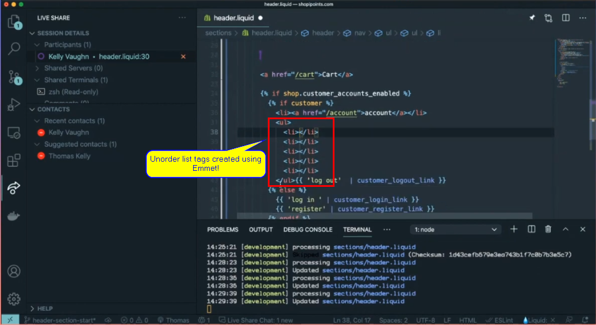
- `{{ | plus: Kelly }}`: "🆗 That's doing... That's times it by 5. So how would I wrap? Like, here, I already have everything that I want, I just want to wrap. I know there's a way..."
- `{{ Kelly | }}`: "There was a shortcut. I never remember what it is."
- `{{ | plus: Kelly }}`: "Yeah! Exactly. It's like uh... Does anyone remember the shortcut to like wrap?"
- `{{ Kelly | }}`: "Option W!?"
- `{{ | plus: Kelly }}`: "Option W!?"
- `{{ Kelly | }}`: "Does that work? Nope. that's the wrong one."
- `{{ | plus: Kelly }}`: "Let's try this Emmet that [kuipou] added.."
  - [kuipou] commented in chat with `ul>li{xxx}`
- `{{ Kelly | }}`: "You don't need a `ul` there."
- `{{ | plus: Kelly }}`: "Yeah, that's true. We just need... Like this!? 🆗 I'm going to brush up on my Emmet skills and your 🤬 autocomplete is driving me crazy!"
- `{{ Kelly | }}`: "🤣 It's my autocomplete that's doing that?"
- `{{ | plus: Kelly }}`: "Well, yeah it's doubling it or something"
- `{{ Kelly | }}`: "It literally picks up my... I don't think I have... Editor config, get lens, json, liquid, live share... Now, I double checked, I don't even have it"
- `{{ | plus: Kelly }}`: "It's like doing this weird... 🆗 Alright we got the list. :cool: Anything else for the `<header>` that you can think of? So we what we have to start with, we've got our Logo and that has a configurable image. We've got our main navigation, we'll go into the settings and set that navigation. We've got our cart, oh, we should use the routes here instead of a hard coded."
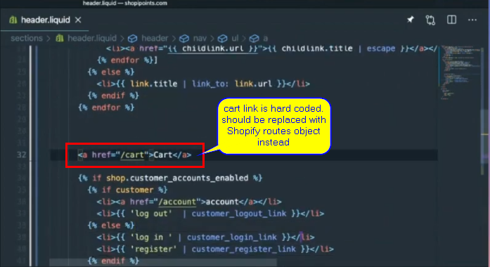
- `{{ Kelly | }}`: "mm-hmm"
- `{{ | plus: Kelly }}`: "So let's do, I mean we should/could just use the liquid anchor here right? Do `routes.cart`!? `cart_url` there we go. Let's do that baby and then, is the filter... `{{ routes.cart_url | }}` and then the filter is `link`!?"
- `{{ Kelly | }}`: "`link_2`"
- `{{ | plus: Kelly }}`: "Oh! `_to`!?"
- `{{ Kelly | }}`: "It's the other way around. It should be cart in quotes, `'cart'` and then the filter `link_to.routes.cart_url` or `routes_cart_url`"
- `{{ | plus: Kelly }}`: "Oh, really!? Like the cart objects?"
- `{{ Kelly | }}`: "So..."
- `{{ | plus: Kelly }}`: " So, that's another way of doing. I haven't done it that way."
- `{{ Kelly | }}`: "No, this is what I was talking about doing. `| link_to: routes.cart_url`"

- `{{ | plus: Kelly }}`: "Which keeps the content to be.. That's the data.."
- `{{ Kelly | }}`: "This is the data... Yes, exactly."
- `{{ | plus: Kelly }}`: "🆗!!! And then we have... We can do the same thing here... Let's replace this here... This is `'Account'` to `account_url`!? Let's make sure Shopify routes..."
- `{{ Kelly | }}`: "Shopify routes..."
- `{{ | plus: Kelly }}`: "To `account_url`. Yep."
- `{{ Kelly | }}`: "`cart account`, oh, `account_login_url`"
- `{{ | plus: Kelly }}`: "We have the other ones."
- `{{ Kelly | }}`: "Oh, yeah. Oh! they're customer login. They're not using routes. Interesting."
- `{{ | plus: Kelly }}`: "This is... yeah. I'm not use... I'm not familiar with this."
- `{{ Kelly | }}`: "I'm not either."
- `{{ | plus: Kelly }}`: "It's from express. It definitely works."
- `{{ Kelly | }}`: "🆗"
- `{{ | plus: Kelly }}`: "Let's take a look at this. Anyone else? Has anyone else used the..."
- `{{ Kelly | }}`: "Well, there is a conversation about it from 2015. 😄. I think these were around before the routes object."
- `{{ | plus: Kelly }}`: "yeah"
- `{{ Kelly | }}`: "'Can you add `cart.item_count` maybe?' That's a good idea. I'm going to change this up and go capture part text"
  - reading a question/comment from chat posted by [sHHr] saying "You can add cart.item_count maybe?"
- `{{ | plus: Kelly }}`: "If customer, I'm sure.. Oh, yeah."
  - `{{ | plus: Kelly }}` working on routes portion still
- `{{ Kelly | }}`: "If cart item count is greater than zero let's say it's going to be cart... Woops nope. That's JavaScript..."
- `{{ | plus: Kelly }}`: "mm-hmm"
- `{{ Kelly | }}`: "All the time. ``, `{{{ cart }}}`. Nope that's a shortcut. Ah! I'm trying to undue and it is 😄"
- `{{ | plus: Kelly }}`: "`account_logout_url` and..."
- `{{ Kelly | }}`: "'For multi lang is there anything special we need to add to cart?' 🤔 I don't know"
  - `{{ Kelly | }}` was reading [kuipou]'s question in chat, which was "For multi lang is there anything special we need to add to 'Cart'?"
- `{{ | plus: Kelly }}`: "If there's anything special? So there's... If we want, right now we're just doing text, so If it was a Logo..."
- `{{ Kelly | }}`: "I changed it."
- `{{ | plus: Kelly }}`: "Oh! Cart... 🆗 That's fine. `Cart.item_count`"
- `{{ Kelly | }}`: "So it only shows the cart if there's something in there, otherwise it's just the word cart."
- `{{ | plus: Kelly }}`: "Oh, it's interesting using a ``. 🆗"
- `{{ Kelly | }}`: "Just to replace that, yeah."
- `{{ | plus: Kelly }}`: "yeah! 🆗"
- `{{ Kelly | }}`: "Technically, you can go `<a href>` and have all that logic live inside as well, so, I just did not feel like redoing it... 🆗 so you decided to switch them too."
- `{{ | plus: Kelly }}`: "Yeah, just to follow best practices"
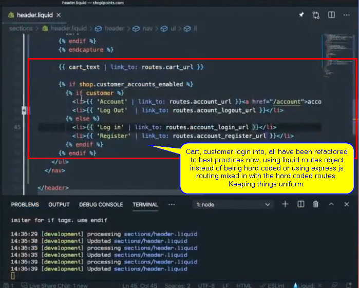
- `{{ Kelly | }}`: "register_url I assume!? Making an assumption."
  - `{{ Kelly | plus: Kelly }}` making some changes to the header's liquid code and using dynamic routes objects of liquid instead of the hard coded/express coded URL direct links or redirects (express)
- `{{ | plus: Kelly }}`: "uh! Here I can double check."
- `{{ Kelly | }}`: "🆗"
- `{{ | plus: Kelly }}`: "Yeah, it's the `account_register_url` there you go"
- `{{ Kelly | }}`: "`routes.account_register_url`. 🆗 :cool:"
- `{{ | plus: Kelly }}`: "🆗. :cool: So we have..."
- `{{ Kelly | }}`: "Good idea [sHHr] on adding the `item_count`"
![Screenshot of `cart.item_count` being added to `cart` based on commented idea from user [kuipou], from twitch chat.](Assets/img/2021-03-13-14_01_48-{{Kelly_plus_Kelly}}-Building_out_the_header_section-February_3rd_2021-Cart_item_count-Update.png "Cart item count")
- `{{ | plus: Kelly }}`: "Let's take a look. Let's make sure everything's handy dandy here. We have `cart`. We don't have customer accounts enabled so what we just did won't be visible"
- `{{ Kelly | }}`: "🆗"
- `{{ | plus: Kelly }}`: "We want to get the `cart` as a list item"
- `{{ Kelly | }}`: "Ah! Yes."
- `{{ | plus: Kelly }}`: "Can you wrap it in a list! And, 🆗 Let's go in, let's get our customer accounts enabled"
- `{{ Kelly | }}`: "What is adding the autocomplete?"
- `{{ | plus: Kelly }}`: "Customers 🎶! To enabled them do you just add a customer!?"
- `{{ Kelly | }}`: "Oh, go to settings tab, at the bottom and then go to checkout..."
- `{{ | plus: Kelly }}`: "Checkout 🎶!!!"
- `{{ Kelly | }}`: "... and then you can enable it there"
- `{{ | plus: Kelly }}`: "'Accounts are disabled'🎶‼ 'Accounts are optional, there we go. Oh!!! There's the 'Multipass' that we talked about last time. Multipass login!!"
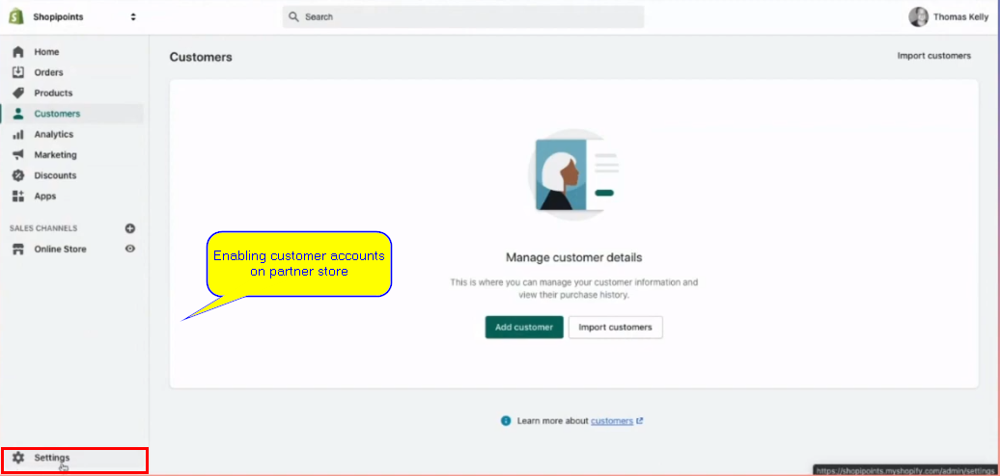
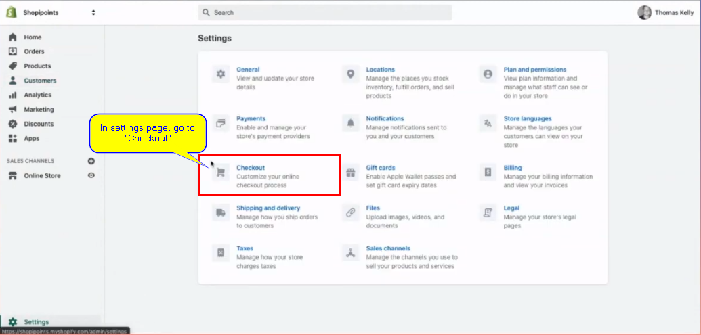

- `{{ Kelly | }}`: "Yeah. 🆗 [bao_dangamble] asked if you can add classes with the `link_to`? There's one way to find out!! `class: test`. Can you please check to see if the 'cart' link has the class of test!?"
- `{{ | plus: Kelly }}`: "Where did you add it?"
- `{{ Kelly | }}`: "Under the `cart`... yeah"
- `{{ | plus: Kelly }}`: "🆗 yeah. Let's see 'cause I never use the `link_to`, I always use the link filter or like the create link... Nope. List, Anchor"
- `{{ Kelly | }}`: "Yeah! Oh! Nope"
- `{{ | plus: Kelly }}`: "It's got a title 😂"
- `{{ Kelly | }}`: "Just title! 😂 Interesting. 🆗. `lin_to` shopify, let's see what it does."
- `{{ | plus: Kelly }}`: "..."
- `{{ Kelly | }}`: "It's literally... Yeah. It looks like `link_to`... `link_to` does the title... Curious.."
- `{{ | plus: Kelly }}`: "I always use the URL. It wasn't an `asset_url`, it was... what's the anchor one⁉ It's not image. There's one that just spits out a... Isn't there another one that spits out an anchor tag!? `Image_url`..."
- `{{ Kelly | }}`: "Not that I am aware of"
- `{{ | plus: Kelly }}`: "No!? It's always `link_to`!?"
- `{{ Kelly | }}`: "Yeah!"
- `{{ | plus: Kelly }}`: "..."
- `{{ Kelly | }}`: "I need a link... Oh, no it's..."
- `{{ | plus: Kelly }}`: "Can you add a class to that? 'cause I feel like there must have been a way to a class to it."
- `{{ Kelly | }}`: "Uh, we're working on the preview theme and I don't have a link to it!"
- `{{ | plus: Kelly }}`: "Oh, here I can pass it to you. You gotta to go..."
- `{{ Kelly | }}`: "Maybe I can pull out through... I have access to the store right?"
- `{{ | plus: Kelly }}`: "Yeah. You'll have to..."
- `{{ Kelly | }}`: "[Shopipoints](https://shopipoints.com)... There it is, yeah."
- `{{ | plus: Kelly }}`: "... That would be nice to have `classes`. That's a silly thing that we don't have that because I mean that's why I always just ended up using anchors by themselves, right?"
- `{{ Kelly | }}`: "Nope wrong number of arguments... Yeah. Exactly. So, no you cannot add `classes` with tags or with `link_to`"
- `{{ | plus: Kelly }}`: "🆗 for now this works for HTML. Thank you [dan]"
- `{{ Kelly | }}`: "..."
- `{{ | plus: Kelly }}`: "for checking my..."
- `{{ Kelly | }}`: "Literally wants... It's so weird"
- `{{ | plus: Kelly }}`: "😂 Checking me"
- `{{ Kelly | }}`: "There we go... expect... Just out of curiosity"
  - `{{ Kelly | }}` is working on the header.liquid code in the background, updating/removing things.
- `{{ | plus: Kelly }}`: "🆗 anything else? Does anyone else typically have anything?..."
- `{{ Kelly | }}`: "What else are we missing?"
- `{{ | plus: Kelly }}`: "... I am going into set the navigation item so we know what pages we..."
- `{{ Kelly | }}`: "😄"
- `{{ | plus: Kelly }}`: "... because I keep forgetting the pages that we want to have on this. So we're gonna go to online store, navigation... The header tag? 🤨🤔 [sHHr] we have the `<header>` tag that's wrapping everything, right!?"
  - [sHHr] commented "the header tag?"
- `{{ Kelly | }}`: "Yeah, I think it was there. You can remove header and use the tag parameters in the section schema..."
  - [sHHr] also commented back saying "you can remove the `<header>` and use the "tag" parameters in section schema" to which `{{ Kelly | }}` responded to.
- `{{ | plus: Kelly }}`: "So we don't want to have home because we're just going to have that as the main . So we want to have..."
- `{{ Kelly | }}`: "Section everywhere release date..."
- `{{ | plus: Kelly }}`: "🤣"
- `{{ Kelly | }}`: "is going to be a page we create 😁😂"
- `{{ | plus: Kelly }}`: "Sections everywhere 😂"
- `{{ Kelly | }}`: "🤣 sneak peek"
- `{{ | plus: Kelly }}`: "🤣... That's going to link to a page..."
- `{{ Kelly | }}`: "Which we haven't created yet"
- `{{ | plus: Kelly }}`: Do we have to make the pages first!?"
- `{{ Kelly | }}`: "Yeah, you do have to make the pages first"
- `{{ | plus: Kelly }}`: "🆗 here let's make the pages super quick, because we're going to want to have an episodes page. Episodes or wait. Episodes we're going to use blg, right!? But we want the leaderboard page"
- `{{ Kelly | }}`: "Yes!"
- `{{ | plus: Kelly }}`: "Yes!!! 🆗 for now we're just going to use the defaults. We'll come in here after and change the template that we're going to be using 'cause we're going to want to have a custom page template for that. We want to have... a board... Do we want to have like a, just a page for episodes, that should be..."
- `{{ Kelly | }}`: "That's what our blog was going to be."
- `{{ | plus: Kelly }}`: "We're going to use blog? 🆗"
- `{{ Kelly | }}`: "Yeah"
- `{{ | plus: Kelly }}`: "So let's do that then... Menu... Of course I didn't save it..."
- `{{ Kelly | }}`: "Having a standing desk is the best, just because I can just bounce around"
- `{{ | plus: Kelly }}`: "right!"
- `{{ Kelly | }}`: "I constantly just like stand on one foot, it's really great."
- `{{ | plus: Kelly }}`: "Have you seen those standing mats with the different shapes and different, uh..."
- `{{ Kelly | }}`: "You mean like this one!?"
- `{{ | plus: Kelly }}`: "Yeah, exactly! there's the one with a little ball in the middle"
- `{{ Kelly | }}`: "Yep! That's the one I have."
- `{{ | plus: Kelly }}`: "Umm, wait. Why am I still not ing any pages here?"
- `{{ Kelly | }}`: "You have to refresh the page."
- `{{ | plus: Kelly }}`: "I just navigated to it again for the..."
- `{{ Kelly | }}`: "Well, try it again! I'll link to the anti-fatigue matt. I have two of them, in different offices, I absolutely love it. It is by [Topo](https://www.amazon.com/dp/B00V3TO9EK?ots=1&slotNum=22&imprToken=74bbb4b6-02ad-0e74-133&ascsubtag=[]st[p]cjmht7wgc00bo0xy60lq2zt2e[i]9PsW0M[t]w[r]google.com[d]D[z]m&tag=thestrategistsite-20) I believe."
- `{{ | plus: Kelly }}`: "Just like to press your arches to. Another good thing is a either a tennis ball or a cricket ball to have on the floor"
- `{{ Kelly | }}`: "uh!"
- `{{ | plus: Kelly }}`: "To just press your arches with."
- `{{ Kelly | }}`: "That makes sense."
- `{{ | plus: Kelly }}`: "There it is. 🆗 You're right. I had to refresh, even though... Oh, I probably went back, that's probably why. 🆗 So, we've got leaderboard, even though it didn't change... OMG what's going on here! Oh, 🆗... We want to have... So to our blog we're going to call that 'Episodes'!?"
- `{{ Kelly | }}`: "Yeah"
- `{{ | plus: Kelly }}`: "and that's going to take us to"
- `{{ Kelly | }}`: "I think, it's just blogs!? Nope, nope. 'Blogs'"
- `{{ | plus: Kelly }}`: "Just blogs! 🆗"
- `{{ Kelly | }}`: "And then 'News'. We can rename it."
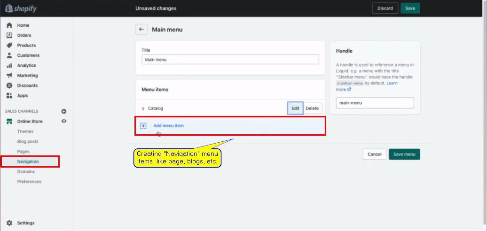
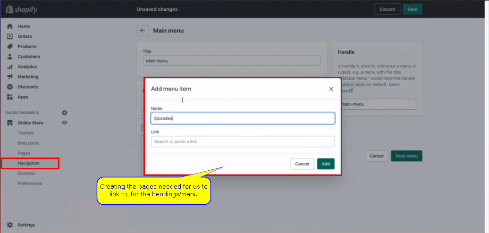

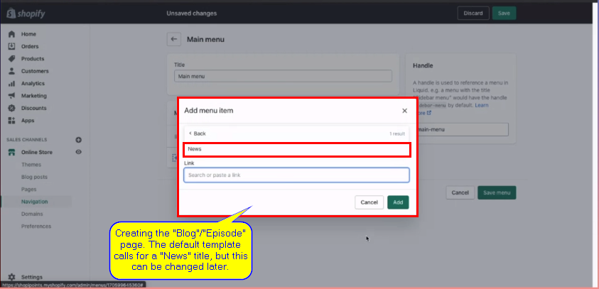
- `{{ | plus: Kelly }}`: "Yeah, we'll change that right after. And then we're going to want to have 'Merch' or 'Rewards'"
- `{{ Kelly | }}`: "Yep! That'll be a 'Page'. You know.."
- `{{ | plus: Kelly }}`: "Maybe like a collection!?"
- `{{ Kelly | }}`: "if you already named the page... Oh! It's a collection because you can buy them, that's right. Did we create the 'Collection' already?"
- `{{ | plus: Kelly }}`: "Umm! Just call it homepage collection?"
- `{{ Kelly | }}`: "Yeah. We can just rename it."
- `{{ | plus: Kelly }}`: "Rename it after!?"
- `{{ Kelly | }}`: "Your video is frozen."
- `{{ | plus: Kelly }}`: "My vid.."
- `{{ Kelly | }}`: "Just your face."
- `{{ | plus: Kelly }}`: "😩"
- `{{ Kelly | }}`: "Feel very solemn right now"
- `{{ | plus: Kelly }}`: "Thanks for letting me know."
- `{{ Kelly | }}`: "You welcome! 😁 I'm here to point out..."
- `{{ | plus: Kelly }}`: "That's a fairly.... I do look very solemn. I'm taking a moment of silence."
- `{{ Kelly | }}`: "🤣"
- `{{ | plus: Kelly }}`: "A moment of silence for sections everywhere"
- `{{ Kelly | }}`: "Oh!!! That's was so nice! 🤣"
- `{{ | plus: Kelly }}`: "🔫"
- `{{ Kelly | }}`: "🤣"
- `{{ | plus: Kelly }}`: "Uh, let me just... I gotta go..."
- `{{ Kelly | }}`: "I gotta go!"
- `{{ | plus: Kelly }}`: "I just have to open up the... This is the one thing with my USB hub that I have that for some reason, every once in awhile, now my cam link freezes."
- `{{ Kelly | }}`: "Oh! It's 🆗. My expensive podcast equipment crackles, so..."
- `{{ | plus: Kelly }}`: "🤣 Your [sm7b](https://www.amazon.com/Shure-SM7B-Cardioid-Dynamic-Microphone/dp/B0002E4Z8M). Yeah!! 🤣"
- `{{ Kelly | }}`: "Yep!"
- `{{ | plus: Kelly }}`: "It's not suppose to do that!"
- `{{ Kelly | }}`: "My not crappy podcasting microphone 🤣"
- `{{ | plus: Kelly }}`: "No!... There was something else we wanted. Um! Here wait..."
- `{{ Kelly | }}`: "There was the link to sections everywhere"
- `{{ | plus: Kelly }}`: "🤣"
- `{{ Kelly | }}`: "But. 🆗 So add it. Type in sections everywhere but just use a hash for the link because we're not gonna release that page yet."
- `{{ | plus: Kelly }}`: "Yep. Right and it's just not going to work. 🆗"
- `{{ Kelly | }}`: "Yeah! You can just put a hash and then you just have to click it, the hash, no results. It's like teaching a merchant how to use Shopify! 😁"
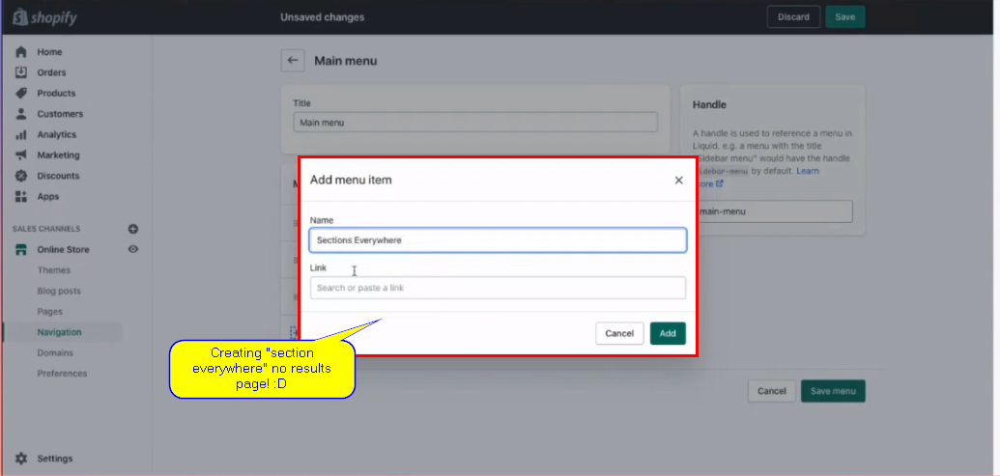
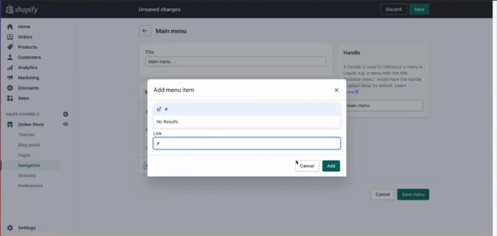
- `{{ | plus: Kelly }}`: "🤣 I won't take that personally 🤣"
  - `{{ | plus: Kelly }}` was saying it in a funny crying voice 🤣
- `{{ Kelly | }}`: "🤣"
- `{{ | plus: Kelly }}`: "This is good though. No, like. How many of you... For some of you this this may I'm hoping, for some of you, this is new. For others, you may have done this once upon a time. I feel like I've done this once upon a time but it's good to go over it again and just check to know wha you do know, what you don't and hopefully just by watching it then you get that same experience of just going through it again. 🆗 leaderboard, episodes, rewards, sections everywhere and we've got cart, we've got login..."
- `{{ Kelly | }}`: "That should be good for now."
- `{{ | plus: Kelly }}`: "Good for now!? 🆗"
- `{{ Kelly | }}`: "Yeah"
- `{{ | plus: Kelly }}`: "Take a look. There we go!"
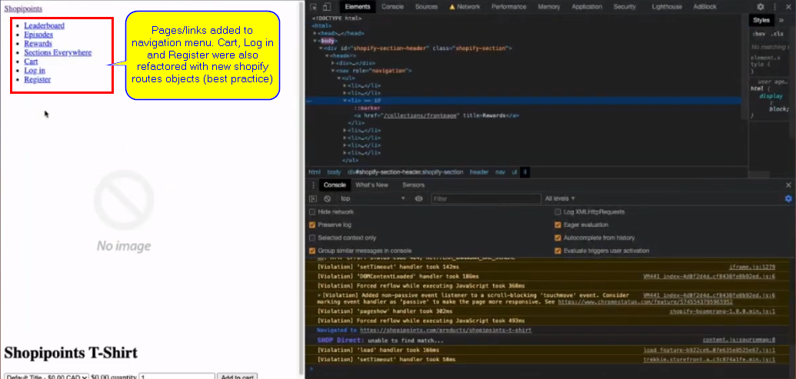
- `{{ Kelly | }}`: "We have pages!!!"
- `{{ | plus: Kelly }}`: "We have pages. Our header is no longer `<h1>` though. What happened there?"
- `{{ Kelly | }}`: "You're on a page. You're not on the homepage right now."
- `{{ | plus: Kelly }}`: "Im not! Oh! That's why 🆗. Uh, :cool: We're on [Shopipoints](https://shopipoints.com) T-Shirt. Let's go to the homepage"
- `{{ Kelly | }}`: "Entering 82 collections in a menu is long!!! Yes it is. It'd be really great if you could build menus via the API but that is a dream!"
  - `{{ Kelly | }}` was reading a comment from [kuipou] saying "Entering 82 collections in a menu is looonnggg"
- `{{ | plus: Kelly }}`: "I do write these things down. If anyone has any ideas like this, especially when it comes to APIs this is all developer experience, ultimately. An online store is particularly behind on the APIs game compared to the rest of Shopify"
- `{{ Kelly | }}`: "Yep"
- `{{ | plus: Kelly }}`: "So, there's a growing interest in how far behind it is, I'd say"
- `{{ Kelly | }}`: "Can you add to that list, exposing the sections files to the API!?"
- `{{ | plus: Kelly }}`: "Exposing the section files to the API!? 🤔"
- `{{ Kelly | }}`: "So if you go in the Admin portal and click on settings, sorry not section files, setting files,"
- `{{ | plus: Kelly }}`: "Oh! yeah yeah!"
- `{{ Kelly | }}`: "those are files that are specific to the store if you upload like via the Theme customizer or something like that"
- `{{ | plus: Kelly }}`: "Yep! Yep!"
- `{{ Kelly | }}`: "They cannot be copied to another store or downloaded or anything like that except one by one"
- `{{ | plus: Kelly }}`: "That one I've heard before. That one is... I'm hopeful for that one. There's been talk of that one, so yeah. I think there might be something coming for that, well I'm not sure where it's at right now, let's leave there..."
- `{{ Kelly | }}`: "😆 I think I ma or may not be able to discuss this on this stream."
- `{{ | plus: Kelly }}`: "There's no timeline... Yeah. I think it's good to at least like, we hear... at least let people know that we're aware of some fo the pain points 😆"
- `{{ Kelly | }}`: "Yes"
- `{{ | plus: Kelly }}`: "when people are saying 'Oh! We really need this thing' that yeah it is being received and I mean a lot of the reasons why if you don't see something yet, it's like Shopify is the company that will die of having too many things to do. It's crippled by choice, so picking the right things to do, the most the biggest most impactful things is one of the hardest things..."
- `{{ Kelly | }}`: "It'll also be hiring 2021 new developers in 2021 to help support this! 😁"
- `{{ | plus: Kelly }}`: "Which means that'll pay off in a few years, which means we'll be able to do stuff 🤣"
- `{{ Kelly | }}`: "Alright 2024! Let's do this! 🤣"
- `{{ | plus: Kelly }}`: "Once we onboard all those developers 🤣. There we go. We'll get it in 2024 🤣 Umm! 🆗 We've got... Do we want to start leaderboard? What do we feel like?"
- `{{ Kelly | }}`: "What don't we... What are we doing? What's our goal here? Are we continuing to build out Sections or are we wanting to go ahead and style our navigation menu so it's not in one long ass list?"
- `{{ | plus: Kelly }}`: "I'm :OK: with the long ass list right now, to be honest."
- `{{ Kelly | }}`: "🆗"
- `{{ | plus: Kelly }}`: "I'm wanting to just get the content in, as we see fit. Homepage... What we want, we can have"
- `{{ Kelly | }}`: "What we need in terms of sections that I would add, and actually we can probably work with what's in 'Debut', like a 'Hero', introductory text, like a rich text, maybe some featured rewards and then a section where we can pull in the articles from their blog, with the most recent episodes."
- `{{ | plus: Kelly }}`: "mm-hmm"
- `{{ Kelly | }}`: "I think that's where I'd probably start the homepage"
- `{{ | plus: Kelly }}`: "So the 'Hero' we can maybe take a cue from Twitch!? We can have the stream like if we're live, we could have the stream as the 'Hero'!? Would that be cool!?"
- `{{ Kelly | }}`: "That would be cool"
- `{{ | plus: Kelly }}`: "That way you can land on [shopipoints.com](https://shopipoints.com) and we're live, you see the stream."
- `{{ Kelly | }}`: "🆗"
- `{{ | plus: Kelly }}`: "And then below that"
- `{{ Kelly | }}`: "Otherwise it can show like a fixed"
- `{{ | plus: Kelly }}`: "Otherwise it can show, yeah, like a fixed text or fixed image"
- `{{ Kelly | }}`: "🆗"
- `{{ | plus: Kelly }}`: "And then"
- `{{ Kelly | }}`: "One thing, there was also a comment on the chat. 'One thing I would really want is UI for meta data', which, yes, being able to edit meta fields directly within the admin instead of through a third-party app would be stellar"
  - Comment came from [kuipou], in the chat.
- `{{ | plus: Kelly }}`: "That one's been heard too. I've got good feelings about that one too [kuipou]"
- `{{ Kelly | }}`: "😄 also your camera's frozen again"
- `{{ | plus: Kelly }}`: "Are you serious! Ah!!! 😆"
- `{{ Kelly | }}`: "I think you need to buy another usb hub"
- `{{ | plus: Kelly }}`: "I gotta figure out what's... I mean, I can just plug my camera directly in"
- `{{ Kelly | }}`: "Or that!"
- `{{ | plus: Kelly }}`: "To my laptop instead of using the usb-c hub. There we go. There"
- `{{ Kelly | }}`: "That's better!!!"
- `{{ | plus: Kelly }}`: "🆗 So, do you want to continue on the homepage? Or"
- `{{ Kelly | }}`: "I say... I always work.. I do header, homepage, footer and then I start going in into informational pages, so"
- `{{ | plus: Kelly }}`: "And, uh! wait. Say that again"
- `{{ Kelly | }}`: "Header"
- `{{ | plus: Kelly }}`: "I was reading [dan]'s comment"
  - Comment was by [bao_dangamble]
- `{{ Kelly | }}`: "😆"
- `{{ | plus: Kelly }}`: "on 'love it when Tom gets good feelings'. I was a little distracted by that! Yeah! 😆"
- `{{ Kelly | }}`: "😆 I do header and then all the homepage sections and then the footer before I start going onto another page, informational page."
- `{{ | plus: Kelly }}`: "So you always start with the homepage."
- `{{ Kelly | }}`: "I always start with the homepage because usually on the homepage you're able to establish a lot of reusable sections and content between the header and footer obviously being visible on every single page and then you can start building out some sections that might be able to be reused on informational pages"
- `{{ | plus: Kelly }}`: "Head to toes. [kuipou] says 'head to toes'."
- `{{ Kelly | }}`: "Head to toes"
- `{{ | plus: Kelly }}`: "🆗 let's do that then. So we've got, uh! Let me commit our headers"
- `{{ Kelly | }}`: "Yeah"
- `{{ | plus: Kelly }}`: "because I do have a PR (Pull Request) open for that"
- `{{ Kelly | }}`: "This is... Did we start with a brand like a completely empty theme? I don't remember."
- `{{ | plus: Kelly }}`: "Yes we did."
- `{{ Kelly | }}`: "🆗 So we need to build out each of these individual sections"
- `{{ | plus: Kelly }}`: "And what, I like have no problem, I'm not trying to do everything from scratch. I'm happy like especially just to move things along, I'm happy looking at pre-existing examples, like this is how developers work"
- `{{ Kelly | }}`: "We reuse code"
- `{{ | plus: Kelly }}`: "Is through high quality examples. It's kind of Shopify's for not having more of that easily accessible. That's something else that we know! 😂"
- `{{ Kelly | }}`: "😂"
- `{{ | plus: Kelly }}`: "I have a reasonably good feeling about that! 😂 Not as good of a feeling... No!! 🤣"
- `{{ Kelly | }}`: "🤣"
- `{{ | plus: Kelly }}`: "We're aware of that one. Me more than most... Git commits. There we go. 'Finish up the header'"
- `{{ Kelly | }}`: "Uh! Comments saying 'I'm also a web designer since 20 years and I always done it how `{{ Kelly | }}` does it too.' I started coding when I was 11. I've been very stuck in my ways for also 20 years, so."
- `{{ | plus: Kelly }}`: "Yeah"
- `{{ Kelly | }}`: "If it works, it works."
- `{{ | plus: Kelly }}`: "If it works! It works and then also like it's amazing what sticks over time and then what kind of where you loose the... It's like riding a bike in some ways, you always remember parts of it but yeah it's definitely like you see it if you ever interview somebody more senior and they've been in just working in somewhere else and now they're interviewing to do just more, say HTML, for example, if you haven't been living and breathing that every day for a few months at least like the muscle memory is slow, it takes a while to get back up"
- `{{ Kelly | }}`: "Yeah"
- `{{ | plus: Kelly }}`: "To get back up on the horse 😂"
- `{{ Kelly | }}`: "Uh! Before, I know we're about out of time. We have five minutes remaining, I did want to shout out that app"
- `{{ | plus: Kelly }}`: "Let's do it"
- `{{ Kelly | }}`: "That was so yeah. I need to find a link to it real fast"
- `{{ | plus: Kelly }}`: "You're not sharing your screen are you? No"
- `{{ Kelly | }}`: "No no"
- `{{ | plus: Kelly }}`: "So I'll post it on mine"
- `{{ Kelly | }}`: "I'll just post a link to it in the chat. Yeah! If you can."
- `{{ | plus: Kelly }}`: "🆗"
- `{{ Kelly | }}`: "Wow! This is a lot of conversation. 🆗 Maybe I'll just search for it, actually I sent you the link. That'd be faster."
- `{{ | plus: Kelly }}`: "On... Oh yeah"
- `{{ Kelly | }}`: "On [Slack](https://shopifypartners.slack.com/archives/C01P5EKJ29E)"
- `{{ | plus: Kelly }}`: "On [slack](https://shopifypartners.slack.com/archives/C01P5EKJ29E) earlier"
- `{{ Kelly | }}`: "There it is"
- `{{ | plus: Kelly }}`: "Wait. Did you..? you didn't post it"
- `{{ Kelly | }}`: "I am right now!!! So"
- `{{ | plus: Kelly }}`: "Should we go to the website? Let's go to their website, not the app store listing"
- `{{ Kelly | }}`: "Oh, yeah yeah, [themedeploy.io](https://themedeploy.io). So if you have ever used [Netlify](https://www.netlify.com/) or [Vercel](https://vercel.com/experts/commerce-ui) you know if you... Oh! your camera's frozen again"
- `{{ | plus: Kelly }}`: "Yep"
- `{{ Kelly | }}`: "😂 Yeah"
- `{{ | plus: Kelly }}`: "I'm going to plug my camera directly"
- `{{ Kelly | }}`: "If you've ever used either [Netlify](https://www.netlify.com/) or [Vercel](https://vercel.com/experts/commerce-ui) you know if you link a github repository it'll automatically deploy your site. This app actually does the same thing but with Shopify themes. I have never used it before but it is a really really really cool idea, so you should try it out and then report back."
- `{{ | plus: Kelly }}`: "So, this concept of using Github as your main development workflow, I think people have been trying to do this for a while. There's another service available, [beanstalk](https://beanstalkapp.com/)"
- `{{ Kelly | }}`: "Yep"
- `{{ | plus: Kelly }}`: "That has done this. It has been around, I remember seeing this when I was onboarding at Shopify in 2015, which is... I am not sure how it compares to the [themedeploy app](https://themedeploy.io/). I do see in the pricing for [themedeploy](https://themedeploy.io/), let me open up your"
- `{{ Kelly | }}`: "Based on build minutes"
- `{{ | plus: Kelly }}`: "Yeah! There's build minutes in there, so that makes me think kind of Github Actions esque that you can customize what you want to do on deploy"
- `{{ Kelly | }}`: "Yeah"
- `{{ | plus: Kelly }}`: "I'm curious. Let's install this."
- `{{ Kelly | }}`: "🆗"
- `{{ | plus: Kelly }}`: "I want to 🆗 add app. [Shopipoints](https://shopipoints.com)... I think I have it set as a staff store so I can uh.. It should add it. As a shopify employee we get to try out all the apps for free as long as we're not actually using it for like one of our personal stores because then that's just shady, that's not fair, no."
- `{{ Kelly | }}`: "It's like creating your own Shopify store within the partners account and then expecting to get reps share for it so"
- `{{ | plus: Kelly }}`: "Yeah. No no no"
- `{{ Kelly | }}`: "That breaks the terms and conditions."
- `{{ | plus: Kelly }}`: "Yeah, we're held to terms and conditions too. There we go."
- `{{ Kelly | }}`: "That's right. It's called your employment contract"
- `{{ | plus: Kelly }}`: "Right! 🤣 Our penalty is maybe 🤣"
- `{{ Kelly | }}`: "🤣 A little bit more"
- `{{ | plus: Kelly }}`: "just as bad actually like yeah getting your app shutdown, getting fired that's about the same thing"
- `{{ Kelly | }}`: "Getting fired, you know, yeah."
- `{{ | plus: Kelly }}`: "Yeah, I mean if your app gets shutdown at least you might have other sources of revenue, off the bat."
- `{{ Kelly | }}`: "Yes."
- `{{ | plus: Kelly }}`: "So off course we're doing a live demo so I really hope this works out the gate. I'm sorry [themedeploy app](https://themedeploy.io/) if I'm showing a demo where something breaks unexpectedly"
- `{{ Kelly | }}`: "😄"
- `{{ | plus: Kelly }}`: "There's an authorize happening right now. It looks like it's hanging. 🆗 Let's go back to the uh... Let's go back to admin see what happened. Apps. [Themedeploy](https://themedeploy.io/) 🎶 Well"
- `{{ Kelly | }}`: "Maybe that is what the app does. It's like cool graphics"
- `{{ | plus: Kelly }}`: "It's sync.. It's deploying maybe right now because it's.. No. It looks like it's refreshing "
- `{{ Kelly | }}`: "..."
- `{{ | plus: Kelly }}`: "It's a redirect problem"
- `{{ Kelly | }}`: "I wonder if it's, yeah, it's an authenticate. Uh!"
- `{{ | plus: Kelly }}`: "Maybe it's something with my Shopify install... I don't know. We'll have to look at it. We'll get back to it but good shout out `{{ Kelly | }}`, I mean I really like to see people exploring this area. I'm sorry who's the developer's name?"
- `{{ Kelly | }}`: "His name is [Jonathan](https://twitter.com/jonchikly?lang=en)"
- `{{ | plus: Kelly }}`: "[Jonathan](https://twitter.com/jonchikly?lang=en). I will be reaching out if you are watching right now. I do want to talk to you because this is, like what you're proving here or you see the value in having a github workflow with themes because, I mean, this is what we, this is what most developers work with"
- `{{ Kelly | }}`: "Yeah"
- `{{ | plus: Kelly }}`: "It feels natural, why do you have to work through APIs? Why not use git? It's something I don't know if people remember me mentioning but like we've been looking into this at Shopify, it's been hacking, prototyping playing around with it. I mentioned on another stream I was in a hack days project where we were looking at something similar to this. It seems to be a common thread. Seems to be things that developers like, so more eyes on this the better, the more like yeah. This is open source, open collaboration it's proved to"
- `{{ Kelly | }}`: "Love it"
- `{{ | plus: Kelly }}`: "It's proved to be valuable so let's try that."
- `{{ Kelly | }}`: "I can make an introduction between the two of you so you can talk"
- `{{ | plus: Kelly }}`: "🆗"
- `{{ Kelly | }}`: "Well"
- `{{ | plus: Kelly }}`: ":cool:"
- `{{ Kelly | }}`: "We made it to 3pm and we built some menu links"
- `{{ | plus: Kelly }}`: "and we build yeah wait hold on, this is good, we have a full menu. I think, it' just... Audience! How is this format working because we are trying to just approach this in the like we come on and we code things. We are trying to minimize prep time. I'm trying to figure out how we can give the audience the most of what they need while also building out this whole store"
- `{{ Kelly | }}`: "Yeah. I'm wondering if like at some point we should build out some of these theme sections, save the homepage, ahead of time but I mean yeah if you enjoy watching us build these sections as well I'm more than happy to do it live, obviously it'll just take us a few more weeks to get the site ready but"
- `{{ | plus: Kelly }}`: "But that's"
- `{{ Kelly | }}`: "I enjoy the challenge of building sections, so...!"
- `{{ | plus: Kelly }}`: "Yeah and that's... I kind of like... We can have a functioning site if it's just HTML. This what I... We're not delivering this to a client"
- `{{ Kelly | }}`: "Yeah"
- `{{ | plus: Kelly }}`: "We're not setting this out to be like it has to look like all these other stores, e-commerce stores, or... I think this approach of 'let's just make it work with HTML and then the minimum amount of js we need' like when we said the Twitch, being able to see the Twitch stream as it's live like it's gonna be some kind of iframe or Twitch library we'll have to work with but"
- `{{ Kelly | }}`: "yeah I was just seeing what exits out there in terms of"
- `{{ | plus: Kelly }}`: "But if we can, I think, if we can focus on the fundamentals, work our way through it keep styles until we want to work on little bits of styles here and there, if people are okay with that then I'm like that's for me satisfying and that I'm getting back into something that I haven't touched in like three/four years it feels like, I don't know about you `{{ Kelly | }}`"
- `{{ Kelly | }}`: "I do this everyday, so"
- `{{ | plus: Kelly }}`: "Yeah."
- `{{ Kelly | }}`: "😂"
- `{{ | plus: Kelly }}`: "😂 I'm happy your on board then because this is"
- `{{ Kelly | }}`: "🤣 Yeah. It's totally fine. I definitely want to make sure that we're touching on the, you know, some of the more complex stuff and not just spending a week after week doing some basic HTML and CSS, so that was the only piece"
- `{{ | plus: Kelly }}`: "So that's where... So we will work through the parts that are taking time or just the redundant typing out of things, like Emmet, let's say, just getting back on top our Emmet game and being able to get stuff out quickly so that the audience isn't watching us type stuff out! I can see a value touching on like the docs, like the routes object and the request object and going into that, I see, I think, I hope people see value in that"
- `{{ Kelly | }}`: "mm-hmm"
- `{{ | plus: Kelly }}`: "[kuipou] says 'one thing that bothers me when using sections is that if the builder didn't include options it's really annoying'"
- `{{ Kelly | }}`: "Oh, like customizing it like everything is of hard coding set or hard-coded. Yeah! Each section should be more than just adding a section and being able to place it if you're on the homepage, so I definitely agree there"
- `{{ | plus: Kelly }}`: "And then [kuipou] says 'maybe do a quick recap video.' Yeah and that's, I'm talking with some colleagues about being some post-production, like picking out the kind of sweet spots of each episode and publishing a highlights that is if people are really in it for the kind of quick learns and less for the following along and interacting side that should be, we should make the most valuable content accessible."
- `{{ Kelly | }}`: "You know what we should do? We should add a search functionality to the header and then create some kind of query, like in JavaScript, to count how many times people search for 'sections everywhere'"
- `{{ | plus: Kelly }}`: "😂 One [Shopipoints](https://shopipoints.com) per search, yeah!"
- `{{ Kelly | }}`: "Wow! 🆗"
- `{{ | plus: Kelly }}`: "🤣 We'll just get spammed"
- `{{ Kelly | }}`: "Maybe like a half [Shopipoints](https://shopipoints.com)"
- `{{ | plus: Kelly }}`: "Yeah, 🆗 😂"
- `{{ Kelly | }}`: "😂 You gotta work for it"
- `{{ | plus: Kelly }}`: "🤣 🆗 Final comment just because I want to make sure that I give everyone a shout out who's commenting here. [gmgregory] says 'I think most of us know the basics of Shopify theme dev, I'd like to see a built complex example that you walk through how it's built and why you approached it that way.' That's fair enough. So, I think that if we can mix in pre-existing examples and if we're so, yeah, 🆗 So we'll find a sweet spot here, between like typing stuff in or like working through stuff live and then bringing in examples and walking through them. Ultimately, all this code will be available in PRs"
- `{{ Kelly | }}`: "Yep"
- `{{ | plus: Kelly }}`: "So that you will be able to copy it I guess or reference it"
- `{{ Kelly | }}`: "And [sHHr] says 'Use the predictive search API'"
- `{{ | plus: Kelly }}`: "Yeah, so that's a good example of something like we'd have the frame of it setup and then we can dig into like why, how is this JS working to 'cancel' requests, like why, because I know that was part of the predictive search you have the library includes a way of 'cancelling' a pending request. Anyways, :cool:"
- `{{ Kelly | }}`: "things to look at. 🆗 I think that's good for this week though."
- `{{ | plus: Kelly }}`: "That's good!"
- `{{ Kelly | }}`: "We'll be back next week. I'm enjoying this every week schedule. It gives me something specific to do on Wednesdays from 2pm to 3pm Eastern"
- `{{ | plus: Kelly }}`: "Yeah! Same. I hope everyone is enjoying it too. Please join us next Wednesday at 2pm Eastern, just like this week with hopefully `{{ Kelly | }}`will be able to use her fancy microphone next time otherwise"
- `{{ Kelly | }}`: "and maybe connect, you know, hardwired."
- `{{ | plus: Kelly }}`: "And maybe hardwired! I will put my camera directly into my laptop so it doesn't freeze and we will have a bug free stream 🤞."
- `{{ Kelly | }}`: "We shall see 🎶"
- `{{ | plus: Kelly }}`: "We shall see 🎶"
- `{{ Kelly | }}`: "🆗"
- `{{ | plus: Kelly }}`: "Yeah, right! 🆗 See ya 🙋‍♂️"
- `{{ Kelly | }}`: "🙋‍♀️ Bye everyone"

 

* * *

 

### Legend

 
`{{ Kelly | }}` = [Kelly Vaughn](https://www.linkedin.com/in/kellyvaughn/)

 

 
`{{ | plus: Kelly }}` = [Thomas Kelly](https://github.com/t-kelly)

 

* * *

 

### More links

- Slate: <https://shopify.github.io/slate/docs/about>
- Excelify - Bulk Import Export Update & Migrate Shopify Data: <https://excelify.io/>
- Rewind - Protect the data your Shopify store relies on: <https://rewind.com/products/backups/shopify/>
- Visual Studio Code - Real-time collaborative development:
  - <https://visualstudio.microsoft.com/services/live-share/>
  - <https://docs.microsoft.com/en-us/visualstudio/liveshare/quickstart/share>
- JSX - A syntax extension to JavaScript: <https://reactjs.org/docs/introducing-jsx.html>
- Document Oject Model (DOM) - programming interface for HTML and XML: <https://developer.mozilla.org/en-US/docs/Web/API/Document_Object_Model/Introduction>
- Template Object: <https://shopify.dev/docs/themes/liquid/reference/objects/template#template-name>
- International domains: <https://help.shopify.com/en/manual/online-store/os/domains/managing-domains/international-domains>
- Google Fonts: <https://fonts.google.com/>
- MyFonts - Offers the largest selection of professional fonts for any project: <https://www.myfonts.com/>
- Helvetica font: <https://www.myfonts.com/fonts/linotype/helvetica/>
- Emmet:
  - <https://code.visualstudio.com/docs/editor/emmet>
  - <https://docs.emmet.io/cheat-sheet>
- Topo - Anti-Fatigue Mat: <https://www.amazon.com/dp/B00V3TO9EK?ots=1&slotNum=22&imprToken=74bbb4b6-02ad-0e74-133&ascsubtag=[]st[p]cjmht7wgc00bo0xy60lq2zt2e[i]9PsW0M[t]w[r]google.com[d]D[z]m&tag=thestrategistsite-20>
- shopipoints.com: <https://shopipoints.com>
- Slack Partner - `{{ Kelly | plus: Kelly }}` Channel: <https://shopifypartners.slack.com/archives/C01P5EKJ29E>
- Beanstalk - A complete workflow to write, review & deploy code: <https://beanstalkapp.com/>
- Netlify - Develop & deploy the best web experience in record time: <https://www.netlify.com/>
- Vercel - Develop. Preview. Ship. For the best frontend teams: <https://vercel.com/>
- Jonathan Chikly: <https://twitter.com/jonchikly?lang=en>
  - /YYT - Crafting next generation eCommerce: <https://yyt.dev/>
  - Themedeploy.io - A simple and robust deployment pipeline for Shopify: <https://themedeploy.io>
