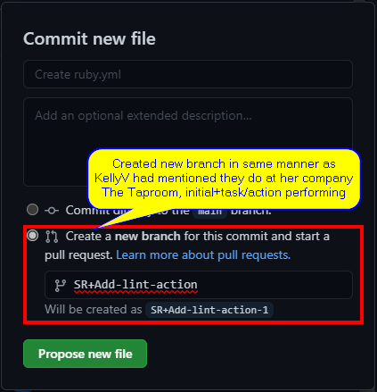

# [{{ Kelly | plus: Kelly }} Linting + Continuous Integration - Dec 9, 2020](https://www.youtube.com/watch?v=bvX6YDh4euM)

about linting. we will be getting a bit more into that. This leads us to continuous integrations (CI), automatic linting.

* * *

Subscribe to our channel for more videos about developing and designing ecommerce stores, apps, and themes with Shopify » www.youtube.com/shopifydevs​

Looking for more information about developing on Shopify check out www.developers.shopify.com and [https://shopify.dev/​](https://shopify.dev/%E2%80%8B)

Connect with us on Twitter » www.twitter.com/shopifydevs

Launch your own online store by visiting Shopify and starting your free trial » <http://bit.ly/VisitShopify>​

* * *

  

Notes:

- `{{ | plus: Kelly }}`: affective that morning a new changelog was put out. There is a new proxy feature for the script tag API.
- `{{ | plus: Kelly }}`: The script tag API allows us to register a javascript file to be loaded in a particular storefront. Typical use case would be an app that integrates with a storefront that would alert/notify saying that they need to include this JavaScript and that it's part of the app and it needs it to load on the page. It then asks to be registered and the the script gets "automagically" registered and gets included in the store. That's Shopify's responsibility.
- `{{ | plus: Kelly }}`: problem with [`ScriptTag`](https://shopify.dev/docs/admin-api/rest/reference/online-store/scripttag) api was that script needed to be hosted by the developer or on a service of some sort, not shopify's service. Because the script is hosted on another service, that is external, to get this script it has to typically do a dns lookup and then you have to connect to another server while the page is loading and that process just slowed things down because it's on another domain. So what this change to the [`ScriptTag`](https://shopify.dev/docs/admin-api/rest/reference/online-store/scripttag) API provides for for developers is that instead of the script being served from an external source, it can now be served from shopify CDNs.
- Shopify is up to three CDNs now, `{{ | plus: Kelly }}` believes.
- Fastly is one of the CDNs and is most likely serving North America (NOAM).
- To enable this new feature in [`ScriptTag`](https://shopify.dev/docs/admin-api/rest/reference/online-store/scripttag), we need to set `"cache": true`. Default is `false`.
- Section everywhere still being worked on and will be released once ready, so as to not have a repeat of last spring when dev preview was pulled.

 

## Linting

 

- In package.json, for linting, `{{ | plus: Kelly }}` updated the file, offline.
- I checked the repo for the updates and I don't see those changes. Will let `{{ | plus: Kelly }}` know next stream.
- So, in the package.json file we have a few updates, shown in screenshot below.
    
    
    
- The dev dependencies in package.json are what are doing our linting.
- The `extends` and/or `overrides` are for ESLint as it does not yet handle top level `await`
- `{{ Kelly | }}`: uses `ESLint` from VSCode extension marketplace to help with linting when she codes. She also has it to where linting would "scream" at her on save. Issues with linting would then show up in the "Problems" tab
    
- To enable auto linting for the ESLint extension, we have to go to it's settings and enable the feature.
- We can also have it so that it just fixes issues that are fixable without having to warn us about the issue and/or the fixed issue.
- `{{ Kelly | }}`: This is especially useful for proper spacing, semicolons, etc. based on however we defined our rules.
    
- ESLint Auto Fix is great, it can also be a crutch, which could substract from your learning.
- `{{ Kelly | }}`: believes that it is useful to learn how to properly create a function.
- `{{ Kelly | plus: Kelly }}` touched on JavaScript's `const`, `let` and `var`.
  - [`const`](https://developer.mozilla.org/en-US/docs/Web/JavaScript/Reference/Statements/const): value cannot be changed through reassignment, and it can't be redeclared.
  - [`let`](https://developer.mozilla.org/en-US/docs/Web/JavaScript/Reference/Statements/let#description): variables that are limited to the scope of a block statement, or expression on which it is used. Also, `let` is initialized to a value only when a parser evaluates it.
  - [`var`](https://developer.mozilla.org/en-US/docs/Web/JavaScript/Reference/Statements/var#description): declarations, wherever they occur, are processed before any code is executed. This is called hoisting.
- if you are running [ohmyz.sh](https://ohmyz.sh/) (macOS) or [Powerline](https://docs.microsoft.com/en-us/windows/terminal/tutorials/powerline-setup) (PowerShell/Terminal/Bash) and you start typing the branch name then hit `tab`, it autofills for you.
- There seems to be a theme especially for bash in the same vain as ohmyz.sh called [`Oh-My-Bash`](https://ohmybash.nntoan.com/).
- Another tool for our toolkit in dealing with linting is `hysky.js`. `{{ | plus: Kelly }}` says that husky.js is an easy way of assigning tasks command line to git.

 

## Continuous Integration

 

- `{{ Kelly | }}`: Continuous Integration (CI) is the process of automating the build and testing of code every time a team member commits changes to version control... What is really being talked about here, especially where Github is concerned, utilizing [Github actions](https://github.com/features/actions) to built in som of these continuous integration kind of tools.
- `{{ | plus: Kelly }}`: CI is pretty much having something run after a particular event. That (those) something can be a particular code, or some scripts, or some command lines when particular even is triggered. Used when push code to a repo like Github, commit, open up a PR, pretty much anything.
- `{{ Kelly | }}`: The Taproom has a Github action that triggers a slack message in a channel called "Pull Requests" when any of the developers there opens a "Pull Requests". This because code reviews are required at The Taproom for all PRs, which helps with mitigating as many errors as possible and also helps new devs with having extra pair of eyes.
- `{{ Kelly | }}`: There is a [marketplace](https://github.com/marketplace?type=actions) for Github Actions. One Github Actions marketplace example is [`Vercel`](https://github.com/marketplace/actions/vercel-action). When deploying a site to `vercel`, the way that the action works is that when a commit or `pull request` is opened, it automatically generates a deploy preview, which can be shared as needed.
- `{{ | plus: Kelly }}`: Github Actions live inside the Github folder and Workflows conveniently live in the workflows folder. Workflows are a list of Github Actions. Even though we may go to the Actions tab in our Github repo and setup Actions, they live in our repo as Workflows.
- `{{ | plus: Kelly }}`: Actions are tasks/steps. If we want to create an `Action`, it creates its own repo and it needs an `action.yml`, which specifies the what the `Action` does, what version of node does it use, etc. Now, for some reasons Github does not allow you to use node v14 (at least at time of webcast), which allows us to use top level `await`.
- There seems to be a way to setup [`Github Actions`](https://github.com/actions/setup-node) to use node v14.
- I thought I had missed the timeline of when we setup the Action. I went back, in the timeline, to the time before `{{ Kelly | plus: Kelly }}` started to speak on Github Actions and I did not miss anything. 🤣🤣 `{{ | plus: Kelly }}` seems to have worked on this offline and is pulling from git, `git pull origin main --rebase`, an `action` that was already setup.
- I was able to find the action that `{{ | plus: Kelly }}` might have chosen to setup. The `Node.js action`, however, has changed and looks to be using more up-to-date `syntax`. So, to "install" the action, I went to actions and chose node.js under the Continuous Integration section of Actions that were suggested to me, with no Actions yet installed. When an action already exist, we just need to click on New workflow and we will see same "dashboard" that came up when initially coming to Actions.

- Now, once that was done, I clicked on "Start commit", chose "Create a new branch for this commit and start a pull request", then clicked on "Commit new file". I then created a new pull request, merged the changes and instead of deleting the branch I created, I left it there because we are using it in the webcast to make changes and commit to. Don't know if that is best practice or not, just made sense to me :D.

- `Pull Request`. Now, errors may come up, don't worry about those at the moment as they are not merge issues, just `syntax` failures as, one, we don't have Ruby in this project, two, we don't have `npm test` set up in this project either.

- Once the changes are merged, go ahead and either delete your branch, best practice, or leave it, make sense to me (possibly not best practice), if you are thinking of still working on same task once `pulled` locally.

- Now once main has been updated, run `git pull origin main --rebase`, as `{{ | plus: Kelly }}` has done in the stream.
- As I am not well verse in git, just starting, here is [Github's doc](https://docs.github.com/en/github/using-git/about-git-rebase) on `rebase`.

- Don't know why the [`npm run build --if-present`](https://docs.github.com/en/actions/guides/storing-workflow-data-as-artifacts#uploading-build-and-test-artifacts) is there or why now we have [`with: node-version: ${{ matrix.node-version }}`](https://docs.github.com/en/actions/reference/workflow-syntax-for-github-actions#jobsjob_idstrategymatrix). I included Github Actions doc links to what I believe may explain why or give an idea.
- what is this `strategy.matrix` thing? According to the `Actions` [Github docs](https://docs.github.com/en/actions/reference/workflow-syntax-for-github-actions#jobsjob_idstrategymatrix), "A matrix allows you to create multiple jobs by performing variable substitution in a single job definition. For example, you can use a matrix to create jobs for more than one supported version of a programming language, operating system, or tool".
- On a side note, if working on multiple environments, [`runs-on`](https://docs.github.com/en/actions/reference/workflow-syntax-for-github-actions#jobsjob_idruns-on) needs to be set up with the varied machines to run the job on.

- Going back to `{{ Kelly | plus: Kelly }}`'s talk on Actions, Github Actions are workflows on in our repo, which are list of tasks/jobs. Github actions live in the Github Actions marketplace.
- `{{ | plus: Kelly }}`: If force pushing use plus sign in front of the branch name, e.g. `git push origin +Add-lint-action`. It supposed to be safer and best practice. `{{ | plus: Kelly }}` does not remember as to the reason why it is safer.
- I made the necessary changes locally regarding node.js linting that was set up.  Went ahead and performed a git push origin +SR+Add-linting-action, as was done by `{{ | plus: Kelly }}`. Followed best practice and deleted the branch this time, since I believe that I am caught up to the Kellys now.
- In Github settings we can enable/force that lint errors be resolved before allowing merging of `pull requests.`

- If you decide to upgrade from the free version of github, to use this feature then your branch window will look like the screenshot below.

- after clicking "Add rule" and I was brought to the "Branch Protection Rule" page, I am able to make the necessary selections, as I follow `{{ | plus: Kelly }}`, on the stream.

- Alright, we are at time.
- `{{ Kelly | plus: Kelly }}` went ahead and commited, pulled and merged the changes made thus far in this cast.
- They are answering some questions, of which one of them is about @`{{ Kelly | }}`'s The Taproom build process. As stated in the `{{ Versioning + Linting }}` stream, in theming, each Dev work on there own duplicated version of the "Live" theme name as so `[Dev] SR` for the Development part. As for staging, they would then duplicate the "Live" theme again and version it based on what was changed in the Deving part, like `[1.0.0] Name of theme`, using [semantic versioning](https://semver.org/). The staging branch is what they work with the client on and once everything is acceptable to the client, then they go ahead and publish to the "Live" version.

 

* * *

 

### Legend

 

- `{{ Kelly | }}` = [Kelly Vaughn](https://www.linkedin.com/in/kellyvaughn/)

- `{{ | plus: Kelly }}` = [Thomas Kelly](https://github.com/t-kelly)

 

* * *

 

### Links

 

- [The Taproom - Build Process: Liquid settings for JS and CSS](https://github.com/the-taproom/build-process/blob/main/setup-docs/liquid-settings-for-js-css.md)
- `NPM Packages`:
  - [@Shopify/eslint-plugin](https://www.npmjs.com/package/@shopify/eslint-plugin)
  - [@Shopify/stylelint-plugin](https://www.npmjs.com/package/@shopify/stylelint-plugin)
  - [@babel/core](https://www.npmjs.com/package/@babel/core)
  - [@babel/eslint-parser](https://www.npmjs.com/package/@babel/eslint-parser)
  - [@babel/plugin-syntax-top-level-await](https://www.npmjs.com/package/@babel/plugin-syntax-top-level-await)
- [Killed by Google](https://killedbygoogle.com/)
- [Oh-My-Bash](https://ohmybash.nntoan.com/)
- [Git rebase](https://docs.github.com/en/github/using-git/about-git-rebase)
- [`npm ci`](https://docs.npmjs.com/cli/v7/commands/npm-ci)
- [`Build`](https://docs.github.com/en/actions/guides/storing-workflow-data-as-artifacts#uploading-build-and-test-artifacts)
- [`Matrix`](https://docs.github.com/en/actions/reference/workflow-syntax-for-github-actions#jobsjob_idstrategymatrix)
- [Github Actions > About continuous integration](https://docs.github.com/en/actions/guides/about-continuous-integration)
- [Semantic Versioning](https://semver.org/)
