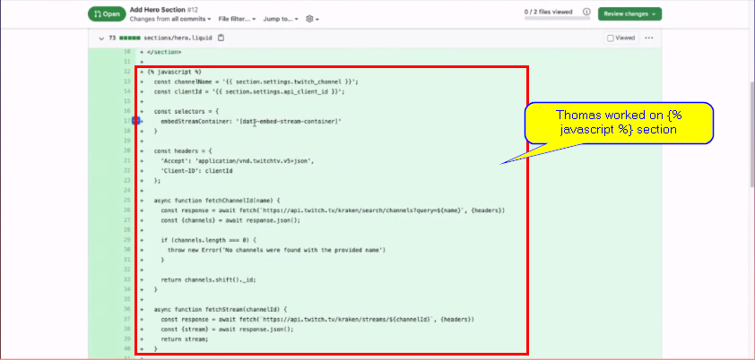
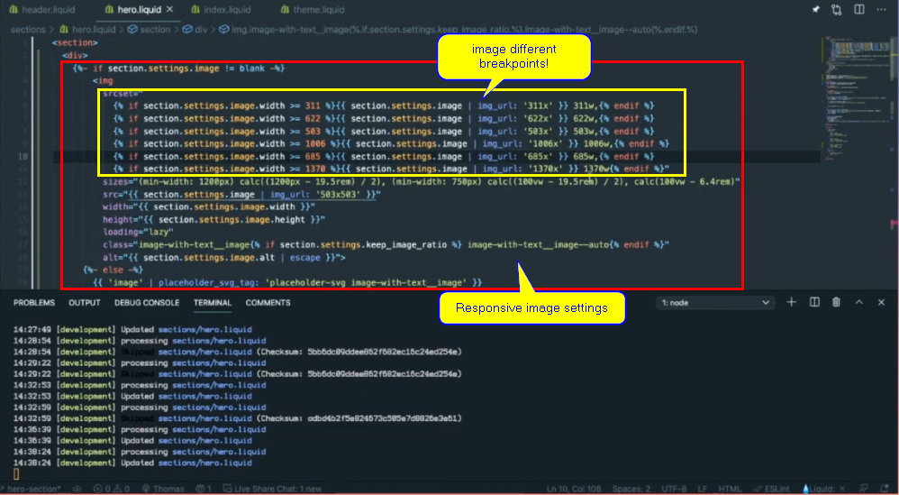
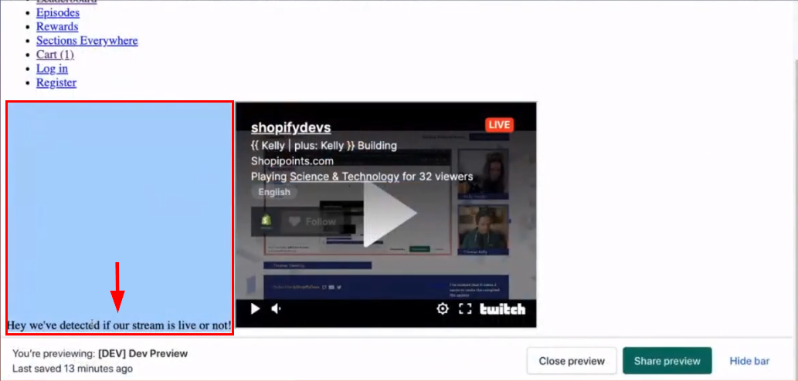
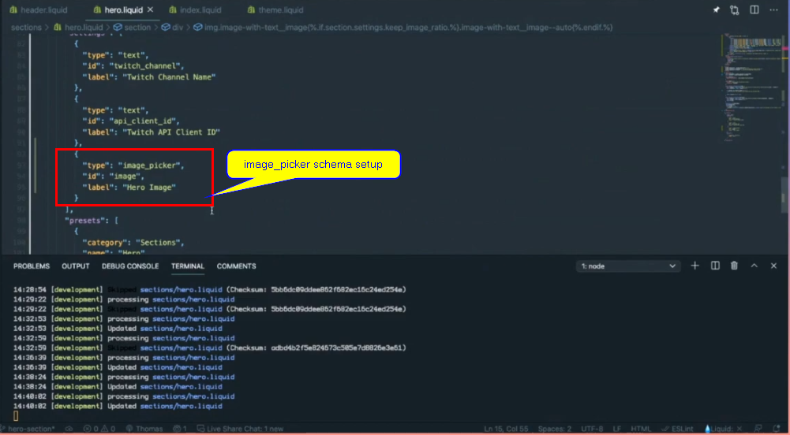
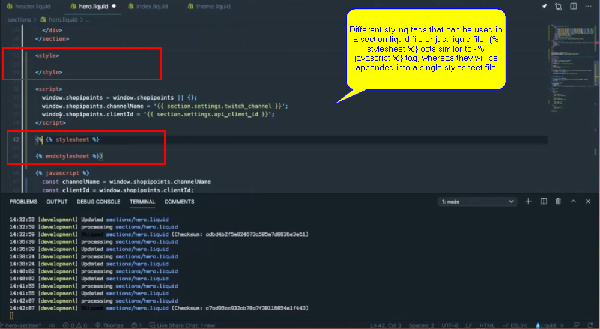
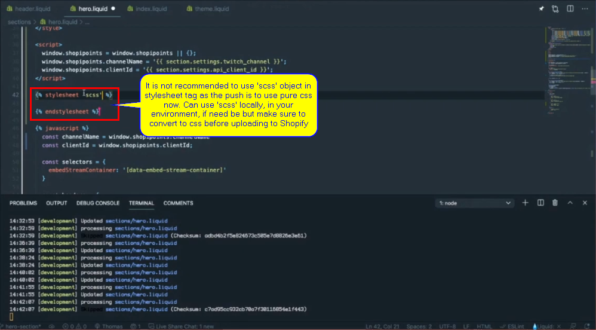
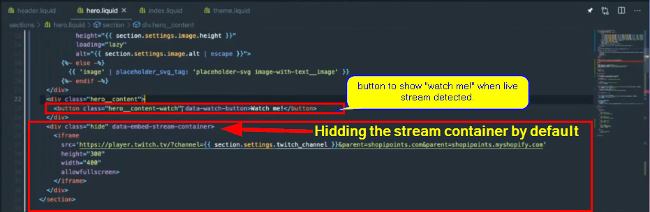

# [{{ Kelly | plus: Kelly }} Building out the home page hero section – February 17th, 2021](https://www.youtube.com/watch?v=Stb0rMAMk6M)

In this stream, we continue building out our online store's home page Hero section, making it more performant by dynamically injecting intensive components (the twitch stream) on-demand and not on page load! We also talk about:

- Theme Section  tag
- Working with CSS Variables
- Responsive Images
- How to approach styling a section

Follow the build LIVE every Wednesday @2PM EST at https://twitch.tv/shopifydevs​. Code available at https://github.com/t-kelly/shopipoint...​

Helpful Links:
- Pull Request (code) - https://github.com/t-kelly/shopipoint...​

***

Subscribe to our channel for more videos about developing and designing ecommerce stores, apps, and themes with Shopify » www.youtube.com/shopifydevs​

Looking for more information about developing on Shopify check out www.developers.shopify.com and https://shopify.dev/​

Connect with us on Twitter » www.twitter.com/shopifydevs

Launch your own online store by visiting Shopify and starting your free trial » http://bit.ly/VisitShopify

***

## Transcription/Notes

- `{{ | plus: Kelly }}`: "And is my camera still frozen?"
- `{{ Kelly | }}`: "No"
- `{{ | plus: Kelly }}`: "Yeah!!!"
- `{{ Kelly | }}`: "your camera's no longer frozen 🤣"
- `{{ | plus: Kelly }}`: "🤣 I've gently tried to fix this camera freeze that we'll probably encounter once again on our stream but we have started on time. Hello everyone! Hello everyone in the chat"
- `{{ Kelly | }}`: "Hello"
- `{{ | plus: Kelly }}`: "Hello `{{ Kelly | }}`"
- `{{ Kelly | }}`: "Hello!"
- `{{ | plus: Kelly }}`: "Hello and funny sneaking"
- `{{ Kelly | }}`: "How is your Wednesday?"
- `{{ | plus: Kelly }}`: "there you know. It's not like we weren't chatting during the countdown"
- `{{ Kelly | }}`: "Oh, no!"
- `{{ | plus: Kelly }}`: "No 😁"
- `{{ Kelly | }}`: "I just showed up here"
- `{{ | plus: Kelly }}`: "Yeah 😁"
- `{{ Kelly | }}`: "Like two seconds ago 😁 So we're good! 😁"
- `{{ | plus: Kelly }}`: "It's funny, the uh! 🤣 We have the video call going during the countdown and it's like 'are we sure other people can't hear us right now?'"
- `{{ Kelly | }}`: "🤣"
- `{{ | plus: Kelly }}`: "checking on the phone and listening, 🆗 no no I just hear the music that's fine"
- `{{ Kelly | }}`: "🤣 We can't let you know all of our secrets before we can tell you 🤣"
- `{{ | plus: Kelly }}`: "There's some really big secrets being discussed on during the Twitch countdown. Yeah! To be a fly on that wall audience."
- `{{ Kelly | }}`: "So, I sit there and watch the countdown go down like alright, I have to finish my thought with at least 60 seconds to spare just in case 😂"
- `{{ | plus: Kelly }}`: "😂 Who is in the chat? Let's see I still don't know how to actually check to see everyone who's in the chat other than people who talk so I'm going to rely on people who talk. We got the"
- `{{ Kelly | }}`: "I think that's the only way to see it."
- `{{ | plus: Kelly }}`: "I do have a way of seeing all the viewers because I do see like we have 25 viewers right now, hello 25 people! [davidwarrington]. We got [roberttables] dubbed as Kelly. [kuipou]"
- `{{ Kelly | }}`: "[kuipou] is Chris"
- `{{ | plus: Kelly }}`: "Oh! Chris! Hey Chris. [CarlosAlfaroDev]. [tripstar1]. [Tikio88]. [CodeBrotha] Hello."
- `{{ Kelly | }}`: "[sidro01]"
- `{{ | plus: Kelly }}`: "[sidro01]. So for those of you who haven't tuned in before, I feel like we should do a right we need an intro you know like for those who are new to"
- `{{ Kelly | }}`: "👩‍🎤 'It's the `{{ Kelly | plus: Kelly }}` show' 🎶"
- `{{ | plus: Kelly }}`: "🎶"
- `{{ Kelly | }}`: "You're welcome!"
- `{{ | plus: Kelly }}`: "🆒"
- `{{ Kelly | }}`: "It's my backup career! 😂"
- `{{ | plus: Kelly }}`: "I'll make a clip of that and we'll just use that for every stream now."
- `{{ Kelly | }}`: "🤣"
- `{{ | plus: Kelly }}`: "🤣"
- `{{ Kelly | }}`: "🆗 Perfect!"
- `{{ | plus: Kelly }}`: "🆗 🆒 For first time viewers here, welcome to the `{{ Kelly | plus: Kelly }}` stream. In this stream we talk about Shopify online stores, answer any questions that the audience has and maybe to keep things moving along we have an actual online store that we're coding on throughout the stream. Progress is not a priority, I think is what we're figuring out 🤣."
- `{{ Kelly | }}`: "🤣 It is not. So, we're more interested in showing you how we do what we're doing and of course answering your questions along the way taking ideas from you. This store we're calling [Shopipoints](https://shopipoints.com) and we are embedding some Twitch stuff into it, which is what we worked on last week. Going to have a leaderboard on there. Maybe talk about sections everywhere, maybe not!!!"
- `{{ | plus: Kelly }}`: "Maybe not!!"
- `{{ Kelly | }}`: "I have in my Shopify speaking contract that I have to mention sections everywhere at least four times in every stream so!"
- `{{ | plus: Kelly }}`: "🤣"
- `{{ Kelly | }}`: "That's two!"
- `{{ | plus: Kelly }}`: "🤣 Just 🤣 for consistency we gotta gain, now it's about building the hype you know this is all a secret game just to because nobody knows about sections everywhere clearly"
- `{{ Kelly | }}`: "😂"
- `{{ | plus: Kelly }}`: "we have to uh 🤣"
- `{{ Kelly | }}`: "What's that!?"
- `{{ | plus: Kelly }}`: "It's been this, yeah, obscure thing that only a few people have heard about. 😂😐 Is? Oh! I like [Tikio88] 🆗 'Is Tobi going to join this stream like the clubhouse?' 🤣"
- `{{ Kelly | }}`: "🤣 We shall see"
- `{{ | plus: Kelly }}`: "We have had [JML](https://twitter.com/jmwind?ref_src=twsrc%5Egoogle%7Ctwcamp%5Eserp%7Ctwgr%5Eauthor). We have had [@jmwind](https://twitter.com/jmwind?ref_src=twsrc%5Egoogle%7Ctwcamp%5Eserp%7Ctwgr%5Eauthor) join the `{{ Kelly | plus: Kelly }}` stream"
- `{{ Kelly | }}`: "mm-hmm"
- `{{ | plus: Kelly }}`: "in December or November!? I haven't been able to snag Tobi on this one. Might drop it by him. 'Last time on `{{ Kelly | plus: Kelly }}` all dramatic we see Thomas in the distance struggling with Emmet'"
  - comment read by `{{ | plus: Kelly }}` came from [kuipou] (aka Chris)
- `{{ Kelly | }}`: "😆"
- `{{ | plus: Kelly }}`: "Yeah! Yeah! it was a couple times ago. I'll try to avoid Emmet from now 🤣"
- `{{ Kelly | }}`: "🤣 [sidro01] asks 'have some questions from one of your previous post theme functionality is that ok?' Please ask any questions you have."
- `{{ | plus: Kelly }}`: "Sure! Yeah!"
- `{{ Kelly | }}`: "If you are unfamiliar with who we are, we are both a Shopify employee and a Shopify partner to keep things interesting, Thomas you wan tto introduce yourself"
- `{{ | plus: Kelly }}`: "Yeah. 😐 My name is Thomas Kelly, `{{ | plus: Kelly }}` that's where the Kelly comes from. I've been at Shopify for just over five years now and I've worked on the themes team building free themes and I've worked on developer tooling, if you've ever heard of Slate that was my little pet project before things changed! Things moved on! Uh! I worked on"
- `{{ Kelly | }}`: "He's not bitter! 😁"
- `{{ | plus: Kelly }}`: "online performance! No! I'm not bitter! No! No! There's good reasons. Worked on online store performance and now I'm just doing everything, I'd say. It's just online store"
- `{{ Kelly | }}`: "Yep"
- `{{ | plus: Kelly }}`: "living and breathing online store and what about you Kelly?"
- `{{ Kelly | }}`: "So! I am not a Shopify employee. I am the founder and CEO that's Chief everything officer of [The Taproom](https://thetaproom.com/pages/about). It's a [Shopify Plus development agency](https://thetaproom.com/pages/shopify-plus). So, I started building Shopify themes in 2014 and I still build Shopify themes but I also do other fun stuff, some custom app developments and all kinds of fun Shopify related things but we only work on Shopify, so we uh"
- `{{ | plus: Kelly }}`: "Kelly's there to save me when I'm totally forgetting half the stuff that"
- `{{ Kelly | }}`: "you forget how to code"
- `{{ | plus: Kelly }}`: "I'm suppose to know"
- `{{ Kelly | }}`: "yep"
- `{{ | plus: Kelly }}`: "I am truly experiencing what I saw in my leads when I was more of a junior dev in the like 'Oh! I know this, but why can't I remember?'"
- `{{ Kelly | }}`: "🤣"
- `{{ | plus: Kelly }}`: "or I'm really empathizing for all the people that I've interviewed over the years doing pair programming interviews and just seeing them like 'I know this but what is?'"
- `{{ Kelly | }}`: "'It's not coming to me!!!' Yeah! I have a lot of respect for the people who we interview so I have some levels in my company, at this point, so I do the final interview but our director of technology does the peer programming exercise with our devs for who we're interviewing and I think it's a good experience. We try to make it as least stressful as possible."
- `{{ | plus: Kelly }}`: "Exactly"
- `{{ Kelly | }}`: " We literally tell you what we're going to be working on"
- `{{ | plus: Kelly }}`: "That is"
- `{{ Kelly | }}`: "if you want to do some research ahead of time. The idea is to just see how you think through things and how you code. I mean, we already saw your dev test to begin with so we have a general idea but kind of like code together really I mean it's a proper pairing experience so"
- `{{ | plus: Kelly }}`: "Did you guys like take notes from the Shopify Interview process or something? This is sounding vaguely familiar here."
- `{{ Kelly | }}`: "I have never been through the Shopify interview process so"
- `{{ | plus: Kelly }}`: "No, not even just to like"
- `{{ Kelly | }}`: "I came up with it here 🧠"
- `{{ | plus: Kelly }}`: "Oh! 🆗 Two different conversations about the same thing happening two different rooms end up sounding vaguely familiar. Yeah!"
- `{{ Kelly | }}`: "That's right"
- `{{ | plus: Kelly }}`: "It just sounds whenever I'm doing those interviews pair program, I don't know if anyone in the audience has done pair programming interviews! Actually it's a little bit like streaming live and watching people, people watching you code live. It's like having somebody"
- `{{ Kelly | }}`: "Oh, yeah!"
- `{{ | plus: Kelly }}`: "staring over your shoulder judging every little key that you type"
- `{{ Kelly | }}`: "or like a technical conference talk where you're actually live coding during the conference talk"
- `{{ | plus: Kelly }}`: "Live coding"
- `{{ Kelly | }}`: "Yep"
- `{{ | plus: Kelly }}`: "Yeah and hoping"
- `{{ Kelly | }}`: "Things I do not enjoy doing"
- `{{ | plus: Kelly }}`: "Hope that live demos actually work because they never do"
- `{{ Kelly | }}`: "Yep"
- `{{ | plus: Kelly }}`: "Yeah!"
- `{{ Kelly | }}`: "🆗"
- `{{ | plus: Kelly }}`: "🆗 we do have time"
- `{{ Kelly | }}`: "So, last week... It is we are eight minutes in so, we have time!!!!"
- `{{ | plus: Kelly }}`: "Yeah"
- `{{ Kelly | }}`: "Last week we added this Twitch embed"
- `{{ | plus: Kelly }}`: "let me share it on the screen. There we go! So we"
- `{{ Kelly | }}`: "this is what our Shopify theme currently looks like. It's really really beautiful and detailed!"
- `{{ | plus: Kelly }}`: "Oh! Wait! Let me do an even better inception because last time we only had a half"
- `{{ Kelly | }}`: "😆"
- `{{ | plus: Kelly }}`: "half inception."
- `{{ Kelly | }}`: "Oh!!"
- `{{ | plus: Kelly }}`: "it was only when we had the dev console, so wait, let me get a proper inception here, hopefully I'm not killing the auto but yes we have our Twitch stream!"
- `{{ Kelly | }}`: "There we go"
- `{{ | plus: Kelly }}`: "There"
- `{{ Kelly | }}`: "Ah! Amazing! Uh! That's exactly what we aspire to do so our work is done here we can call it quits for the day! 😐 What are we actually working on for today?"
- `{{ | plus: Kelly }}`: "So when we started this we had three objectives. One, Twitch inception. We got that done. What we are working on next was detecting if the stream was live or not so that we could change what this, this is going to be the 'Hero' section, context. The main top above the fold, as false of the term as that is, section on the page and we only want to show the stream or we only want to allow people to click 'Hey watch the stream' if the stream is actually live. So where we left off was detecting is the stream was live and what we should have if I, it should be where there's probably something that's broken because I did last minute changes and of course I'm not suppose to be working"
- `{{ Kelly | }}`: "🤣"
- `{{ | plus: Kelly }}`: "we'll debug it live if it's not working. I was able to finish what we started in the last stream. We were, I was getting hung up on how to detect or using the Twitch API calls to see if we were live or not... Yeah! somethings borked here. Uh!"
- `{{ Kelly | }}`: "borked!"
- `{{ | plus: Kelly }}`: "Let me just go to the preview. 'Theme actions'"
- `{{ Kelly | }}`: "while you're doing that. [sidro01] did have some questions. 'Is it best practice to use styles inside a section?' So we're actually"
- `{{ | plus: Kelly }}`: "ooh"
- `{{ Kelly | }}`: "going to be digging into this pretty soon. Um!"
- `{{ | plus: Kelly }}`: "We can look at that now, wait, I mean we can do an examp"
- `{{ Kelly | }}`: "🆗"
- `{{ | plus: Kelly }}`: "we can talk about it and do an example"
- `{{ Kelly | }}`: "🆗"
- `{{ | plus: Kelly }}`: "if you want to. So [sidro01] stay tuned. We'll get to some section styles and then maybe talk about the case. I won't guarantee we will get anything significant styled right now"
- `{{ Kelly | }}`: "Yeah! 'Is it 🆗 to create a css.liquid snippet for whatever sections you are looking to style or should I just figure out a way of putting everything inside css variables.liquid and in a custom styles.css file?' Um! Yeah! We talked about this last week, in terms of css variables, I like putting them in a snippet that I like to within the theme.liquid file but we avoid using any kind of like '.css.liquiq' or '.scss.liquid' files. So we are compiling those before and we're separating out our css files as well by like sections or by page, whatever makes the most sense, to keep some level of organization because as you move into custom themes the css can get a little bit messy so we like having things kind of straightforward and organized."
- `{{ | plus: Kelly }}`: "And you can use css variables with Sass. It's not officially supported by Sass but it seems to work in my experience"
- `{{ Kelly | }}`: "Yeah!"
- `{{ | plus: Kelly }}`: "I've been able to do anything that I need to do with it"
- `{{ Kelly | }}`: "Yeah!"
- `{{ | plus: Kelly }}`: "but I'm just seeing you're removing a css right? Yeah! I'm hearing that there's still a lot of good uses for Sass! but"
- `{{ Kelly | }}`: " we still write it, we still use it"
- `{{ | plus: Kelly }}`: "You still use it"
- `{{ Kelly | }}`: "Yeah! We still use it but we just compile before we push everything up. 😐 The '.scss.liquid' is what or it's the Sass styling within a Shopify them that's I think recommended you don't do anymore, that you should pre-compile"
- `{{ | plus: Kelly }}`: "mm-hmm. I'm looking for, you know the script file that's included when you use sections and you use the... Here we go, here. 🆗 Let's talk about this for a second."
- `{{ Kelly | }}`: "Yeah."
- `{{ | plus: Kelly }}`: "So, here is what I worked on just in between the last, from between the last stream and now. Let me blow this up so people can see it. So, I moved before, when we were testing out the JavaScript, I was doing most of it in the browser console. I brought in some JavaScript into the page. I wrapped it in this section JavaScript tag. `{{ Kelly | }}` do you wanna...? You said you wanted to talk about this. What do you wanna talk about?"

- `{{ Kelly | }}`: "Yeah! I just wanted your take on using it. So, I often like I see when you're using like certain so the nice thing is this loads only for this section. So it's not like you're loading a ton of JavaScript across your entire site, when maybe you only have this functionality on a product display page, for example. What's your take on using it?"
- `{{ | plus: Kelly }}`: "I've struggled so when I was making themes or when this was first introduced I struggled to find a fit for it, especially in the just with our bundling tools and how we were managing `JavaScript`! Recent exploration into it, we actually were doing some really cool stuff with it. I've always had the feeling that there's a lot of potential in it because i've seen the overlaps between just like module components structure and this like there's a `Vue` component webpack library... Anyway, you can write like Vue components if you have the HTML, the styles and the `JavaScript` all in one file and it feels very just tidy like here is a nicely scoped user interface and here's where each part of that interface is defined with and then on top of that with Shopify you have the `schema`, like you'd add even a `schema` portion to a section"
- `{{ Kelly | }}`: "Yeah"
- `{{ | plus: Kelly }}`: "so I've always felt the overlap there. What we have been doing recently is using this as a way to dynamically include section `JavaScript` only when the page actually has that section on it so instead of what I have below here, just forget about all this stuff, we would have import script, so `import`, I don't know Jquery, and then here"
- `{{ Kelly | }}`: "Boo!!! 👎"
- `{{ | plus: Kelly }}`: "we would do `from` so you can do, now this is legitimate JS syntax, so Jquery and then"
- `{{ Kelly | }}`: "Sorry just had to boo you using Jquery"
- `{{ | plus: Kelly }}`: "`asset_url` I Just go to Jquery because it's a comfortable place"
- `{{ Kelly | }}`: "Yeah"
- `{{ | plus: Kelly }}`: "It's an old friendly home if for examples. So what's 🆒 about this is and this so it could be just uh! let me do `section` and `section` it would be `section.js` something like that"

- `{{ Kelly | }}`: "Yeah"
- `{{ | plus: Kelly }}`: "This way only when the section is included on the page is, and I'm kind of jumping ahead, but only when this section is included on the page, in the editor, is this `import` declaration included in the sections `JavaScript` file that's generated"
- `{{ Kelly | }}`: "Yeah"
- `{{ | plus: Kelly }}`: "by Shopify which is where I'm at right now. I'm trying to find that sections file. Do you remember what it's called?"
- `{{ Kelly | }}`: "So, there's a `<script id="section script">` but what's throwing me is that it's empty."
- `{{ | plus: Kelly }}`: "😐"
- `{{ Kelly | }}`: "Uh! It's like if you look on the actual, on the site source code"
- `{{ | plus: Kelly }}`: "Yep"
- `{{ Kelly | }}`: "inside the `<header>` tag"
- `{{ | plus: Kelly }}`: "'inside the `<header>` tag' Yeah! I'm here"
- `{{ Kelly | }}`: "The `<head>` tag rather, 😐"
- `{{ | plus: Kelly }}`: "inside the `<head>`"
- `{{ Kelly | }}`: "Yeah! I see `<script id="sections-script" datasections="hero" defer="defer">`"
- `{{ | plus: Kelly }}`: "Uh!!!"
- `{{ Kelly | }}`: "😐"
- `{{ | plus: Kelly }}`: "😐 I'm not seeing that"
- `{{ Kelly | }}`: "Chris, [kuipou], is asking, while you're looking for it, just do a search for it"
- `{{ | plus: Kelly }}`: "🆗 Here!"
- `{{ Kelly | }}`: "Chris, [kuipou], is asking about pulling `Vue` or `React` for something like this. So, I've actually done this with `Vue` and, yeah, you can import `Vue` the same exact way. `React` is a little bit of a different story, just based on how `React` is a little bit differently structured. I find `Vue` to be much more easily componentized into like a certain template, for example. So you know like we have a theme that we've built out that has a custom checkout flow that's entirely based on `Vue.js` but everything else is a Shopify theme but were able to utilize Shopify sections within that custom section that we built on top of `Vue`, to allow the client to go ahead and make changes to the theme or to the content within that `Vue` app without having to dig into the code, or use like a custom CMS or something."
- `{{ | plus: Kelly }}`: "😐 I didn't see the file when I searched, so I'm looking in my networks tab here"
- `{{ Kelly | }}`: "I don't think its an actual... it doesn't actually turn it into a file"
- `{{ | plus: Kelly }}`: "Oh! It inlines it?"
- `{{ Kelly | }}`: "Yeah!"
- `{{ | plus: Kelly }}`: "🆗 Wait!"
- `{{ Kelly | }}`: "I see uh!"
- `{{ | plus: Kelly }}`: "No! It doesn't inline it, does it?"
- `{{ Kelly | }}`: "It's not like proper... no it not fully inline"
- `{{ | plus: Kelly }}`: "I always thought it was an external file"
- `{{ Kelly | }}`: "😐 It is but it's like cdn.shopify.com/s/file/blahblahblah/compileassetscripts.js"
- `{{ | plus: Kelly }}`: "😐"
- `{{ Kelly | }}`: "but when I open it up it is an empty file."
- `{{ | plus: Kelly }}`: "See! I'm not even seeing it on my page. I don't know why. I should see it in my network tab. 'compiled'... see I don't see 'compiled' here. 😐"
- `{{ Kelly | }}`: "I see all kinds of stuff floating in here."
- `{{ | plus: Kelly }}`: "Yeah! Are you in the preview right now?"
- `{{ Kelly | }}`: "I am in the theme preview, yeah! I grabbed the ID"
- `{{ | plus: Kelly }}`: "So let me just check the section here. So I got I've got hero.liquid. It isn't a `JavaScript` tag, 🆗 `` 🎶"
- `{{ Kelly | }}`: "You had an extra character in there"
- `{{ | plus: Kelly }}`: "Would it just not render it if it's invalid? No! It would just append it like it should still generate it. 😐 Maybe because it's an old"
- `{{ Kelly | }}`: "Oh! Oh, no, that's something different. 😐 I just found the extra character which is now gone."
- `{{ | plus: Kelly }}`: "🆗 🎶 So for people following along, we're just trying to find when you use the liquid `JavaScript` tag what happens is Shopify will take all the sections on the page or look at all the sections on the page, take all the `JavaScript` that are inside those `JavaScript` sections, in each section, and then combine it into one file and serve it under one file and for some reason we're not seeing that but I have faith that it's actually there. So let me just go..."
- `{{ Kelly | }}`: "I'm a just go... Hello!! I added a `console.log` in there. I just wanted to see if it's detecting it at all. Oh! No! it's uh! 🆗 Well it's picking up some errors now. Actually do"
- `{{ | plus: Kelly }}`: "Oh!"
- `{{ Kelly | }}`: "Yeah! it's populating now."
- `{{ | plus: Kelly }}`: "It is!?"
- `{{ Kelly | }}`: "Yeah!"
- `{{ | plus: Kelly }}`: "🎶 Where do you see it? it's populating now. What do you mean?"
- `{{ Kelly | }}`: "Uh! I'm looking at your `console.log`"
- `{{ | plus: Kelly }}`: "Uh! devtools"
- `{{ Kelly | }}`: "Sorry. Refreshing."
- `{{ | plus: Kelly }}`: "I am... 🎶 'Violation'... I am not seeing... I don't know why I am not seeing... So I'm in the Dev Preview"
- `{{ Kelly | }}`: "Are we in the same preview? Yeah! We're totally viewing the same preview"
- `{{ | plus: Kelly }}`: "same preview. 😐 'Sources'. Uh! So I should see it in network. What's the file, so the file is called 'compiled'"
- `{{ Kelly | }}`: "it's called, uh! Script.js"
- `{{ | plus: Kelly }}`: "'script.js'... Let me see it. Hang on"
- `{{ Kelly | }}`: "'channels and...' Oops! That's not a word"
- `{{ | plus: Kelly }}`: "😐 Maybe my preview is borked on me just uh!"
- `{{ Kelly | }}`: "Yeah! 'cause I can see what's"
- `{{ | plus: Kelly }}`: "because I just saw something else on my preview that didn't make sense like it said 'this channel's for mature audiences'"
- `{{ Kelly | }}`: "🤣"
- `{{ | plus: Kelly }}`: "Our channel is not for a mature audience, it's very kid friendly! Not that I don't think there's a lot here that will be appealing to a kid"
- `{{ Kelly | }}`: "While you doing that theres a question from [alabamaman_returns] 'Currently studying computer science in college. I haven't make any personal project or done any coding on the side. Any ideas where to start so I can land a job at Shopify?"
- `{{ | plus: Kelly }}`: "Go for it. I'm just gonna get this working"
- `{{ Kelly | }}`: "Oh! I was letting you answer that because you actually work at Shopify! 🤣"
- `{{ | plus: Kelly }}`: "🆗 I'll stop coding. Juggling, juggling the questions in the code. Do you want to look at this error while I answer this"
- `{{ Kelly | }}`: "Yeah! I'm looking at the error right now"
- `{{ | plus: Kelly }}`: "It should... I don't know why channel's length, unless it's not coming... Oh! It could, it might be... No!!"
- `{{ Kelly | }}`: "It's the 🤔 section settings? It says it doesn't like the way it's being"
- `{{ | plus: Kelly }}`: "🆗"
- `{{ Kelly | }}`: "Yeah!"
- `{{ | plus: Kelly }}`: "😐 Channels should always be an array but we'll see. 🆗 Uh! 'I haven't made any personal projects or done any coding on the side any idea where to start so I can land a job at Shopify?' 🤔 Personal sites are fun for this in that it's can be a sandbox, a playground, that you can both work on like showing, like talking about or like sharing who you are with people visiting site and also playing around with new technologies. It's a... Ultimately, a good place to start is to find just a direction to focus your work into some producible item, similar to here like we decided to make this thing called [shopipoints.com](https://shopipoints.com) totally unofficial. We have some fun ideas around it, it's largely there just to like practice and demonstrate and share the code that we're working on. So find that idea that might be of interest, that just sound, that gets you exited to see this thing work, basically. Something fun and then the quicker you can realize like 'Oh! I got this like one thing working' it's almost like a momentum that builds up, in my experience, when it comes to developing, it's just like try to find a quick win and then build off that win and try to just get something else working and just follow what's in front of you, for, to make this thing work. My experience with that, I remember it was with [`meteor.js`](https://www.meteor.com/), `{{ Kelly | }}` do you ever use [`meteor`](https://www.meteor.com/)?"
- `{{ Kelly | }}`: No!!!"
- `{{ | plus: Kelly }}`: "There was such a focus on developer experience and getting the developer up and running really quickly and like having a server and a client side kind of a whole app up and running in like an hour, or not even, just really really quickly and it was so satisfying to see it up and running and then being able to like create your own database table and then show it on the screen and there was just such a nice quick return on investment that really was motivating. So I would definitely recommend that you try to find a project like that, get into it and that way the more you're into it the more you actually dive into something the easier it is to talk about it and the easier it will be when somebody asked you to talk about it. Make sense?"
- `{{ Kelly | }}`: "So I figured out the issue and [gmgregory] also ssaid the same thing. You can't render sections, uh! section content, within this the `JavaScript` tag"
- `{{ | plus: Kelly }}`: "Oh!! 🆗 Yeah!"
- `{{ Kelly | }}`: "If you `console.log` it, it actually just says the section channel"
- `{{ | plus: Kelly }}`: "So that was my, of course. So, I made this last minute switch right before, of course, right before I went live of course don't make last minute changes"
- `{{ Kelly | }}`: "🤣"
- `{{ | plus: Kelly }}`: "right before you go live. There we go. So good point! Inside this `` because this is basically taking the content of the `JavaScript` tag and just literally taking the text content and putting it in a file. That file is not a '.js.liquid' file. It's just a '.js' file. So any liquid that is in this will not actually get rendered out to values."
- `{{ Kelly | }}`: "Yeah!"
- `{{ | plus: Kelly }}`: "So to take care of this, I'll just show you what I typically do"
- `{{ Kelly | }}`: "Script! Script! Script!"
- `{{ | plus: Kelly }}`: "Script! Script! Script! Script! Script!..."
- `{{ Kelly | }}`: "🤣"
- `{{ | plus: Kelly }}`: "😐 So, I typically do that, except I will not do `cons`, I will do `window.` 🤔"
- `{{ Kelly | }}`: "Yes!!!!"
- `{{ | plus: Kelly }}`: "`.shopipoint`, let's make a global name space, `.channel.name`. There's... there you go. 🆒"
- `{{ Kelly | }}`: "There we go!"

- `{{ | plus: Kelly }}`: "And!!! Actually what we can do, wait! Let me just go back. Keep what we had there before."
- `{{ Kelly | }}`: "😄"
- `{{ | plus: Kelly }}`: "😄"
- `{{ Kelly | }}`: "Oh! Oh!"
- `{{ | plus: Kelly }}`: "😐 So! Now, order of execution. This will be synchronous. The `script` tag that comes in is always deferred"
- `{{ Kelly | }}`: "Deferred!"
- `{{ | plus: Kelly }}`: "so will always run at the end of the HTML like once the HTML has been parsed."
- `{{ Kelly | }}`: "Yeah!"
- `{{ | plus: Kelly }}`: "🆗 Wait! Before I do this, those, so people can follow me along, what I'm trying to figure out here or just to make sure is that we want if we change `channelName =` this value here (`window.shopipoints.channelName`) and if we change `clientId` to be this value here (`window.shopipoints.clientId`). We need to make sure that this value is being set before it is being assigned to this variable here before like this script needs to run before this script basically, it's what I'm just trying to make sure."

- `{{ Kelly | }}`: "Yep"
- `{{ | plus: Kelly }}`: "And so going through why that happens is as the browser loads the page it's going to be parsing, first it's going to see the request for the `JavaScript` file, the `script.js` file, which has this content in it so that's going to start downloading but it has a `defer` tag on it so it's not going to execute, I mean it's going to download but it's downloading in the background. Browser is going to continue loading the page eventually hitting the HTML that has this `script` tag in it. It's going to execute because this is a blocking `script`. It's literally, it sees it and then it runs this `` and then it keeps going down the HTML. It's going to run this `JavaScript`, these things are going to be assigned and then once the HTML has been parsed, this deferred `` file will be executed and we have our values already assigned so this should work."
- `{{ Kelly | }}`: "It should work! Yes! 🤔 I have a fun question for you, 😁"
- `{{ | plus: Kelly }}`: "😁"
- `{{ Kelly | }}`: "it's from [microbored]"
- `{{ | plus: Kelly }}`: "Hey [microbored]"
- `{{ Kelly | }}`: "'What's the standard tooling for developing the theme locally as opposed to the web editor these days? I built a site with the "theme" command line tool, but because it overwrote the live theme, it felt very fickle / scary, like FTPing into a server.' It's really great timing because, uh, Thomas and I"
- `{{ | plus: Kelly }}`: "😂"
- `{{ Kelly | }}`: "were talking about this before the stream! 😂"
- `{{ | plus: Kelly }}`: "Are you sure we we couldn't be heard during the countdown?"
- `{{ Kelly | }}`: "🤣 I know! I'm very concerned now!"
- `{{ | plus: Kelly }}`: "I don't know"
- `{{ Kelly | }}`: "🤣"
- `{{ | plus: Kelly }}`: "I think [microbored] maybe has a tunnel into our conversation. I think he, uh"
- `{{ Kelly | }}`: "it's still seating... I still see processing. Oh! Checksum! 🆗 You got it, yeah! Uh! Yeah! So, there is no proper local theme developments when it comes to building with Shopify. So, usually you are working on an unpublished theme as opposed to allowing that `allow-live` tag and actually pushing changes live, unless you like to live you life"
- `{{ | plus: Kelly }}`: "Dangerously!"
- `{{ Kelly | }}`: "dangerously! Exactly"
- `{{ | plus: Kelly }}`: "Yeah!"
- `{{ Kelly | }}`: "😂"
- `{{ | plus: Kelly }}`: "😐 Yeah! So it's... the well... the most of... Yeah! What has come out of this is there's a number of strategies to do that, like ultimately you have to preview you code on a production store somewhere. I don't know if people can hear a nice sire in my background"
- `{{ Kelly | }}`: "Yep"
- `{{ | plus: Kelly }}`: "they're clearing snow! Yeah! there we go. 😐 Welcome to Montreal! Where there clearing snow!"
- `{{ Kelly | }}`: "How Canadian of you! 😁"
- `{{ | plus: Kelly }}`: "Yeah! There clearing snow and all the tow trucks come by the street and make loud sirens that basically say 'Hey! You better move your car! We're towing it!' 😐 There's been a number of ways that people get around this. The most popular is to like what we're doing here is just to use a unpublished theme and push all your changes to that unpublished theme, that way this unpublished theme can share the same products in production, share the same navigation, can share all the things of your production site but it's an unpublished theme so changes won't be viewable in production. `Themekit` has something to help with this baked into it, that you have to include a flag to push changes to the live theme that is here, so by default it's kind of encouraging to push changes to an unpublished theme. Another approach is for people to use a Dev store in their partner dashboard"
- `{{ Kelly | }}`: "Yeah"
- `{{ | plus: Kelly }}`: "which you can create in your partner dashboard and that's just a Shopify store that you can't really use as a real store but then you have to duplicate products and you have to basically set it up as its own store"
- `{{ Kelly | }}`: "especially when it comes to apps that's when you run into the issue because then you're potentially having to pay for multiple apps if there's not a developer version of that app, which was actually mentioned in the comments by, I'm going to read it as cd boy uk, [cdboiuk]. Reminds me of skater boy like"
- `{{ | plus: Kelly }}`: "Skaty boy! Like Avril Lavigne Skater Boy"
- `{{ Kelly | }}`: "Yeah"
- `{{ | plus: Kelly }}`: "🆗"
- `{{ Kelly | }}`: "Just the audio UK version"
- `{{ | plus: Kelly }}`: "Why don't I see the script tag loading now, again?"
- `{{ Kelly | }}`: "What'd you do?"
- `{{ | plus: Kelly }}`: "This is annoying me. I was hoping to get past this really quickly"
- `{{ Kelly | }}`: "🤣 😐"
- `{{ | plus: Kelly }}`: "Now, it's just hanging up"
- `{{ Kelly | }}`: "I think 'cannot set property `channelName` of undefined'"
- `{{ | plus: Kelly }}`: "😐 I don't"
- `{{ Kelly | }}`: "That's weird"
- `{{ | plus: Kelly }}`: "Why is it...? Yeah! Something with my preview is weird! Never had this before. There! 🆗 'Cannot set property channelName of undefined' 😐"
- `{{ Kelly | }}`: "It's because we haven't defined [Shopipoints](https://shopipoints.com)"
- `{{ | plus: Kelly }}`: "[Shopipoints](https://shopipoints.com). Yeah! 😩 Off course! So, window dot [shopipoints](https://shopipoints.com) equals window dot [shopipoints](https://shopipoints.com) or an empty object (`window.shopipoints = window.shopipoints || {};`)"

- `{{ Kelly | }}`: "Way!!"
- `{{ | plus: Kelly }}`: "that way now if we have another section that wants to use this [shopipoints](https://shopipoints.com) namespace, uh, we're not going to just set it to an empty object. We'll either, if it exist, use it, if it doesn't, make it an empty object. 🎶 I don't know if it's like?? 🤨"
- `{{ Kelly | }}`: "I'm seeing it take like a hot minute to actually update on my end"
- `{{ | plus: Kelly }}`: "Yeah"
- `{{ Kelly | }}`: "Up! There we go! Hey we've detected if our stream is live or not"
- `{{ | plus: Kelly }}`: "😐 Oh! You see it on your end!? For some reason mine doesn't look like I'm... When I refresh the page it just doesn't load it any, I have to almost res, I have to restart the pre... this is really annoying"
- `{{ Kelly | }}`: "Can you hard..."
- `{{ | plus: Kelly }}`: "Yeah! like command shift"
- `{{ Kelly | }}`: "Yeah"
- `{{ | plus: Kelly }}`: "I'll try the command + shift next time. Maybe it's because I have dev?"
- `{{ Kelly | }}`: "It shouldn't be"
- `{{ | plus: Kelly }}`: "Yeah. Alright! 🆒!! There! That's where I wanted to start the stream at!!"
- `{{ Kelly | }}`: "🤣"
- `{{ | plus: Kelly }}`: "Hey everyone!!! Hey! As we said"
- `{{ Kelly | }}`: "Now we begin!"
- `{{ | plus: Kelly }}`: "as we said progress is not an objective! There! 🆗 We're here for the adventure. We're about the journey. Life is about the journey not the destination, right?"
- `{{ Kelly | }}`: "Now we're an inspirational channel! 🤣"
- `{{ | plus: Kelly }}`: "🤣 We need [king] in here to give us some more inspirational tweets"
- `{{ Kelly | }}`: "Yeah! Where is [king]?"
- `{{ | plus: Kelly }}`: "Yeah! I haven't seen [king] Yeah!"
- `{{ Kelly | }}`: "Uh! [microbored] 'Is there a Shopify sdk, say to enable developers to build a next.js app but use Shopify to manage products, etc.?' "
- `{{ | plus: Kelly }}`: "🤔 for apps!?"
- `{{ Kelly | }}`: "I think that's more like, yeah, for web apps, let's say going headless perhaps"
- `{{ | plus: Kelly }}`: "Oh! I think like 🆗 because for apps, like Shopify apps, yes but online store you think!?"
- `{{ Kelly | }}`: "Yeah"
- `{{ | plus: Kelly }}`: "Yeah"
- `{{ Kelly | }}`: "There's... Well I mean there's not really a proper sdk that exists. I'm assuming you're talking about kind of going headless here. You would basically need to build out the data layer yourself or you could use a service such as [Nacelle](https://nacelle.com/) but that is more... not meant for like developer mode, smaller merchants, definitely a pricier project or product rather. It's a really great product. I absolutely love it."
- `{{ | plus: Kelly }}`: "😐 🆗 So, what we're going to do here... So we've got the detection is working. Uh! for those that saw, I'm just appending this little bit of text, for now "Hey! We detect our stream is live' and then we actually have the the stream here. So, what we want to be doing, to refresh, we want to for on page load detect if this stream is live, only if it's live do we want to show 'Watch the stream now' and then when you click the 'Watch the stream now' button we'll load the iframe that has the actual stream in it."
- `{{ Kelly | }}`: "Yep"
- `{{ | plus: Kelly }}`: "So by default we just want to show our defaults hero date"
- `{{ Kelly | }}`: "Cat picture"
- `{{ | plus: Kelly }}`: "Cat picture. 😐 So"
- `{{ Kelly | }}`: "🎶 placekitten.com"
- `{{ | plus: Kelly }}`: "we have 🎶 Do you wanna go grab the URL for the kitty"
- `{{ Kelly | }}`: "Always!!"
- `{{ | plus: Kelly }}`: "😐"
- `{{ Kelly | }}`: "What dimensions are we looking for here?"
- `{{ | plus: Kelly }}`: "Uh! Something big, I guess!? Uh! Oh! We'll probably want to... you'll want to make this a s... you'll want to upload it so that we can do it responsive, right!?"
- `{{ Kelly | }}`: "Yeah."
- `{{ | plus: Kelly }}`: "We'd want this to be responsive image. Good old responsive images. 😐"
- `{{ Kelly | }}`: "I'm gonna go big like I'm gonna go two thousand by eight hundred. How about that?"
- `{{ | plus: Kelly }}`: "mm-hmm. 🆗"
- `{{ Kelly | }}`: "Alright! If you're unfamiliar with this placeholder site, it is [placekitten.com](https://placekitten.com). You're able to append any kind of dimensions to the URL such as this, <https://placekitten.com/2000/800>, or you could put 801, <https://placekitten.com/2000/801>, and suddenly it's one pixel higher and you get a different cat! 😂"
- `{{ | plus: Kelly }}`: "This is where we need to have your screen share enabled so we can"
- `{{ Kelly | }}`: "Yeah! I just posted the links in the chat"
- `{{ | plus: Kelly }}`: "Oh! 🆗 🆒"
- `{{ Kelly | }}`: "as I was describing it"
- `{{ | plus: Kelly }}`: "🆗"
- `{{ Kelly | }}`: "Well, I guess the links in the chat show up before I actually say it on the internet so"
- `{{ | plus: Kelly }}`: "I am just grabbing the like a standard responsive image chunk of, uh"
- `{{ Kelly | }}`: "Yeah!"
- `{{ | plus: Kelly }}`: "image with text. There we go."
- `{{ Kelly | }}`: "I just optimized the image. It's a very long and narrow image. I don't know if you want one taller than this, actually!?"
- `{{ | plus: Kelly }}`: "🤔 we'll work with it."
- `{{ Kelly | }}`: "🎶"
- `{{ | plus: Kelly }}`: "🆗 So! Here is the mess that is responsive images. Let's do so you have image, are you calling it type image? Or like a id image? I'm assuming!?"
- `{{ Kelly | }}`: "Are we doing over... yes... it's done. 🆗 😐 I can! Let's see!! 🎶 'where do we go??' 'Text'. Here. 🆗"
- `{{ | plus: Kelly }}`: "😐 🆗 `srcset`"
- `{{ Kelly | }}`: "woooh!"
- `{{ | plus: Kelly }}`: "ranges just to drop this"
- `{{ Kelly | }}`: "😂"
- `{{ | plus: Kelly }}`: "🎶"
- `{{ Kelly | }}`: "`'id':`. `"image"`. Oops!"
- `{{ | plus: Kelly }}`: "Well"
- `{{ Kelly | }}`: "`'label':`"
- `{{ | plus: Kelly }}`: "Uh! How many people in the audience have worked with responsive images on Shopify? Curious, because this is not easy to work with 🤣"
- `{{ Kelly | }}`: "😁 which is why we copy and paste it from other places instead of writing it from scratch"
- `{{ | plus: Kelly }}`: "Which is why we copy and paste, that... Yeah! 🆗 'have a snippet for it'. 'yes'. 'not on Shopify'. So, anyone who's worked with responsive images, in general, I'm sure you're familiar with just the breadth of settings that are available or that you need to set to do responsive images kind of successfully."
  - reading comments from [cdboiuk], [mirceapiturca], [kuipou]
- `{{ Kelly | }}`: "😀"
- `{{ | plus: Kelly }}`: "What we're looking at here, I'm just looking at what I copied in here so this is ultimately setting different breakpoints for the image. I'm trying to figure out why there's like '1006' like why that is! That's a weird order. 🆗"

- `{{ Kelly | }}`: "😂"
- `{{ | plus: Kelly }}`: "😐 I'm trying to... Wait! What is? What are these orders?"
- `{{ Kelly | }}`: "What are they?"
- `{{ | plus: Kelly }}`: "This is interesting. 🆗 Well, we'll work on them for now. 'Sizes' and I don't know if this is the... this I'm not fam... using 'calc'. 🆗 Let's see what happens here. I haven't used this example"
- `{{ Kelly | }}`: "where'd this come from"
- `{{ | plus: Kelly }}`: "Uh! This came from ['Express'](https://themes.shopify.com/themes/express/styles/bistro)"
- `{{ Kelly | }}`: "['Express'](https://themes.shopify.com/themes/express/styles/bistro)! 🆗"
- `{{ | plus: Kelly }}`: "Yeah! 😐 `src`. `section.image`. So by default if responsive images are not supported then you load... then this will 😐 this URL will be loaded image URL '503', uh!"
- `{{ Kelly | }}`: "It's so specifically '503'"
- `{{ | plus: Kelly }}`: "Yeah! why is this 😐 I'm gonna see if there's just... I'm going to compare this to another section like let's look at image with text, product!? Let's get the product section! 🎶 Yeah! It's the same 'if media width equals 311'. 'Media preview image'. Yeah! they've got these weird breakpoints in ['Express'](https://themes.shopify.com/themes/express/styles/bistro). I'm going to have to follow the team"
- `{{ Kelly | }}`: "Yeah"
- `{{ | plus: Kelly }}`: "I'm not... '`<picture>` is easy to deal with.' 🆗 So, but the thing with picture is that picture helps you deal with different file formats. So if you want to do responsive images plus handle like Webp or like jpeg 2000 and jpeg, depending on what's supported, picture element helps as well picture element helps with artistic directions so if you want to change basically like you want to show this image on mobile but you want to show this image on desktop and they could be two totally different images that cropped differently!? right!?"
  - comment '`<picture>` is easier to deal with' came from [mirceapiturca]
- `{{ Kelly | }}`: "You can. I mean you can also just call the same image with different dimensions as well, technically."
- `{{ | plus: Kelly }}`: "I feel like there's something I'm missing here. 😐 🆗 `503` `image_url` why is it image URL `503x503`? This is"

- `{{ Kelly | }}`: "🤣"
- `{{ | plus: Kelly }}`: "Uh!"
- `{{ Kelly | }}`: "and the question 'Were you able to get the JavaScript tag thing working?'"
- `{{ | plus: Kelly }}`: "Yes!"
- `{{ Kelly | }}`: "Yes"
- `{{ | plus: Kelly }}`: "Yes! we were, so we have the JavaScript running and it is injecting into our page 'Hey we detected our stream is live or not!' 😐 🆗 Let's see. So, you set the image `"id"` to `"image"` 🆗 `class` let's get rid of classes for now. I need that loading lazy so that's the browser lazy loading image `alt`"

- `{{ Kelly | }}`: "That's fine"
- `{{ | plus: Kelly }}`: "in height. that is"
- `{{ Kelly | }}`: "They're pulling dimensions straight from the image. That's fine"
- `{{ | plus: Kelly }}`: "From the image, yeah! 🆗 I see. This works 🎶 Did you set the image?"
- `{{ Kelly | }}`: "No I did not. I don't have... Oh! I do have access to the store! 🤣"
- `{{ | plus: Kelly }}`: "Yeah!!"
- `{{ Kelly | }}`: "Got to make you do some of the work! 😁"
- `{{ | plus: Kelly }}`: "Got to make you do some of the work!! 😁"
- `{{ Kelly | }}`: "Oh! I need to send you the image in this case! 😆"
- `{{ | plus: Kelly }}`: "Yeah, why don't you upload it"
- `{{ Kelly | }}`: "Oh! 🆗! Yeah! I get it! Alright! I'll sign-on the Shopify partners real fast. I wonder if my team sees [shopipoints](https://shopipoints.com) on the list of stores and are like 'what is that?' 'Who's that client?'"
- `{{ | plus: Kelly }}`: "😄 Shopipoints! This sounds official! 😄 😐"
- `{{ Kelly | }}`: "'Why am I not working on this project!?' 'Wow this theme sucks!'"
- `{{ | plus: Kelly }}`: "😆 So we want this to be a... Uh! 🆗! We do have to do some styling here to get things to overlay, right!? 😐 So now we can get to the point of the stream where we talk about styling just to, 😐, because there was"
- `{{ Kelly | }}`: "Oh! we already had a cat in there. Oh! it's a little picture, let me... Yeah! I'll upload the new cat."
- `{{ | plus: Kelly }}`: "😐 So! Styling sections, where to include your styles! So what's available to you when it comes to styling sections is you can either have a style tag in your section like this, ``, of course it's going to do together, or you can have a style sheet tag, ` `. 😐 So, the two differences between this, `` acts similar to the `` tag and that you can include styles in here and they will be appended into a single style sheet file and that will be included on your page. Can you set...? I'm trying to remember. I think you can do that, ``, and it can be"

- `{{ Kelly | }}`: "you can for now but I don't think it's recommended"

- `{{ | plus: Kelly }}`: "We are trying to encourage people to do `scss` locally 😐"
- `{{ Kelly | }}`: "Yes"
- `{{ | plus: Kelly }}`: "that it's gonna slow down the rendering, re-rendering, of your store having `scss` in your theme like forcing Shopify to process the Sass."
- `{{ Kelly | }}`: "Yeah!!!"
- `{{ | plus: Kelly }}`: "So, recommended to do stylesheet just like that so you can in here you can include your generic styles that don't need access to liquid but there are times where you will want to write 😐 you'll want to write styles that use liquid and in particular where I see this the most is when you want to have more than one instance of a section and you need to style like there is a setting in that section that styles the section so"
- `{{ Kelly | }}`: "at the section `"id"`"
- `{{ | plus: Kelly }}`: "Yes."
- `{{ Kelly | }}`: "also worth noting another really good use case of this is if you're giving the merchant the ability to change colors of things"
- `{{ | plus: Kelly }}`: "Yes, inside the section settings. So, here"
- `{{ Kelly | }}`: "Yeah"
- `{{ | plus: Kelly }}`: "we have section `"id"`"
- `{{ Kelly | }}`: "and you can do the same thing for `blocks` inside of here as well. So you can include the `block` `"id"` as well"
- `{{ | plus: Kelly }}`: "mm-hmm"
- `{{ Kelly | }}`: "to allow that custom styling but all of this has to happen in the 'style' and 'closed style' of tags, ``, there instead of the 'stylesheet' and then 'endstylesheet',`` uh!! Tags!!"
- `{{ | plus: Kelly }}`: "I... I'm trying to remember my... I'm so rusty with css. 🆗"
- `{{ Kelly | }}`: "You got it!"
- `{{ | plus: Kelly }}`: "`data-section-id` and then we would do the same thing `section.id` right here and that way, uh, so we have that and, uh, let's say... let's do a background color!?"
- `{{ Kelly | }}`: "Yeah! I'll add a setting."
- `{{ | plus: Kelly }}`: "`Background-color:` so and then it will be `section.settings.background_color`!?"

- `{{ Kelly | }}`: "Is that what we're doing? 🆗 Sure I need to stop following you or else I'm not going to be able to type this! 😄 🆗"
- `{{ | plus: Kelly }}`: "😐 'Oh nice, I thought they output as inline styles! It's good to know they are being compiled into a stylesheet. I assume this is an additional file rather than appended to an existing CSS file?' Yes! So all, uh this is [cdboiuk], yeah! So, it's similar to `` they'll be appended, not the one that I'm writing right now 😐 that will not be appended. 😐 Can I wrap this in... This is the funny thing about writing styles with liquid. Can I wrap that in a string and it'll work?"
- `{{ Kelly | }}`: "'End follow.' Uh! Well, we're about to find out."
- `{{ | plus: Kelly }}`: "🆗"
- `{{ Kelly | }}`: "😐 I'm not done writing this. It's gonna... 🆗 You kept on bouncing up as you were doing things. Uh! We called it what, `background_color`?"
- `{{ | plus: Kelly }}`: "Yep"
- `{{ Kelly | }}`: "`"label": "background color"`"
- `{{ | plus: Kelly }}`: "😐"
- `{{ Kelly | }}`: "I'll give it a `"default":` color as well. `"default"`"
- `{{ | plus: Kelly }}`: "'Hero'"
- `{{ Kelly | }}`: "#ff1493"
- `{{ | plus: Kelly }}`: "😐 `hero_background` and then will do here... So `hero_background` uh! Let's set that to"
- `{{ Kelly | }}`: "I already have it set. I set a `"default"`"
- `{{ | plus: Kelly }}`: "For the color?"
- `{{ Kelly | }}`: "mm-hmm"
- `{{ | plus: Kelly }}`: "🆗 🆒! And is it styling!?"
- `{{ Kelly | }}`: "Well yes but it's, well... ah! it's, I think it's, the way... Oh gosh! I've just messed up a lot of things. 😐 You don't have to wrap this."
- `{{ | plus: Kelly }}`: "So, those of you that are following, I'm using [BEM](https://en.bem.info/methodology/). Yeah! 🆗 That's what I was wondering. It's just gonna throw some text errors but whatever."
- `{{ Kelly | }}`: "Yeah!"
- `{{ | plus: Kelly }}`: "For those of you following, I'm using [BEM](https://en.bem.info/methodology/) naming convention so that we can start uh!"
- `{{ Kelly | }}`: "Oh! it's so beautiful."
- `{{ | plus: Kelly }}`: "Is it working?"
- `{{ Kelly | }}`: "It is working."
- `{{ | plus: Kelly }}`: "Oh! I'm so proud! Yes! There's some pink there. 🆗 🆒"
- `{{ Kelly | }}`: "A really big picture of a cat."
- `{{ | plus: Kelly }}`: "It's a really and I just see the, uh, the ass! 🤣"
- `{{ Kelly | }}`: "🤣"
- `{{ | plus: Kelly }}`: "🤣"
- `{{ Kelly | }}`: "Yep"
- `{{ | plus: Kelly }}`: "What's the one thing your cat is gonna like 🤣"
- `{{ Kelly | }}`: "🤣"
- `{{ | plus: Kelly }}`: "Uh! It's been a while since I've had a cat in the house."
- `{{ Kelly | }}`: "🤣"
- `{{ | plus: Kelly }}`: "🤣😐 🆗 So `hero_background` so we want to basically show this 🤔 Oh jeez! We're going into... Do I want to do the image right now? I'm like having second thoughts about the image just because we have to do like an overlay and we have to do text on top of it 😐 Do we...?"
- `{{ Kelly | }}`: "I can really quickly write that but"
- `{{ | plus: Kelly }}`: "🆗 😐 So, section backgrounds, `embed-stream-container`. We want"

- `{{ Kelly | }}`: "Write the `html` and I'll write the `css`"
- `{{ | plus: Kelly }}`: "🆗 I'm going to do the `btn`!! `div class="hero__content"` ... This is driving me crazy."
  - 🤣 Autocomplete came back again and started to add more closing elements again 🤣
- `{{ Kelly | }}`: "😂"
- `{{ | plus: Kelly }}`: "Uh! So here we would have the"
- `{{ Kelly | }}`: "I don't know why it keeps on doing that"
- `{{ | plus: Kelly }}`: "Yeah, I need to really figure that out. 😐 `hero__content` 😐 `-watch`, `hero__content-watch`. Maybe that should just be a button here"
- `{{ Kelly | }}`: "Wasn't this supposed to be a button? Yeah."
- `{{ | plus: Kelly }}`: "Yeah! Undo. `button` 😐 and that actually we can do it... I don't need to style that right now but I'll just leave that now. `x`, no. `data-watch-button`. Here we want to hide this by default. So `class`, uh, let's just have a 'hide' `class` here, we'll pull that out later, so `hide` equals 😐 none... Oh my god! It's been so long since I wrote css... that needs to be a string right? `display: none`
  - `
`

- `{{ Kelly | }}`: "Where are you?"
- `{{ | plus: Kelly }}`: "49"
- `{{ Kelly | }}`: "I stopped following you. Thank you. Oh! 49! No."
- `{{ | plus: Kelly }}`: "No! Just... 🆗 Yeah! See! Rusty! Uh!! 🎶 So, that needs to be hidden by default. So we hide the stream by default. We show the button 😐 and here we can have 😐 so this uh watch me here we can have uh `hero__content`, by default this will be hidden as well. `hero` 😐 because we want to have here `
`, or no. Let's do `<h2>` 'We are live, watch us'"

- `{{ Kelly | }}`: "🆗... 'Watch the stream'. What shows up if we are not live?"
- `{{ | plus: Kelly }}`: "Yeah! `hero__content_live` 🎶 `data-hero-content-live` Hey! Then if we are not live then we'll do, if and this is the, uh, just let's have 'Welcome to Shopipoints' for now"

- `{{ Kelly | }}`: "🆒"
- `{{ | plus: Kelly }}`: "So by default this is going to be hidden, `
`, 😐 should we...? Yeah, we can use the `hide` class, hide helper class, on this. 😐 That's hidden. That's Hidden. 😐 🆒 Anything else you can think of for content?"
- `{{ Kelly | }}`: "So, 😐, 'Welcome to Shopipoints' is that what we're showing?"
- `{{ | plus: Kelly }}`: "That will always be showing. We'll want to hide it 😐 We'll want to hide it, we'll swap it out like uh!! Oh! Yeah! I guess it can always be showing, yeah. Let's do... yeah"
- `{{ Kelly | }}`: "Let's do an `<h3>` tag then. Oh! That works too."

- `{{ | plus: Kelly }}`: "🎶 🆗 I'm just going to hide the image for right now just so we can get the swapping out and then we'll make it fancy with the image"
- `{{ Kelly | }}`: "🆗"
- `{{ | plus: Kelly }}`: "😐"
- `{{ Kelly | }}`: "In this way I can always just come back and do the CSS later or something"
- `{{ | plus: Kelly }}`: "🆒"
- `{{ Kelly | }}`: "'Welcome to Shopipoints'"
- `{{ | plus: Kelly }}`: "🆗 I really don't like how this"
- `{{ Kelly | }}`: "🎶 '...is hidden'"
- `{{ | plus: Kelly }}`: "😲 it still loads if it's `display: none`"
- `{{ Kelly | }}`: "Yes, it does!"
- `{{ | plus: Kelly }}`: "Oh! And my webcam froze!"
- `{{ Kelly | }}`: "😂 you really just thinking about it"
- `{{ | plus: Kelly }}`: "Oh! I'm showing off my tuque"
- `{{ Kelly | }}`: "🤣"
- `{{ | plus: Kelly }}`: "Anyone see my tuque!?"
- `{{ Kelly | }}`: "It's beautiful!"
- `{{ | plus: Kelly }}`: "I just get an echo now. This is my dinosaur. Do you recognize this dinosaur?"
- `{{ Kelly | }}`: "Oh! Totally!"
- `{{ | plus: Kelly }}`: "Yeah!!"
- `{{ Kelly | }}`: "I've played many a game with the dinosaur"
- `{{ | plus: Kelly }}`: "This is a little... 🆗 Best Chrome Dev summit swag that they've had. Very very in tune with Canadian needs giving out a tuque"
- `{{ Kelly | }}`: "😂 Yeah!"
- `{{ | plus: Kelly }}`: "🆗 I'm hearing myself now. I have to close this. 🆗, so `display: none`, uh, so we're going to have to inject this iframe"
- `{{ Kelly | }}`: "iframe"
- `{{ | plus: Kelly }}`: "with JavaScript!?"
- `{{ Kelly | }}`: "mm-hmm"
- `{{ | plus: Kelly }}`: "🆗! So! Let'... 🎶. So here is the stream. Let's have another function here. `function inject`"
- `{{ Kelly | }}`: "Stream!"

- `{{ | plus: Kelly }}`: "`stream`. mm-hmm. 😐 So, selectors we want to insert the stream in this container. So `data-embed-stream-container`. Do we have that as selector right now? `selectors`, `data-embed-stream`"
- `{{ Kelly | }}`: "We do!"
- `{{ | plus: Kelly }}`: "Yes, we do! I already had it."

- `{{ Kelly | }}`: "our stream's... that's convenient!"
- `{{ | plus: Kelly }}`: "Beautiful! 😐 🆗, here let me... Uh! Oh! And we'll have to... So, whenever you are working with 'sections' you need to localize your `selectors` to the current section so we'll want to first we need to do it off of this `data-section-id` first right? 😐 Like you always need to query"
- `{{ Kelly | }}`: "Yes."
- `{{ | plus: Kelly }}`: "data section `"id"` that equals this"
- `{{ Kelly | }}`: "Otherwise if you have that same section on there twice, it's not"
- `{{ | plus: Kelly }}`: "😐 or you do `foreach` so you look for"
- `{{ Kelly | }}`: "`querySelectorAll`"
- `{{ | plus: Kelly }}`: "Yeah! Uh! 'cause, yeah, you'll have to... do we want to do multiple cases?"
- `{{ Kelly | }}`: "but we want it to be just in the stream"
- `{{ | plus: Kelly }}`: "Yeah"
- `{{ Kelly | }}`: "Well.. yeah! I mean it's 🆗 to just do it, I mean, it just means that it's going to be queried every time but we're not having nine thousand hero sections on our site, so I'm not concerned"
- `{{ | plus: Kelly }}`: "😐 Nine thousand hero, yeah! 🆗 🤣 We'll just deal with the one right now"
- `{{ Kelly | }}`: "🤣"
- `{{ | plus: Kelly }}`: "🤣 I think we're short on time 🤣 Uh! 🆗, so we've got that and then we want to 😐 `const iframe`"
- `{{ Kelly | }}`: "or 'inframe' 😁"
- `{{ | plus: Kelly }}`: "'inframe' 😂 😐 `document.createElement`"
- `{{ Kelly | }}`: "mm-hmm"
- `{{ | plus: Kelly }}`: "Why isn't that auto completing? It's making think I'm doing something wrong."
- `{{ Kelly | }}`: "Nope. You're good."
- `{{ | plus: Kelly }}`: "🆗 😐 `iframe`!?"
- `{{ Kelly | }}`: "Yep!"
- `{{ | plus: Kelly }}`: "Uh! and then you can add, can you chain attributes to it? No."
- `{{ Kelly | }}`: "I have not, no! I think you have to be separate"
- `{{ | plus: Kelly }}`: "`iframe` 🤔 Oooh!!! `attribute` Do you have the... 🆗 So we need"
- `{{ Kelly | }}`: "Set. `set attribute`"
- `{{ | plus: Kelly }}`: "`set attribute` Yeah!"
- `{{ Kelly | }}`: "Yeah!"
- `{{ | plus: Kelly }}`: "We're going just do things directly right now"
- `{{ Kelly | }}`: "Oh, well no, sorry! This is a uh! Yeah! I mean `set attribute` what you want but you could technically create a helper function if you really wanted to but we're not going to go through that"
- `{{ | plus: Kelly }}`: "🎶 Feels like there's"
- `{{ Kelly | }}`: "Oh! We need to replace this"
- `{{ | plus: Kelly }}`: "😐 Where's the other quote?"
- `{{ Kelly | }}`: "Uh!!"
- `{{ | plus: Kelly }}`: "Oh! Yeah! 🆗. Yeah, that needs to go there. 🆗 I'll let you do that!"
- `{{ Kelly | }}`: "That's it"
- `{{ | plus: Kelly }}`: "Uh!"
- `{{ Kelly | }}`: "What was the Twitch... Oh! Hold on, I need to stop following you, I can't do my work! 😄"
- `{{ | plus: Kelly }}`: "Yeah. Uh!!"
- `{{ Kelly | }}`: "😐 Oh! It's the channel name"
- `{{ | plus: Kelly }}`: "'while full screen'"
- `{{ Kelly | }}`: "Which is... Am I still...? Uh! Nope. I'm down there now"
- `{{ | plus: Kelly }}`: "'Some of your code is eerily similar to mine', 'Today I learn...'"
- `{{ Kelly | }}`: "[Kinngh]!!!"
- `{{ | plus: Kelly }}`: "Yay!!!"
- `{{ Kelly | }}`: "You made it!!!"
- `{{ | plus: Kelly }}`: "That makes me, uh!! That actually makes me feel better. Thank you [cdboiuk]"
- `{{ Kelly | }}`: "unless you're just both writing terrible code"
- `{{ | plus: Kelly }}`: "Yeah! Right!"
- `{{ Kelly | }}`: "🤣"
- `{{ | plus: Kelly }}`: "Thank you for classifying it as terrible you know. We could assume that"
- `{{ Kelly | }}`: "I'm also writing writing it, so! 🤣"
- `{{ | plus: Kelly }}`: "Or we're both writing amazing code! Thank you!!"
- `{{ Kelly | }}`: "🤣"
- `{{ | plus: Kelly }}`: "'300 and `iframes` set', `iframe.setAttribute`, I feel like we could... no you can't chain these"
- `{{ Kelly | }}`: "No you can't. You have to write it out if you're going to"
- `{{ | plus: Kelly }}`: "Well.. and then we want to 😐 `container` `append`, `container.append`,"
- `{{ Kelly | }}`: "iframe!!! Don't forget to fix line '103' as well. Kind of left it hanging!"
- `{{ | plus: Kelly }}`: "Oh! Yeah! 🆗 We can just, uh!! So if stream does not equal null then insert stream"

 !== null` condition")
` function")
- `{{ Kelly | }}`: "Hooray!!! 🙌"
- `{{ | plus: Kelly }}`: "See if that works! 🎶. I need to get out of that! So I'm using... for some reason when I open my preview from there wasn't doing it."
- `{{ Kelly | }}`: "To? Oh! Oh! Allow full screening to twice or"
- `{{ | plus: Kelly }}`: "Oh!"
- `{{ Kelly | }}`: "Do you guys"
- `{{ | plus: Kelly }}`: "or it's true"
- `{{ Kelly | }}`: "Do you, like use it with `true`"
- `{{ | plus: Kelly }}`: "It was just an attribute. It doesn't have a value"
- `{{ Kelly | }}`: "Yeah! Let's try `true`"
- `{{ | plus: Kelly }}`: "You did `true`"
- `{{ Kelly | }}`: "I'm honestly not sure! Doesn't yell at me anymore, so! 🎶 'iFrame'! Where are you? You're in here. Nope, you're here. Oops!"
- `{{ | plus: Kelly }}`: "Yeah!"
- `{{ Kelly | }}`: "We forgot to delete the old `iFrame`"
- `{{ | plus: Kelly }}`: "We got to remove... Yep."
- `{{ Kelly | }}`: "🤣"
- `{{ | plus: Kelly }}`: "You want to delete it?"
- `{{ Kelly | }}`: "Yeah! I got it."
- `{{ | plus: Kelly }}`: "And it's hidden too. So we can... here let me get rid of that class! Oh! I hear an echo 🤣 it's so annoying! 🤣 Yeah! Uh! I'm so happy"
- `{{ Kelly | }}`: "Just hit the mute button!"
- `{{ | plus: Kelly }}`: "the stream can hear"
- `{{ Kelly | }}`: "Oh! You can't hit the mute button! 😂"
- `{{ | plus: Kelly }}`: "No."
- `{{ Kelly | }}`: "Whompf! Oh! I just noticed it's 3pm."
- `{{ | plus: Kelly }}`: "😐 Yeah! We're at time. Do we want to, uh!! Yeah! We can wrap it up, 'cause I have"
- `{{ Kelly | }}`: "Yeah! We can wrap this up"
- `{{ | plus: Kelly }}`: "Yeah. I have... This broadcast... Why is it...? I have caching issue happening here because this is a uh!!! I know it... In a previous 😐, when I was playing around with things, I set it to another channel which was just like a death metal, uh"
- `{{ Kelly | }}`: "🤣"
- `{{ | plus: Kelly }}`: "So it's uh"
- `{{ Kelly | }}`: "I thought we were just like stepping up the game of what we were actually producing on here"
- `{{ | plus: Kelly }}`: "No! It's... so this is why it's... look if we start watching this 😐"
- `{{ Kelly | }}`: "Oh! Nice!"
- `{{ | plus: Kelly }}`: "AlexBentdrums, that was a risky click there. 🤣"
- `{{ Kelly | }}`: "🤣"
- `{{ | plus: Kelly }}`: "It was just like what else could this be loading, Twitch!?  Yeah! 🆗! He's not live right now. 😐 'Mute the tab in Chrome (right click, mute tab) or mute site' Oh! speaking of that, there's this really cool extension that lets you play with the volume of individual tabs"
- `{{ Kelly | }}`: "Volume Manager! Oh! That's cool. hugh!!"
- `{{ | plus: Kelly }}`: "Like if you have a google, if you have like a stream or if you're watching two things, you need to adjust the volume while you "
- `{{ Kelly | }}`: "[mirceapiturca] see's 'Sections Everywhere' in the nav!"
- `{{ | plus: Kelly }}`: "🤣"
- `{{ Kelly | }}`: "🤣 You just wait for what that's going to become!"
- `{{ | plus: Kelly }}`: "Don't you there click that button! There's some really big secrets behind there! 😉"
- `{{ Kelly | }}`: "🤣"
- `{{ | plus: Kelly }}`: "🤣 🆒 🆗 Uh! Let me switch back to our side by side so we can say hello and goodbye to people."
- `{{ Kelly | }}`: "Yeah! So, we'll finish up next week and actually uh"
- `{{ | plus: Kelly }}`: "Uh! Yeah, I think uh by the next stream we'll just... I'll like have this PR done or yeah! We'll... I'll see if I can coax any work out of Kelly!"
- `{{ Kelly | }}`: "Maybe, we'll see"
- `{{ | plus: Kelly }}`: "😐"
- `{{ Kelly | }}`: "I'm a very busy person! 😁"
- `{{ | plus: Kelly }}`: "Any request... You are, I mean, busy on Clubhouse, having Toby drop into your Clubhouse sessions"
- `{{ Kelly | }}`: "🤣 usually casual"
- `{{ | plus: Kelly }}`: "😐 'Hey Thomas do you have an email?' Yes I do. I'm not comfortable giving it out on a live stream broadcast that is recorded and then redistributed. [kuipou]"
- `{{ Kelly | }}`: "[kuipou]"
- `{{ | plus: Kelly }}`: "you can send me a message on twitter that's the best way to start a conversation, I'd say. Thommas, two 'm's' Kelly. Uh! Any last questions from the audience?"
- `{{ Kelly | }}`: "Yeah! Anyone else?"
- `{{ | plus: Kelly }}`: "Any requests for stuff that you want to see us work on the next stream? I really liked the request to kind of talk about styles. I hope we were able to answer that question about styles or at least the different parts of styling a section and what's available"
- `{{ Kelly | }}`: "Do a dance party! 💃🎉"
- `{{ | plus: Kelly }}`: "Yeah!"
- `{{ Kelly | }}`: "That was fun"
- `{{ | plus: Kelly }}`: "That's my head bob, doing dance party! 🆒 Uh! That's about it?"
- `{{ Kelly | }}`: "I think that's it"
- `{{ | plus: Kelly }}`:"That's about it! 🤣"
- `{{ Kelly | }}`: "I just saw our dance party, so it's pretty great. I'm really glad we could join that! 🤣"
- `{{ | plus: Kelly }}`:"'So, I have a client at the moment I am building an app for to handle quantitys as a float.' 🆗 🆒 😐 I think that's it, so thank you for everyone"
- `{{ Kelly | }}`: "Oh, no I think there was more to it"
- `{{ | plus: Kelly }}`:"Oh! Oh! I missed it. 🆗 did I miss anything? no that's just kind of"
- `{{ Kelly | }}`: "😐 'is there an easier way to do this?' So, if you're handling quantities as a float or as like a smaller increments, it's really annoying. There's no really good way to do this. It means that each quantity is set to that decimal or like a tenth of something so a quantity of one is one tenth so if you want one whole, you have to add ten of that quantity. Uh! It's fine on the cart until you reach checkout and then you're going to see ten of that item at checkout, unless you're at Shopify Plus and you can kind of like play with those numbers a little bit. 😐 there's that's honestly the easiest way to do this it's just there is no such thing as floats when it comes to buying a quantity of something on Shopify."
- `{{ | plus: Kelly }}`:"This is like price by weight or price by quantity or like this is"
- `{{ Kelly | }}`: "A good example is if you're buying like fabric and you have to you want to buy like a quarter yard"
- `{{ | plus: Kelly }}`: "Yeah! I was or I'm thinking of like food, like you want to buy 😐 Oh! No, I'm thinking of something else"
- `{{ Kelly | }}`: "3.4 pounds of Angus"
- `{{ | plus: Kelly }}`: "like I want to buy two steaks but the price of the steak is based on the total weight, like you can't guarantee you're always going to pack like 500 grams of steak so"
- `{{ Kelly | }}`: "Yeah!"
- `{{ | plus: Kelly }}`: "I'm thinking of this conversation I'm pressed by weight"
- `{{ Kelly | }}`: "🤣"
- `{{ | plus: Kelly }}`: "fabric by the meter! yeah! Metric for the win! Thank you"
- `{{ Kelly | }}`: "Sorry to americanize the conversation! 😂"
- `{{ | plus: Kelly }}`: "Yeah! Isolate your... It's only Americans that's using yards right? No"
- `{{ Kelly | }}`: "I... you know"
- `{{ | plus: Kelly }}`: "like two other countries? I don't know"
- `{{ Kelly | }}`: "We're... Yeah! There's not to many of us and I have"
- `{{ | plus: Kelly }}`: "Unless you're in Canada and then you have this weird mix of metric and imperial where like I always say I'm five foot nine and never incent but then it's like 10 Kilometers down the road like"
- `{{ Kelly | }}`: "🤣"
- `{{ | plus: Kelly }}`: "😐 Oh, there's such a cool mix of metric and imperial in Canada."
- `{{ Kelly | }}`: "I travel enough to get the experience of mixing the two in various countries so I'm used to it at this point but I still have no gauge of how far like meters are"
- `{{ | plus: Kelly }}`: "Meters"
- `{{ Kelly | }}`: "Or Kilometers are when you're like walking down the street"
- `{{ | plus: Kelly }}`: "Wait I still can't really"
- `{{ Kelly | }}`: "Then again, I don't really know what"
- `{{ | plus: Kelly }}`: "do my weight in Kilos"
- `{{ Kelly | }}`: "Oh! It's 🆗"
- `{{ | plus: Kelly }}`: "Canadians all do their weight in pounds, so it's 😐"
- `{{ Kelly | }}`: "It's easier. That's for a reason at least we're not all using stone, sorry British people."
- `{{ | plus: Kelly }}`: "Yeah! 🆒 🤣"
- `{{ Kelly | }}`: "Well I think that uh"
- `{{ | plus: Kelly }}`: "That's the way to end it! 🤣"
- `{{ Kelly | }}`: "A good way to end it. Apologies to the British. 🤣"
- `{{ | plus: Kelly }}`: "🤣 Apologies from a Canadian. I'm sorry England. Yeah!"
- `{{ Kelly | }}`: "I would apologize but I'm American! So!! 😁"
- `{{ | plus: Kelly }}`: "Yeah! I'm not allowed to, right!"
- `{{ Kelly | }}`: "🤣 That's right"
- `{{ | plus: Kelly }}`: "Too proud! Too proud! 😄 Great!"
- `{{ Kelly | }}`: "Amazing! 😐"
- `{{ | plus: Kelly }}`: "Thanks to everyone for joining"
- `{{ Kelly | }}`: "Quick Question: 'Are you also on slack? Would also love to chat there.' 😐 There's a Shopify partner Slack! And Thommas I don't think you're on there though!? "
- `{{ | plus: Kelly }}`: "I am. I am on there."
- `{{ Kelly | }}`: "Are you on there? We can set"
- `{{ | plus: Kelly }}`: "We could be chatting"
- `{{ Kelly | }}`: "the `{{ Kelly | plus: Kelly }}` channel!"
- `{{ | plus: Kelly }}`: "Yeah we should! Why didn't you have this idea?"
- `{{ Kelly | }}`: "Let's do it!"
- `{{ | plus: Kelly }}`: "🆗"
- `{{ Kelly | }}`: "Yes! Shopify Partners Slack! Join us we will create a `{{ Kelly | plus: Kelly }}` channel and we can continue the conversation over there"
- `{{ | plus: Kelly }}`: "Doing that right now"
- `{{ Kelly | }}`: "Perfect! Alright! We will"
- `{{ | plus: Kelly }}`: "See"
- `{{ Kelly | }}`: "be back on your desktop/laptops next Wednesday"
- `{{ | plus: Kelly }}`: "Or mobile device, for that matter!"
- `{{ Kelly | }}`: "Or mobile device! Yes!"
- `{{ | plus: Kelly }}`: "Whatever Twitch device you choose to use! 😄"
- `{{ Kelly | }}`: "😄 Please watch us wherever you would like to be! 😄"
- `{{ | plus: Kelly }}`: "😂 Not just exclusively on iPhones! You can watch us on Android"
- `{{ Kelly | }}`: "🤣 slight dig at Clubhouse 🤣"
- `{{ | plus: Kelly }}`: "Seems to be... Yeah! This is a trending dig! Uh! Yeah! See you next week 2PM"
- `{{ Kelly | }}`: "Bye!"
- `{{ | plus: Kelly }}`: "Bye!!!"

 

***

 

### Legend

 

`{{ Kelly | }}` = [Kelly Vaughn](https://www.linkedin.com/in/kellyvaughn/)

 

`{{ | plus: Kelly }}` = [Thommas Kelly](https://github.com/t-kelly)

 

***

 

### More Links

 

- Nacelle - The headless Commerce Platform that Increases Your Sales, Boost Conversions, Maximizes Flexibility: <https://nacelle.com/>
- Place Kitten: <https://placekitten.com>
- Shopify Express theme: <https://themes.shopify.com/themes/express/styles/bistro>
- Block, Element, Modifier (BEM) methodology:
  - <http://getbem.com/introduction/>
  - <https://en.bem.info/methodology/>
  - <https://css-tricks.com/bem-101/>
- Tuque: <https://en.m.wikipedia.org/wiki/Toque>
