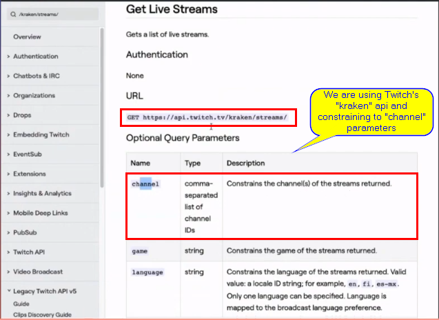
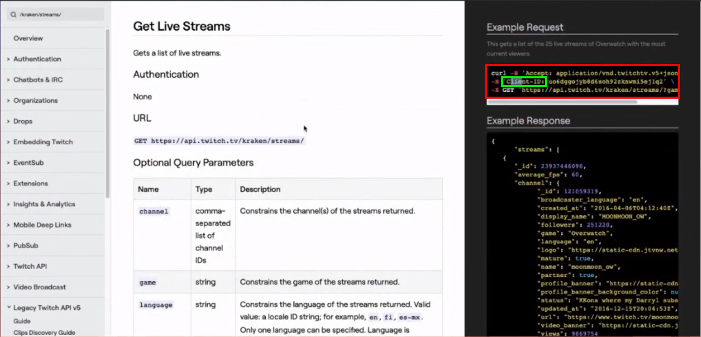
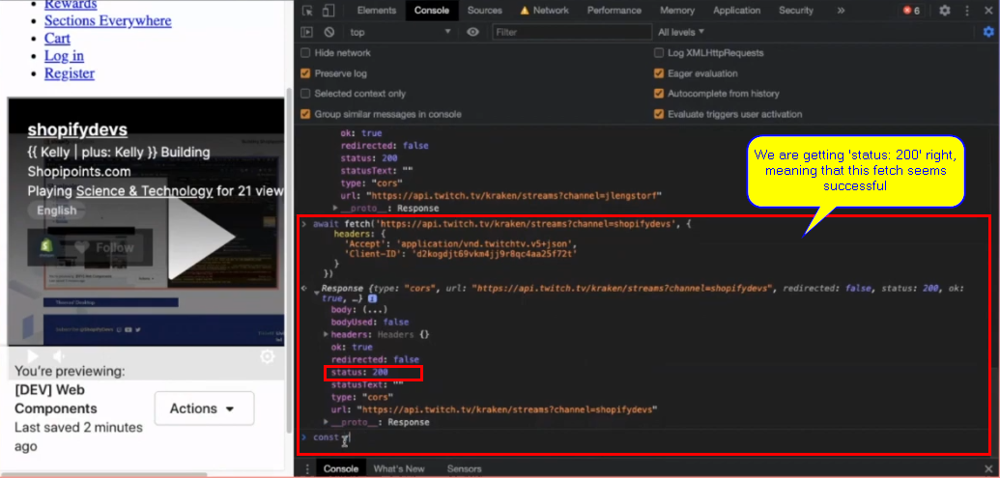

# [{{ Kelly | plus: Kelly }} Embedding our stream on the home page – February 10th, 2021](https://www.youtube.com/watch?v=Orb0BlWhTH8)

In this stream, we get started building out our online store's home page with a Hero section that shows the ShopifyDevs stream when it's live! Follow the build LIVE every Wednesday @2PM EST at <https://twitch.tv/shopifydevs>​. Code available at <https://github.com/t-kelly/shopipoint>.

Mentioned Links:

- <https://www.youtube.com/channel/UCWXqvX3fRn55DuDeFKozGiQ>
- <https://dev.twitch.tv/docs/embed/video-and-clips>
- <https://github.com/Shopify/themekit/tree/master/theme-template>
- <https://shopify.dev/tutorials/build-a-shopify-app-with-node-and-react/embed-your-app-in-shopify>

***

Subscribe to our channel for more videos about developing and designing ecommerce stores, apps, and themes with Shopify » www.youtube.com/shopifydevs​

Looking for more information about developing on Shopify check out www.developers.shopify.com and <https://shopify.dev/>​

Connect with us on Twitter » www.twitter.com/shopifydevs

Launch your own online store by visiting Shopify and starting your free trial » <http://bit.ly/VisitShopify>

 

***

 

## Transcription/Notes

 

- `{{ | plus: Kelly }}`: "Let's see if it works. Hey are we working!? 🤣"
- `{{ Kelly | }}`: "😁 Hey!!!!!!"
- `{{ | plus: Kelly }}`: "Hey yo!!!!"
- `{{ Kelly | }}`: "I'm a person. I don't sound like a robot."
- `{{ | plus: Kelly }}`: "Yeah."
- `{{ Kelly | }}`: "I think."
- `{{ | plus: Kelly }}`: "Using professional audio gear and now"
- `{{ Kelly | }}`: "I'm even wired! I remembered to hardwire today."
- `{{ | plus: Kelly }}`: "Now comes the moment of truth. Let's wait for people to like say 'hey something's wrong' wait for it"
- `{{ Kelly | }}`: "🤣"
- `{{ | plus: Kelly }}`: "No!! is everything good!? 🤣"
- `{{ Kelly | }}`: "fingers crossed 🤞"
- `{{ | plus: Kelly }}`: "For once nothing changed in our setup and nothing"
- `{{ Kelly | }}`: "Hey! Hey! don't jinx it. You know what"
- `{{ | plus: Kelly }}`: "There we go"
- `{{ Kelly | }}`: Knocking on wood. "I am knocking on my desk just for safety"
- `{{ | plus: Kelly }}`: "🆗"
- `{{ Kelly | }}`: "Hey somethings wrong! 😂"
  - Comment from me [sidro01] making a joke
- `{{ | plus: Kelly }}`: "Hey somethings wrong! Oh no! 😂"
- `{{ Kelly | }}`: "Don't do that to us! 🤣"
- `{{ | plus: Kelly }}`: "🤣 Hello everybody in the chat. Let's see who's here."
  - `{{ | plus: Kelly }}` calling out some name from the chat
- `{{ Kelly | }}`: "[sHHr]"
- `{{ | plus: Kelly }}`: "[sHHr] my favorite, my favorite name to say! 😂"
- `{{ Kelly | }}`: "😂"
- `{{ | plus: Kelly }}`: "... Here we are at it once again."
- `{{ Kelly | }}`: "Here we are. We're right back at it again"
- `{{ | plus: Kelly }}`: "`{{ Kelly | }}` you've had a very live afternoon so far"
- `{{ Kelly | }}`: "Yeah!"
- `{{ | plus: Kelly }}`: "How are you doing?"
- `{{ Kelly | }}`: "I'm doing good! I'm standing at my standing desk because whenever I do live streams I'm like 'let me see how much I could move around' and it gives me an opportunity to move around"
- `{{ | plus: Kelly }}`: "And the power position too you know you can really get the power stance"
- `{{ Kelly | }}`: "that's right, so yeah, I'm good though, I'm good. I just spent the last hour talking about subscriptions on Shopify and now we get to build our own store so things are good. How are you?"
- `{{ | plus: Kelly }}`: "I'm doing good. I spent the.. I was not just on another stream, this is my first live stream of the day. Oh! For those of you who maybe have missed it, `{{ Kelly | }}` was on another live stream with Mark, or I'm feeding them, sorry I'm forgetting his name"
- `{{ Kelly | }}`: "Louis"
- `{{ | plus: Kelly }}`: "Mark Louis"
- `{{ Kelly | }}`: "Ms Hallico. Yep"
- `{{ | plus: Kelly }}`: "Toss it, if you wan to toss the link"
- `{{ Kelly | }}`: "Yeah, let me pop a link in there"
- `{{ | plus: Kelly }}`: "Just talking about Shopify subscriptions. I was only able to peek at it really quickly but because I was busy setting this up, even though we're doing this every week it still requires a little bit of prep work. But this morning, I don't know, this morning I was looking at, uh, I had a good discussion with one of our partners about PWAs (Progressive Web Apps)"
- `{{ Kelly | }}`: "That's not the right link. That's the original stream link. Oh, no it redirects to that. 🆗 Just kidding it works"
- `{{ | plus: Kelly }}`: "There you go"
- `{{ Kelly | }}`: "Talked about PWAs huh!"
- `{{ | plus: Kelly }}`: "'Hey Kellys it's chris' Hey Chris how's it going. Yeah! I'm kind of continuing down this rabbit hold of looking at PWAs. Uh! if anyone has anything to talk about when it comes to PWAs, in the audience, love to talk to you. Right now PWAs are kind of this gray area on the platform that we have apps in the app store that kind of provide some of the functionality of PWAs and it's largely been possible via app proxies and like app proxies weren't really intended to be used for serving service workers. Anyways it's this big big giant thing of a topic space to dive into which I haven't really done it in you know when PWAs kind of took off like 2016/2017, I was following along pretty closely then but"
  - Comment in chat read by `{{ | plus: Kelly }}` was from [kuipou]
- `{{ Kelly | }}`: "Was it that long ago"
- `{{ | plus: Kelly }}`: "Yeah! I know! It's like five years of PWAs. 'I want to believe in PWAs' yeah, exactly. I think that [Tohfoo_] and I have similar feelings like I want to believe in PWAs and the material that I'm reading on them is encouraging, still, what are you thoughts? I mean we've talked about PWAs. Yeah, we've talked briefly about PWAs before"
- `{{ Kelly | }}`: "Yeah"
- `{{ | plus: Kelly }}`: "what's your most recent... No, more particularly what are your clients saying about PWAs? What's the industry"
- `{{ Kelly | }}`: "Uh! I mean those who are interested in going headless have a little more of an understanding of what a progressive web app is. I think that PWA apps should not exist in the Shopify app store because it'll never be a true progressive web app. Hot take potentially, I, yeah, I think there's a lot. PWA, the concept of a PWA is really cool. I think that it's a lot, there's a lot more struggle to achieve it the more complex your site is and naturally e-commerce lends to be a little more complex than say a blog or an informational website, so there are just some extra barriers you kind of run into when you try to go like proper PWA with Shopify."
- `{{ | plus: Kelly }}`: "I like this concept of like if you build your website right then turning it into a PWA is just kind of adding a service worker or like it's the transition into calling it a PWA. That's something I'm interested in. Also, this concept of is a PWA its own sales channel like kind of what you're referring to in like a headless commerce sense or is it always you're going to have your online store in your PWA or should it really just be one thing!? Is looking at PWAs, are PWAs really like native apps? Are you approaching a PWA trying to be like an alternative to having a native app?"
- `{{ Kelly | }}`: "I think the whole point of a PWA is that it's not a native app"
- `{{ | plus: Kelly }}`: "Yeah"
- `{{ Kelly | }}`: "it's the closest you're going to get to that native app experience with the benefit, the added benefit, of not having to build in specific native app languages"
- `{{ | plus: Kelly }}`: "Environment, yeah"
- `{{ Kelly | }}`: "So not having to, you know, build for Android and build for iOS we could talk about [React Native](https://reactnative.dev/) and how cool that is but that's not really a topic for Shopify, so"
- `{{ | plus: Kelly }}`: "No, but I mean it is. It's e-commerce. It's building for the web. 'PWA is great for very specific stuff, for an e-commerce platform, meh' and that's at the core of my exploration is really, um like PWAs are talked about in the broad web sense and like here are the benefits of PWAs you get, like advanced caching techniques offline experience, you still get the discoverability of being on the web yadi yada. What are the perks for e-commerce? What merchants would actually benefit from, from a native app and then if that native app was just easier to implement aka via PWA, still what is relevant for e-commerce inside of PWAs"
  - PWA comment in chat that `{{ | plus: Kelly }}` read came from [Francismori7]
- `{{ Kelly | }}`: "So, here's the thing that, I/my take on that. You cannot get full appreciation of a progressive web app unless you can experience the site offline. And even if you go headless and you build a progressive web app because the whole point is that it caches it and you'll be able to you know browse no matter where you are. If you build a headless storefront, that's a progressive web app adn you've previously visited the website before, so you can use it offline, that's great until you hit checkout and then you're still on Shopify's checkout and if you're not online you can't actually checkout"
- `{{ | plus: Kelly }}`: "But what you're hinting to there or what I'm hearing that's like going into what I've been thinking about this morning, is, like, all of this value is based on repeat use. That an app is really only valuable when you have an excuse for something to be reused or like used over and over again. I went open up my phone and I looked what are the e-commerce apps that are on my phone right now and it's Amazon, of course, Apple store came pre-installed on my phone, ebay, another giant, all these basically giant e-commerce platforms and these giant retailers can do this because they have the breadth, the huge catalog but like what does a small medium business need an app for, need a PWA for"
- `{{ Kelly | }}`: "You know you can get them, there's like a certain market and certain verticals apps are really popular, for example apparel for brands that are like apparel let's say boutiques that have an app people go wild over new drops"
- `{{ | plus: Kelly }}`: "mm-hmm"
- `{{ Kelly | }}`: "And the idea that you could really quickly get a push notification when new products are in stock and buy it before anybody else has an opportunity to, that's a really... I've seen it more in the apparel industry than anything else that people actually do enjoy having an app."
- `{{ | plus: Kelly }}`: "And so it's kind, it's very specific to the business model"
- `{{ Kelly | }}`: "Absolutely"
- `{{ | plus: Kelly }}`: "Or like it's very business model specific that like if you are a t-shirt well no I'm doing apparel"
- `{{ Kelly | }}`: "😄"
- `{{ | plus: Kelly }}`: "Yeah, well, subscriptions to your point, like, you just got out of subscriptions talking about subscriptions that requires some repeat usage. I'm think of the Hello Fresh app that I use that like every week I have to check what are the meals that I'm getting, what is my subscription and, anyway, maybe we've gone down this topic far enough for now."
- `{{ Kelly | }}`: "The horse isn't dead yet but we'll move on"
- `{{ | plus: Kelly }}`: "No we'll move on though I'll make sure. Was anything... Were you following the chat there"
- `{{ Kelly | }}`: "Yeah. Yeah. Chris had mentioned 'the shoes pre-order for puma or nike'. Those are definitely... Shoes! 😄"
- `{{ | plus: Kelly }}`: "and the drop. Yeah. The drop"
- `{{ Kelly | }}`: "Yeah. Yeah. That a really good example"
- `{{ | plus: Kelly }}`: "'Oh Tom and his rabbit hole' 🤣 🆒 How about we get started with the show, with what we wanted"
  - `{{ | plus: Kelly }}` reading comment from Chris aka [kuipou]
- `{{ Kelly | }}`: "Let's do it"
- `{{ | plus: Kelly }}`: "Yeah"
- `{{ Kelly | }}`: "Yep"
- `{{ | plus: Kelly }}`: "So we left last week we had, le me pull up the [shopipoints.com](https://shopipoints.com). We got the navigation out, we built out some HTML. I struggled with Emmet to just write HTML fast. Had lots of encouraging words in response to expressing my vulnerability there, so thank you for everyone who encouraged me that, yes, I still am a good developer. Development is hard. So, you mentioned that you would like to start with the homepage?"
- `{{ Kelly | }}`: "Yes"
- `{{ | plus: Kelly }}`: "So this is our homepage right now. We've got some work to do, I think before we really get"
- `{{ Kelly | }}`: "It's not perfect"
- `{{ | plus: Kelly }}`: "No, especially this little image."
- `{{ Kelly | }}`: "It's probably pretty performant, but it's not perfect"
- `{{ | plus: Kelly }}`: "You know, I, again on the performance, I don't know so right here look we've got, we are, maybe like"
- `{{ Kelly | }}`: "🤣"
- `{{ | plus: Kelly }}`: "We are at least top 1% of Shopify right now with a score of 98. This is unheard of!"
- `{{ Kelly | }}`: "Yeah we are!!"
- `{{ | plus: Kelly }}`: "Yeah, anyone who's been looking at speed scores know that it's hard 🤣, it's really hard 🤣. So we, I think, we ended the stream last week we said that homepage let's have a 'Hero' section that has our stream that people can watch the stream on it'll tell the user if we're live, below that we can have some of the products that you can redeem [Shopipoints](https://shopipoints.com) for and then as well a list of past episodes like our blog post. So that's three sections there, sounds like we've got lots to work with."
- `{{ Kelly | }}`: "Yep"
- `{{ | plus: Kelly }}`: "We get started on the most interesting one!?"
- `{{ Kelly | }}`: "Let's start on the most interesting one!"
- `{{ | plus: Kelly }}`: "Yeah"
- `{{ Kelly | }}`: "We need to have some fun."
- `{{ | plus: Kelly }}`: "🆒 🆗 I don't know if people saw my tweet before this but I was thinking about this just before getting online and the 'Hero' section, embedding our [Twitch stream](https://www.twitch.tv/shopifydevs), it just so happens that Twitch has an... Is this really an API? Is this considered an API? or this is just"
- `{{ Kelly | }}`: "An embed is not, no"
- `{{ | plus: Kelly }}`: "An embed, like, what do you call this?"
- `{{ Kelly | }}`: "It is a widget"
- `{{ | plus: Kelly }}`: "A feature? A widget! Classic."
- `{{ Kelly | }}`: "😂"
- `{{ | plus: Kelly }}`: "😂 back to jQuery widgets"
- `{{ Kelly | }}`: "While you are doing that [sidro01] does have a question. 'is having .liquid at end of css still good to go or is best practice more the css variable way?'
- `{{ | plus: Kelly }}`: "Ooh!!"
- `{{ Kelly | }}`: "That's a good question!"
- `{{ | plus: Kelly }}`: "Juicy! I have an opinion on this. I want to hear yours"
- `{{ Kelly | }}`: "What is your opinion on this? Nope you go first."
- `{{ | plus: Kelly }}`: "🆗 I believe now that css variables are like universally available, evergreen browsers, you should be building for evergreen browsers. Build for the modern stack, so as a result you can use variables in, say, you can set CSS variables in your theme.liquid, so you're at primary color, or I'm forgetting that, yeah at primary forgetting the syntax, in your main HTML document and then your CSS files can remain vanilla CSS referencing those variables. And then to from like by going evergreen then it's about making sure, 🆗 it's not pixel perfect on legacy browsers but it's still usable. So this approach of like build for the browsers that you want, that like the majority of users are using and build for the modern web but just make sure that things are still usable on old browsers. It doesn't need to be feature matched like you don't need to have all features, you can just make sure that the essential paths work that in terms of CSS like make sure that your products links are still visible and that you can still get to the checkout and then once you're at the checkout that people can buy stuff. So, I'm on the CSS variable way. What about you?"
- `{{ Kelly | }}`: "I'm team CSS variable as well. I usually pop our CSS variables into a snippet which I link into the theme.liquid file to keep the theme.liquid file as clean as possible but yeah we use CSS variables as well"
- `{{ | plus: Kelly }}`: "Snippet is such a good topic because there's like... developers are like 'Oh I love snippets', I love to segment my code and then non-developers like I'm getting... there's two sides of this like debate that I'm hearing"
- `{{ Kelly | }}`: "now I've seen some people take snippets and then just run to the other side of the country with them and then you're having to go like `` 🆗 I have to go to this snippet. Oh! this one has a different ``. Oh, this one has a different `` and then you're eight levels deep"
- `{{ | plus: Kelly }}`: "Yes"
- `{{ Kelly | }}`: "And then you're like, where was I? So there has to be some level of organization if you are going to use snippets."
- `{{ | plus: Kelly }}`: "And I think at the core fo this debate is this like, is it easier just to read all the code in one file or in fewer files? Kike does everything need to be abstracted out into its own snippet? I know this is a topic that has made its way through Shopify at least in our internal themes team, of like 'does this really need to be abstracted to its own file?' It's such a per, in my experience, it's such a personal preference though of like"
- `{{ Kelly | }}`: "Yeah"
- `{{ | plus: Kelly }}`: "I personally like to have things in their own code files but I know some other developers like to just be able to read one file and see everything that's there"
- `{{ Kelly | }}`: "Yeah, I mean it's definitely a personal preference"
- `{{ | plus: Kelly }}`: "Yeah"
- `{{ Kelly | }}`: "I will be pushing my ways on people 😁"
- `{{ | plus: Kelly }}`: "so both should be possible"
- `{{ Kelly | }}`: "both are possible. Absolutely!"
- `{{ | plus: Kelly }}`: "Yeah, yeah."
- `{{ Kelly | }}`: "I will say one's right and one's wrong because"
- `{{ | plus: Kelly }}`: "yeah"
- `{{ Kelly | }}`: "I am highly opinionated"
- `{{ | plus: Kelly }}`: "Like that. Good question [sidro01]. Yeah! I like that one."
- `{{ Kelly | }}`: "Yeah"
- `{{ | plus: Kelly }}`: "🆗 Let's get back to it. So we are going to be embedding Twitch in your website. Do we want to embed everything? Do we want to embed just the chat? Or dow we want to embed just the video feed?"
- `{{ Kelly | }}`: "I'd say just the video feed."
- `{{ | plus: Kelly }}`: "I was having the same feeling, 🆗"
- `{{ Kelly | }}`: "Yeah. We don't need a chat on there. You can go to [Twitch.tv/ShopifyDevs](https://www.twitch.tv/shopifydevs) if you want to join in the chat."
- `{{ | plus: Kelly }}`: "🆗 Um! 🆗 🆒 So I figured the way that we can approach this during the stream, we've got 45 minutes about left, so we're going to get this thing working. We'll have a point where we have a stream inception where people on the screen will see what's on my screen which will be our stream and hopefully we'll get into some kind of infinite loop and have some fun"
- `{{ Kelly | }}`: "fingers crossed 🤞😁"
- `{{ | plus: Kelly }}`: "Yeah! 🆗. That's the first milestone. Second milestone we want to conditionally load this embedded video stream only if the user chooses to interact with it right!? Any reason why we would do that? A little pop quiz question. Why would we"
- `{{ Kelly | }}`: "A little performance boost to not load it for everybody who doesn't want to watch it, especially for mobile devices"
- `{{ | plus: Kelly }}`: "Yeah! Performance. So this goes with any external, especially any third-party service, so if you want to include YouTube videos or vimeo or any kind of embedded or any, just anything really, that like only include things on the page that you know users are going to want to use, delay everything else until as late as possible and then you get in the pre-loading subject 🆗 messy"
- `{{ Kelly | }}`: "😂"
- `{{ | plus: Kelly }}`: "but yeah we want to delay we don't want anything from Twitch to load until the user decides '🆗 I want to view the stream' and then we'll load everything but that's phase two. Then phase three, we want the user to know if we're live or not. That if we, so maybe phase two. Phase two we want to check to see if we're live or not and then phase three we can do the performance optimization"
- `{{ Kelly | }}`: "🆗"
- `{{ | plus: Kelly }}`: "so that if we're live maybe we can have somewhere on the page"
- `{{ Kelly | }}`: "A different kind of banner, 'We're live' with the alert emojis"
- `{{ | plus: Kelly }}`: "or maybe that will be the trigger between our we'll have a non-live state of the 'Hero' section which we'll just put an image of a cat. We'll use that cat site again"
- `{{ Kelly | }}`: "Yes! 😁"
- `{{ | plus: Kelly }}`: "and then when we're live, the live state will be 'click here to watch'"
- `{{ Kelly | }}`: "I love it"
- `{{ | plus: Kelly }}`: "'We're live click here to watch' sounds good everyone?"
- `{{ Kelly | }}`: "Now, I'm curious, that 'We're live' component is that actually available as part of the... If it's an embedded iframe that's not going to be available."
- `{{ | plus: Kelly }}`: "I did a quick google search, I think there's a `get` endpoint on Twitch that you can just do a request"
- `{{ Kelly | }}`: "API WORK!!!!"
- `{{ | plus: Kelly }}`: "This is a super hacky I really hope this works. I did a really quick Google search just like 'how to check if Twitch stream is live' and it was just, yeah, 😆 🆗 So"
- `{{ Kelly | }}`: "Awesome"
- `{{ | plus: Kelly }}`: " 🆗"
- `{{ Kelly | }}`: "Let's do it!"
- `{{ | plus: Kelly }}`: "Let's do it! So, to get started, let's get the Twitch stream inception. So I will post the link to these docs so other people can help out as we're doing this because, by the way this is totally fresh I haven't tested this out yet so we're doing live demo material right now"
- `{{ Kelly | }}`: "half the fun"
- `{{ | plus: Kelly }}`: "Um! Non-interactive inline frames for let's, I like the look of this example. Let's try this"
- `{{ Kelly | }}`: "This example looks good"
- `{{ | plus: Kelly }}`: "Are you in the... Yes you are."
- `{{ Kelly | }}`: "Yeah"
- `{{ | plus: Kelly }}`: "🆗 I'll create a new section. We'll do... call it 'Hero'. 'Hero' 🎶 Who invented the term 'Hero' for like your 'Hero' image or 'Hero' banner"
- `{{ Kelly | }}`: "Who invented 'Hero Image' for"
- `{{ | plus: Kelly }}`: "Where did this come from"
- `{{ Kelly | }}`: "Top of website"
- `{{ | plus: Kelly }}`: "Anyways"
- `{{ Kelly | }}`: "'Hero Image'! Oh! Woohoo! There's a story 'The epic story of the 'Hero Image'"
- `{{ | plus: Kelly }}`: "😄 Paste the link. I'll read it after. 😆"
- `{{ Kelly | }}`: "😄 🆗 I have no idea if this is anything good to read so"
- `{{ | plus: Kelly }}`: "😂"
- `{{ Kelly | }}`: "we're going to learn together"
- `{{ | plus: Kelly }}`: "🤣 hopefully not total garbage 🤣"
- `{{ Kelly | }}`: "🤣"
- `{{ | plus: Kelly }}`: "😄 🆗. So, could you? Do you mind getting started as I read through the docs here on how to fill out these query parameters? Just getting the basic section setting or"
- `{{ Kelly | }}`: "Yeah"
- `{{ | plus: Kelly }}`: "Yeah, just building"
- `{{ Kelly | }}`: "The schema"
- `{{ | plus: Kelly }}`: "this out to be an official section"
- `{{ Kelly | }}`: "This is a homepage section correct?"
- `{{ | plus: Kelly }}`: "This is in a homepage"
- `{{ Kelly | }}`: "We're gonna need a preset"
- `{{ | plus: Kelly }}`: "Yes. Yeah. Exactly"
- `{{ Kelly | }}`: "🆗"
- `{{ | plus: Kelly }}`: "'cause we'd want to move it around 🎶. We want to, well. I mean, we'll make it... it's easy to make it"
- `{{ Kelly | }}`: "Yeah!!!"
- `{{ | plus: Kelly }}`: "🆗 Let's read these query parameters. `<iframe>` attributes, we don't want `<iframe>` too we want `src`. 🆗. 'With one of these query parameters', so we can use channel here we'll do channel [ShopifyDevs](https://www.twitch.tv/shopifydevs)."
- `{{ Kelly | }}`: "Um! I need... what's not there?"
- `{{ | plus: Kelly }}`: "Channel equals ShopifyDevs and"
- `{{ Kelly | }}`: "sections"
- `{{ | plus: Kelly }}`: "There was a parent. Where's that parent? Attributes, `parent` 'required domain(s) that will be embedding Twitch. You must have one parent key for each domain your site uses'. 🆗, let's just try [shopipoints.com](https://shopipoints.com)"
- `{{ Kelly | }}`: "Do you wan these 'height' 'width' and 'allow full screen' to be settings or what's the plan here"
- `{{ | plus: Kelly }}`: "😐 🎶"
- `{{ Kelly | }}`: "or how about 😐 'channel equals ShopifyDevs' alright, yeah, I'll let you update this first and 'parent equals'"
- `{{ | plus: Kelly }}`: "😐 I think there's a minimum 'height' I saw in the docs we can just set it to the minimum height just to get it working. I think it needs to be 400x300"
- `{{ Kelly | }}`: "400x300 alright, I'll just hard code it"
- `{{ | plus: Kelly }}`: "So we'll just... we can start with that... 'npm watch'. Not running."
- `{{ Kelly | }}`: "Do we have any settings for this?"
- `{{ | plus: Kelly }}`: "😐 I don't know. Do we...? What kind of...? I'm kind of 😬"
- `{{ Kelly | }}`: "`"type": "text"`, `"id": "twitch"` oops. `username` `"label": "Twitch Username"`. I don't know what to call usernames or handles but section settings Twitch username for that"
- `{{ | plus: Kelly }}`: "So... 🎶 we will want to customize this so for those following along just so I can speak as we're..."
- `{{ Kelly | }}`: "'So you save this as' got it."
- `{{ | plus: Kelly }}`: "what we're doing right now is uh what `{{ Kelly |}} "`'s getting the basic `schema` of our section built out. Uh! be great to just be able to you know like actually I think I've seen some plugins that you can just write a command and it'll create a boilerplate section with like"
- `{{ Kelly | }}`: "Yeah I have a cacher. I use it an app called cacher to store a bunch of snippets. I can actually make this public and share it with anybody. 😐 Copy"
- `{{ | plus: Kelly }}`: "😓 🎶"
- `{{ Kelly | }}`: "I think it's basically just like a gist on github so you can steal this it's basically a section with blocks, section with blocks and presets, so if your using... I mean section with settings and presets. So it's uh presets use of course for homepage sections so you can use them within content for index"
- `{{ | plus: Kelly }}`: "and speaking of content that's what I'm about to add to our index.liquid"
- `{{ Kelly | }}`: "🆒! 🆗"
- `{{ | plus: Kelly }}`: "For those of you not familiar with content for index, this is the basically the way to say anything inside the index page or like anything inside context or index is all the sections in the main body is generally what it's used for"
- `{{ Kelly | }}`: "Yes"
- `{{ | plus: Kelly }}`: "I haven't seen any other creative uses for it to be honest. 😀"
- `{{ Kelly | }}`: "I don't know if there are any other creative uses for it"
- `{{ | plus: Kelly }}`: "I'm sure somebody's done something creative with it"
- `{{ Kelly | }}`: "😄 Content for product. Oh! Look we've just created sections everywhere"
- `{{ | plus: Kelly }}`: "😂"
- `{{ Kelly | }}`: "You welcome! 😂"
- `{{ | plus: Kelly }}`: "Insert sections everywhere joke 🃏 here yeah"
- `{{ Kelly | }}`: "🤣"
- `{{ | plus: Kelly }}`: "😐 Product pages, let me get to the homepage. Uh! 🆗 We don't have a selector yet"
- `{{ Kelly | }}`: "did you... yeah"
- `{{ | plus: Kelly }}`: "😐 The 'Hero' this should be uploaded, did we upload...? Yeah we got updated"
- `{{ Kelly | }}`: "Yeah"
- `{{ | plus: Kelly }}`: "sections right here"
- `{{ Kelly | }}`: "It's in sections. When did you open up the customizer? You might have to refresh it."
- `{{ | plus: Kelly }}`: "...custom yeah 🆗 Probably. Let's do a refresh 🎶. It's always this first section that like enables all this sections homepage there it is"
- `{{ Kelly | }}`: "There we go!"
- `{{ | plus: Kelly }}`: "'Add section'"
- `{{ Kelly | }}`: "Yeah. Oh! Look at my new section"
- `{{ | plus: Kelly }}`: "'Hero' 🎶"
- `{{ Kelly | }}`: "It's called 'Hero'"
- `{{ | plus: Kelly }}`: "Oh! Nice. 'Twitch player refused to connect'"
- `{{ Kelly | }}`: "Alright let's see what's going on."
- `{{ | plus: Kelly }}`: "🆗"
- `{{ Kelly | }}`: "Oh! The Twitch username is not set. Set it to ShopifyDevs"
- `{{ | plus: Kelly }}`: "😐 Oh! I thought they had."
- `{{ Kelly | }}`: "I created a setting for it."
- `{{ | plus: Kelly }}`: "Oh! 🆒 Oh! you created a setting. Oh!!!! That's... 🆗"
- `{{ Kelly | }}`: "It's good practice to not hard code anything."
- `{{ | plus: Kelly }}`: "Your still. Oh! "
- `{{ Kelly | }}`: "If it's still not working, that not my problem 😄"
- `{{ | plus: Kelly }}`: "Also I love that the developers for the Theme Editor thought about if you hit command + 's' that it doesn't open the browser save this page, it saves"
- `{{ Kelly | }}`: "Oh, yeah!"
- `{{ | plus: Kelly }}`: "settings. I just did it out of reflex"
- `{{ Kelly | }}`: "Yep"
- `{{ | plus: Kelly }}`: "Love that it doesn't break things."
- `{{ Kelly | }}`: "The number of times I accidentally almost save a website file! 'Yes, I want to download page.html thanks for asking.'"
- `{{ | plus: Kelly }}`: "🆗 Oh we got something loading!!!"
- `{{ Kelly | }}`: "[sirnightlord] asked 'are we building this from scratch?' Yes we are. This is an empty theme."
- `{{ | plus: Kelly }}`: "Totally empty. So, [sirnightlord] love the name"
- `{{ Kelly | }}`: "Yeah"
- `{{ | plus: Kelly }}`: "we're focusing on kind of raw features first of all HTML you know getting that HTML and the core functionality out of the way first and we're gonna be looking at styles and you know all that fancy stuff but style CSS is so fancy isn't it?"
- `{{ Kelly | }}`: "It's the fanciest. I love CSS I absolutely love it I love writing CSS. To me that's my favorite part of the challenge."
- `{{ | plus: Kelly }}`: "I miss writing CSS. So this isn't our stream because we are live right now. Are there any errors? Let's see"
- `{{ Kelly | }}`: "So what's going on?"
- `{{ | plus: Kelly }}`: "So, this isn't our stream because we are live right now. Are there any errors? Let's see"
- `{{ Kelly | }}`: "And is the embed URL actually ShopifyDevs is it like correct I mean it does say live on it so that's the thing"
- `{{ | plus: Kelly }}`: "So that's it yeah so that's the encouraging part. I saw live and I was like 'oh, sweet we're going to have an inception here'."
- `{{ Kelly | }}`: "But instead we're just seeing darkness."
- `{{ | plus: Kelly }}`: "I'm living in a world of darkness. Oh! We got an extra curly bracket curly bracket going on there."
- `{{ Kelly | }}`: "Uh!!! Stupid auto complete. Alright I just saved it again."
- `{{ | plus: Kelly }}`: "Mine's not doing it this time"
- `{{ Kelly | }}`: "Just have to refresh"
- `{{ | plus: Kelly }}`: "the weird autocomplete. 🆗 You just saved it"
- `{{ Kelly | }}`: "It just saved"
- `{{ | plus: Kelly }}`: "is it updated?"
- `{{ Kelly | }}`: "Yeah"
- `{{ | plus: Kelly }}`: "Is it good?"
- `{{ Kelly | }}`: "Yeah! Yeah!"
- `{{ | plus: Kelly }}`: "🆗 Let's see!!"
- `{{ Kelly | }}`: "Odd that it says live if it wasn't actually picking us up!"
- `{{ | plus: Kelly }}`: "Yeah. That was weird actually."
- `{{ Kelly | }}`: "That's kind of perplexing"
- `{{ | plus: Kelly }}`: "😲"
- `{{ Kelly | }}`: "🙌 Yeah"
- `{{ | plus: Kelly }}`: "Yeah!!!"
- `{{ Kelly | }}`: "We did it!!!!"
- `{{ | plus: Kelly }}`: "🕺 Twitch inception. Wait let's watch it. Can I full screen it? Here we go. There we go."

- `{{ Kelly | }}`: "😂 Alright."
- `{{ | plus: Kelly }}`: "🕺😂"
- `{{ Kelly | }}`: "💃😄 We got this going!!!!"
- `{{ | plus: Kelly }}`: "Yeah!!!!! Best part of the stream so far. Good job `{{ Kelly | }}`"
- `{{ Kelly | }}`: "🤣 Looking forward to that clip"
- `{{ | plus: Kelly }}`: "'Careful mics feedback' We shouldn't get mic feedback because I don't have my desktop audio feeding into "
  - Comment came from [kuipou]
- `{{ Kelly | }}`: "anything"
- `{{ | plus: Kelly }}`: "You guys tell me though you're getting wicked feedback right now? 🤣"
- `{{ Kelly | }}`: "🤣"
- `{{ | plus: Kelly }}`: "Just trash the whole stream"
- `{{ Kelly | }}`: "[sirnightlord] asked 'What are the prerequisites for building a Shopify theme or plugin?'"
- `{{ | plus: Kelly }}`: "How do you want to take"
- `{{ Kelly | }}`: "Let's start with the Shopify theme. So, there is a certain theme structure that you need to follow in order to create a theme. There are certain files that are absolutely necessary for themes you know things like theme.liquid, your settings, settings_data.json is definitely necessary. There is a, if you've never built a Shopify theme I don't recommend starting from barebones scratch because you pick up a lot of practices from, you know, what's required for a theme and what's not based on editing previous themes in the first place. Even, you know, we've been building custom themes for years now we still start with content in some format, we're usually not starting at from absolute zero when we're building a theme. For building a plug-in, or in Shopify's case a Shopify app, you need to create the, well I guess it depends on what the purpose of the Shopify app is, cerate a Shopify partner's account first off, join us on the partner program. You can create a custom app in there for a store or you can create what the starting point for a public app if you wanted to actually sell that app in the app store. In terms of programming languages you can use whatever you want in term like you know, we build our Shopify apps with node.js. Shopify has a really great [tutorial that's node react on the front-end Koa](https://shopify.dev/tutorials/build-a-shopify-app-with-node-and-react/embed-your-app-in-shopify) so that's a good starting point and then familiarize your self with the Shopify APIs because they're going to be using those a lot."
- `{{ | plus: Kelly }}`: "Let's see, [build an app with node.js and react](https://shopify.dev/tutorials/build-a-shopify-app-with-node-and-react/embed-your-app-in-shopify)"
- `{{ Kelly | }}`: "Nice!"
- `{{ | plus: Kelly }}`: "Is that the one?"
- `{{ Kelly | }}`: "That's the one."
- `{{ | plus: Kelly }}`: "That was a lot of good interpretations"
- `{{ Kelly | }}`: "Hold on, backup"
- `{{ | plus: Kelly }}`: "of the question."
- `{{ Kelly | }}`: "Thank you!"
- `{{ | plus: Kelly }}`: "[sirnightlord] was that kind of what you were getting at? Was there something more specific when you said prerequisite? I don't know."
- `{{ Kelly | }}`: "Knowing how to code is probably a prerequisite. 😂"
- `{{ | plus: Kelly }}`: "That's a good start too, yeah, I mean but even then just wing it, you know"
- `{{ Kelly | }}`: "You can still lean how to code as you go but yeah"
- `{{ | plus: Kelly }}`: "copy and paste"
- `{{ Kelly | }}`: "Never mind I should not talk about this on the live stream. I'll message you later about this one. Speaking of prerequisites of learning or of knowing how to code."
- `{{ | plus: Kelly }}`: "Juicy"
- `{{ Kelly | }}`: "Yeah, so you can link to that. Great tutorial if you've never built a Shopify app before and you're curious about the structure of it, it's a really really really great starting point."
- `{{ | plus: Kelly }}`: "🆗 So, our first, uh, our stream embed went a lot quicker than any"
- `{{ Kelly | }}`: "🤣"
- `{{ | plus: Kelly }}`: "anything that we've ever done on this stream so, 🆗, we're breaking speed records here"
- `{{ Kelly | }}`: "We only had one small error and so yeah"
- `{{ | plus: Kelly }}`: "So, I'm going to do the same google search I did before 'How to check if Twitch stream is live' let's see if in my history"
- `{{ Kelly | }}`: "Let's talk about this Google search for a hot second here because"
- `{{ | plus: Kelly }}`: "Yeah"
- `{{ Kelly | }}`: "when we talk about SEO for a second, when we're doing searches now you know a long time ago when I used google I would be like plus [keyword]"
- `{{ | plus: Kelly }}`: "Yeah!"
- `{{ Kelly | }}`: "plus [keyword] minus [keyword]"
- `{{ | plus: Kelly }}`: "give us a good comic con list"
- `{{ Kelly | }}`: "Yes! Now we're doing what are more phrases that are like long tailed [keywords], they're almost sentences like 'How do I do this' or 'This is breaking' it's just an interesting kind of change, really important when you're writing your content because this how people actually search for things on Google, it's how people are going to find your content as well. [Tikio88] asked 'Does building with Node require Shopify Plus?' It does not"
- `{{ | plus: Kelly }}`: "🙅‍♂️"
- `{{ Kelly | }}`: "Node is a, well it seems to be considered like a backend JavaScript. Is there such thing as a backend JavaScript library?"
- `{{ | plus: Kelly }}`: "Well, I mean that's yeah, like node"
- `{{ Kelly | }}`: "It's JavaScript but"
- `{{ | plus: Kelly }}`: "is JavaScript for the backend, like"
- `{{ Kelly | }}`: "I get, I guess yeah"
- `{{ | plus: Kelly }}`: "Yeah"
- `{{ Kelly | }}`: "So you can write node Shopify apps for any level of Shopify plan"
- `{{ | plus: Kelly }}`: "😐 Yeah! And to that note, so like a partner account is free to sign up. Creating an app is free. The way that the [app cli](https://shopify.dev/tools/cli) is setup is that it creates a free tunnel from your localhost. So you write this Node app, you run it in your localhost, it creates a free tunnel from your localhost port to Shopify so it looks like this app is hosted on a server which when you bring it to production you want to have it as a hosted service. Everything is free"
- `{{ Kelly | }}`: "Yeah"
- `{{ | plus: Kelly }}`: "It's only once you start making money that we start charging you. 😄 Even then! "
- `{{ Kelly | }}`: "But yeah. You can definitely run, you know, localhost or you can use [ngrok](https://ngrok.com/) if you want to also for free to... love me some [ngrok](https://ngrok.com/)"
- `{{ | plus: Kelly }}`: "I want to. 'I'm just going to blow up my console here. Let's clear this out' I want to"
- `{{ Kelly | }}`: "I'd say that's a lot stuff in there"
- `{{ | plus: Kelly }}`: "test this request so I'm reading if I hit this and then ShopifyDevs!? I just want to see what this returns. Fetch from origin, blocked"
- `{{ Kelly | }}`: "[CORS](https://developer.mozilla.org/en-US/docs/Web/HTTP/CORS)!!!!"
- `{{ | plus: Kelly }}`: "😐"
- `{{ Kelly | }}`: "Everyone's favorite warning 🎶"
- `{{ | plus: Kelly }}`: "🎶. 😐!!! I want... This is a 'Get' request, so this is Twitch that's doing the CORS"
- `{{ Kelly | }}`: "Yep"
- `{{ | plus: Kelly }}`: "So how do we... So, this stack overflow isn't helpful! I'm wondering how where else we can find... because this is saying that we can just check and it will return something if it's live and -1 if it's not live. Here's something on a Twitch.tv forum... 'Free as beer.' When was the last time you a free beer [kuipou]? I haven't had a free beer in a while"
- `{{ Kelly | }}`: "🤣 I'd love a free beer!"
- `{{ | plus: Kelly }}`: "😐"
- `{{ Kelly | }}`: "We started buying non-alcoholic beer, just to, we don't drink every single day, and so we were curious how non-alcoholic beer actually tastes and we have one like really solid winner. We have one that's 🤷‍♀️ and then I have an entire case of [Brewdog non-alcoholic beer](https://shopusa.brewdog.com/pages/non-alcoholic-near-beer) that I haven't gotten into yet, so excited to give that a shot"
- `{{ | plus: Kelly }}`: "Uh!! Looks like we need a Twitch API client ID. We need to figure out how to"
- `{{ Kelly | }}`: "Ah! Do the OAUTH route first"
- `{{ | plus: Kelly }}`: "😐. The... I thought like why isn't this just a public...?"
- `{{ Kelly | }}`: "it's weird that it's not public"
- `{{ | plus: Kelly }}`: "this is just"
- `{{ Kelly | }}`: "That seems to be something that doesn't have to be all that complicated"
- `{{ | plus: Kelly }}`: "Yeah, this is just I'm going to the [ShopifyDevs](https://www.twitch.tv/shopifydevs) site and basically seeing is it live or not? 'Client ID. Channel' Yeah. 🆗 Let me just get this"
- `{{ Kelly | }}`: "So you do Client ID or OAUTH token, 🆗"
- `{{ | plus: Kelly }}`: "Well, here wait. 🆗 This was... This is different... 'streams'. 🆗 🤔 This is a different format than what I put here so let's just see if this works. 'Channel equals' oops, 'ShopifyDevs'. Oh, it's still... so yeah. That's the... but still we're getting a [CORS](https://developer.mozilla.org/en-US/docs/Web/HTTP/CORS) error, which isn't like a non-authenticated error"

- `{{ Kelly | }}`: "It's not like a non-authent... yeah."
- `{{ | plus: Kelly }}`: "🎶"
- `{{ Kelly | }}`: "I'm seeing... I don't know that's like a dashboard."
- `{{ | plus: Kelly }}`: "Is this the same!? 🎶 Im' just making sure this is the same URL! Yep! 🎶 this is where we get stuck and we problem solve live because this is what you do when you develop things 🎶. 🎶 you scratch your head 🎶 and you try to figure out what the hell to do. Let's find the docs on this API."
- `{{ Kelly | }}`: "Yeah"
- `{{ | plus: Kelly }}`: "Uh! 'Kraken stream'. 🆗"
- `{{ Kelly | }}`: "What was the 🤔 What were typing in? I'm going to just try it."
- `{{ | plus: Kelly }}`: "I'll put it in the chat"
- `{{ Kelly | }}`: "🆗"
- `{{ | plus: Kelly }}`: "'Channels equals'... 🎶 twitch API!!!"
- `{{ Kelly | }}`: "Kraken is what it's called?"
- `{{ | plus: Kelly }}`: "Kraken"
- `{{ Kelly | }}`: "😄"
- `{{ | plus: Kelly }}`: "I love it."
- `{{ Kelly | }}`: "and it's a `get`"
- `{{ | plus: Kelly }}`: "😐 'Search docs'... I guess, is Kraken like their version? It sounds like a version to me"
- `{{ Kelly | }}`: "See I got... Yeah! Maybe. So, I just popped it into insomnia"
- `{{ | plus: Kelly }}`: "Yeah"
- `{{ Kelly | }}`: "which is what I use instead of postman and I got a 'bad request 400 No Client ID specified.'"
- `{{ | plus: Kelly }}`: "`Get` live streams... Oooh! Here we go. What's this, `get` list of live streams. Wow! that's like all of the live streams!"
- `{{ Kelly | }}`: "😂"
- `{{ | plus: Kelly }}`: "I can see why that"
- `{{ Kelly | }}`: "show me everything"
- `{{ | plus: Kelly }}`: "needs to be authenticated."
- `{{ Kelly | }}`: "'Authentication done.'"
- `{{ | plus: Kelly }}`: "Let's see `get` stream by user... `get` stream summary... 🆗 So, yeah! So, this is what we're using. We're using this and then with the Channel constrained to channels of the streams returned"

- `{{ Kelly | }}`: "No. Yeah. That's a query parameter"
- `{{ | plus: Kelly }}`: "Yeah"
- `{{ Kelly | }}`: "Yeah, so it is a question mark"
- `{{ | plus: Kelly }}`: "That's what we want"
- `{{ Kelly | }}`: "However, even though it says authentication done, I'm still getting 'No Client ID specified'. So, scroll down a little bit."
- `{{ | plus: Kelly }}`: "😐"
- `{{ Kelly | }}`: "Is there anything referencing a Client ID!?"
- `{{ | plus: Kelly }}`: "That's probably at the top, like it would be probably here. Yeah! See! 'Client ID'."

- `{{ Kelly | }}`: "Ah! 🆗"
- `{{ | plus: Kelly }}`: "That's just probably any request to the API requires the Client ID."
- `{{ Kelly | }}`: "Yeah"
- `{{ | plus: Kelly }}`: "😐 Let me just make sure `curl` accept, 🤔 Oh! That's a... What's that header maybe we need that too"
- `{{ Kelly | }}`: "What is that? I can read it"
- `{{ | plus: Kelly }}`: "it's a header accept application"
- `{{ Kelly | }}`: "Application. Oh! That's unique"
- `{{ | plus: Kelly }}`: "Yeah"
- `{{ Kelly | }}`: "Yeah"
- `{{ | plus: Kelly }}`: "We'll add that our fetch request!? Here I'm gonna bring this fetch request into some JS first so let's just do it in line for now just because... Uh! '`<script>`. Oh, `fetch()` 🎶 Make it that and add 'ShopifyDevs'. Alright, wait. We'll use your, we'll use the liquid variable for now."
- `{{ Kelly | }}`: "🆒"
- `{{ | plus: Kelly }}`: "There we go! 😐 Good! And then we want... Do you remember how to set headers in fetch? I don't remember off top of my head."
- `{{ Kelly | }}`: "No, I haven't used fetch in a while. I've been defaulting to [Axios](https://github.com/axios/axios)"
- `{{ | plus: Kelly }}`: "Headers. I know it's in the option, 😐 🎶 Good old MDN docs. 🎶 headers"
- `{{ Kelly | }}`: "Yeah! It's just a fetch URL"
- `{{ | plus: Kelly }}`: "There it is! There it is"
- `{{ Kelly | }}`: "then open brace and then headers. Yeah!"
- `{{ | plus: Kelly }}`: "Object! Setting Object, so we got `headers` and then the `key`. So is it... Yeah! `Key value`. 🆗 So we"
- `{{ Kelly | }}`: "While you're doing that, [sirnightlord] asked 'Aren't there any premium courses for learning Shopify theme? Like [egghead.io](https://egghead.io/) or [pluralsight](https://www.pluralsight.com/)?' Interestingly enough there's really not, however Gavin Ballard wrote in 2017 ['The Definitive Guide To Shopify Themes'](https://www.apress.com/us/book/9781484226407), this can be a really great starting point. It's not a course, it is a book but Gavin has been a Shopify partner since"
- `{{ | plus: Kelly }}`: "Forever!"
- `{{ Kelly | }}`: "I think the like when Shopify partners became a thing"
- `{{ | plus: Kelly }}`: "Yeah."
- `{{ Kelly | }}`: "So he is a great person to learn from."
- `{{ | plus: Kelly }}`: "There's also I think if you, I'm trying to remember his name, there is 🤔 Uh! somebody from Germany I actually know. You know his tutorials are in German for the most part, if I remember correctly, never mind."
- `{{ Kelly | }}`: "🤣 Small pre-requisite know German"
- `{{ | plus: Kelly }}`: "No! We were talking to a colleague about like Shopify influencers and then, trying to remember. Jason"
- `{{ Kelly | }}`: "Oh! Am I a Shopify influencer!? 😁"
- `{{ | plus: Kelly }}`: "if you're in the stream right now, drop your German developer friend's name. I don't even know if Jason's here."
- `{{ Kelly | }}`: "😐 What was I going to do there"
- `{{ | plus: Kelly }}`: "🆗 So, except"
- `{{ Kelly | }}`: "'ShopifyDevs'"
- `{{ | plus: Kelly }}`: "we've got this weird, so this is, I don't know what this actually like I'm not sure what this header does but let's include it just to be sure. It's like accept application Json but this weird Twitch.tv v5 type of Json."
- `{{ Kelly | }}`: "Yeah! that's... I've never seen that before, then again I guess Twitch just ahs to do their own thing to complicate things"
- `{{ | plus: Kelly }}`: "And then we have the URL here 'HTTPS'. 🆗 We're good for that. So we just need to get a Client ID! 'How does one sign up for a Twitch API Client-ID?'"
- `{{ Kelly | }}`: "It's probably within your account"
- `{{ | plus: Kelly }}`: "I am going to check"
- `{{ Kelly | }}`: "which we might not be able to see."
- `{{ | plus: Kelly }}`: "Uh! I'm not going to show that on screen. I will blow up our"
- `{{ Kelly | }}`: "😂"
- `{{ | plus: Kelly }}`: "Put this over here. 🆗 😐 'Channel', 'video', 'security', 'privacy'. I don't see anything obvious in the settings. 🆗 I will open back up the screen so people can follow along. Has anyone...?"
- `{{ Kelly | }}`: "[sockerknuffen] says 'Liquid is cool and all, but i rarely see any work done in React regarding themes. Would be cool if there were any resources about that.' So, the reason why you don't see a lot about React regarding themes is because Shopify wasn't really built to work with React, in a sense!! 😐"
- `{{ | plus: Kelly }}`: "Well Shopify was... Yeah. Liquid was made before"
- `{{ Kelly | }}`: "Yeah"
- `{{ | plus: Kelly }}`: "liquid existed before React is the easy"
- `{{ Kelly | }}`: "Yeah. Usually if you want to in there are Shopify stores that exist built in React but they are a custom storefront that was built on top of a React utilizing the Storefront API, because you have to pull in all the information instead. Now, I've used Vue.js in a Shopify theme, which is always a fun experience because I, well, I prefer Vue over React, so that's generally why I use it also but that at least is possible."
- `{{ | plus: Kelly }}`: "😐 and I'm partial to, take this with a grain of salt because honestly my experience with React is pretty patchy. Like, I've had on and off times of using it over the years, by no means do I consider myself an expert in React, I consider myself I'm able to follow along and kind of understand everything that's going on inside of it."
- `{{ Kelly | }}`: "Yeah"
- `{{ | plus: Kelly }}`: "I've interview people who are doing everything in React and feel at least you know present with the React world but at the core of it I don't believe React is really suited for online stores. React is a front-end application framework and so we're getting into this discussion maybe we've had it before on the stream of applications like what is a web application versus, what is more traditionally what you've seen on the internet, a web document?"
- `{{ Kelly | }}`: "Yeah"
- `{{ | plus: Kelly }}`: "And that I don't really see online stores as complex enough to be a full-on web app that state"
- `{{ Kelly | }}`: "I'm going to take a spicy"
- `{{ | plus: Kelly }}`: "how much state do you really need to manage?"
- `{{ Kelly | }}`: "Exactly it's a bit of a spicy take here. I love building headless sites. I feel like a vast, vast majority of merchants do not need to go headless. It is more complicated than it needs to be for a vast majority of merchants unless they have a very specific use case for why they would want to actually go headless. To answer the questions around here,
  - Question: 'you can use React with a headless theme with [Next.js](https://nextjs.org/) or [gatsby](https://www.gatsbyjs.com/), correct?'
    - `{{ Kelly | }}`: "Yes you can. You can go headless using [Next.js](https://nextjs.org/) or [Gatsby](https://www.gatsbyjs.com/). There are starters that exist, especially I know there's a Gatsby starter theme that you can use that would, you know, that's a good starting point if you kind of want to explore what it's like to go headless. Liquid's still the best way for a vast majority of merchants, as I mentioned, just because there has to be a development team to maintain the headless storefront if it's actually going to be on Shopify and you lose access to a lot of the Shopify perks that already exist. You would have to do custom integrations with certain apps. Some apps you can't ever use because they don't have an API, which everything's going to be reliant on APIs if you actually go headless."
  - Question: 'Do you need Shopify plus?'
    - `{{ Kelly | }}`: Technically no!! Although, once again it depends on the merchant who actually is going headless. I usually don't recommend that a merchant goes headless unless they're doing at least 15 to 20 million dollars annually and if it's less than that, they have a development team to actually maintain the site for them and the leadership has an understanding of the technical side of things to be able to understand the capacity or what actually is going on in the back end that causes or that's requiring more work."
  - So [CodeBrotha] 'If a store has high order volume then a custom headless React frontend will run into API limit issues.'
    - `{{ Kelly | }}`: "Yes, that is absolutely a thing. The nice thing about Shopify Plus is that you do get the extended limit on the API. You have two options, you can just continuously refresh the or rebuild the site every say five ten fifteen minutes so you're always getting more of an accurate count of your inventory especially if it's rapidly changing. You could rely on web hooks but that could really quickly get messy. You would definitely have to queue up those web hooks so you're not overwhelming the system and then you could potentially be pushing old you know rebuilding an hour later when you really don't need to be rebuilding an hour later. So all my takes on headless again I absolutely love doing headless storefronts. It's just really not the right thing for a vast majority of merchants."
- `{{ | plus: Kelly }}`: "I would just add on to the more, less the headless, more back to the apps like web apps versus web documents. A web application is apparently going to come with a lot more baggage and complexity"
- `{{ Kelly | }}`: "Oh, yes!"
- `{{ | plus: Kelly }}`: "like you need... you're running like almost every single solution is dependent on a ton of JavaScript, which is going to slow down your page, which in the world of e-commerce when it's all about like get this page up as quickly as possible so the user can continue being immersed in your engaging experience and like get to the checkout and buy something as quickly as possible you want that initial, it's all about first impression when it comes to e-commerce. Unlike other web application use cases like Shopify admin. Shopify Admin is built entirely with React or it's almost entirely React now. It's been reactified over the past few years. That makes a lot of sense, it's a repeat usage place. A user goes into it with the expectation of 'Okay it's going to maybe take a second to load and get up and running' but once it's cached and once everything's loaded it's good to like it can be revisited the next day and the next day after that and it's super fast. So"
- `{{ Kelly | }}`: "Yeah."
- `{{ | plus: Kelly }}`: "depending on use case as well."
- `{{ Kelly | }}`: "[sHHr] says 'I love doing Shopify scripts' I do too. I do wish and I know this is eventually coming, I would love to not have to write them in Ruby. I learned Ruby specifically so I could write Shopify scripts. Yeah! I'd love to move past that."
  - [SHA256Collision] 'Can I make an external API call in Shopify checkout and fetch some info before user going to Thank you page?'
    - `{{ Kelly | }}`: "You can only make additional calls at checkout if you are on Shopify Plus and you have access to the checkout.liquid file. Again this is something that I definitely would not want to interrupt... There you are. your webcam froze for a second. I would not want to interrupt the checkout flow to add any kind of level of friction there. So depending on what you're actually loading at checkout, it's iffy as to whether or not you actually want to do that."
- `{{ | plus: Kelly }}`: "And I would say on top of that, the reason why that costly level of customization is limited is in the checkout there's a lot of sensitive information floating around and if we just let anyone inject scripts into the checkout, somebody with malicious intent could come in and be like 'oh, I'll just scoop up that credit card number there or I'll just scoop up this token here'"
- `{{ Kelly | }}`: "Yep"
- `{{ | plus: Kelly }}`: "which, yeah. So there's some security measures that we have to keep in mind"
- `{{ Kelly | }}`: "Yeah! Any merchant who opens up checkout.liquid for additional customization has to sign a liability waiver accepting that things are going to be opening up and they could potentially be doing some damage"
- `{{ | plus: Kelly }}`: "Oooh!!!! Look at that"
- `{{ Kelly | }}`: "Getting response"
- `{{ | plus: Kelly }}`: "Getting response. Fulfilled. Response"

- `{{ Kelly | }}`: "🎉"
- `{{ | plus: Kelly }}`: "🎉 The URL, alright i didn't do the URL but we got a '200'. 🆗 🆒"
- `{{ Kelly | }}`: "😆"
- `{{ | plus: Kelly }}`: "Let me just, let's do another."
- `{{ Kelly | }}`: "So we were missing the headers? That's what it was?"
- `{{ | plus: Kelly }}`: "Yeah."
- `{{ Kelly | }}`: "Or you needed the"
- `{{ | plus: Kelly }}`: "So we have the accept header and then I'm exposing this `Client-ID` you know if Twitch shuts me down because somebody grabs this `Client-ID` from the stream and uses it, so be it we're not running a production app at this point."
- `{{ Kelly | }}`: "😆"
- `{{ | plus: Kelly }}`: "We're just making things work at this point right? There we go. So, for those following along, what I was just doing was creating a `Client-ID` for the Twitch API so that we could get a successful response. We are now pinging the endpoint that we want, so we have a response here. I'm assuming this is good because we're live. Let's do another. Oh! my camera froze again."
- `{{ Kelly | }}`: "Yep"
- `{{ | plus: Kelly }}`: "It's funny, it happens at like a certain time in the stream where ti starts to pick up in frequency. Still haven't figured out what but I moved the cable from my webcam right to the front of my USB hub so I can easily unplug it and plug it back in really quickly."
- `{{ Kelly | }}`: "😆 Nice!"
- `{{ | plus: Kelly }}`: "It still takes a second for it to... Oh, no!!"
- `{{ Kelly | }}`: "Yeah."
- `{{ | plus: Kelly }}`: "Why isn't it coming back"
- `{{ Kelly | }}`: "A few other questions coming in that I'll answer while we're or"
- `{{ | plus: Kelly }}`: "Yep! Go for it, while I come back on"
- `{{ Kelly | }}`: "[hikertommy] 'Will the upsell API be made available to more developers soon? Zipify and a few others seem to have a monopoly!' a 'Poly monopoly'. Obviously cannot speak to that one as a partner, but from what I've been hearing and what I've seen in the Shopify partner slack workspace, that is the plan to be opening it up to other developers. They intentionally started with a select group just so we can make sure that every... 'We'. Just so that Shopify can make sure that everything works as it should."
- `{{ | plus: Kelly }}`: "[Tikkio88] 'Are you using Nvidia Broadcast?' No. I think this started happening to me, I have a pluggable USB-C or Thunderbolt dock that I have my cam link, my Elgato cam link 4k plugged into and ever since I've started plugging it into that dock it just periodically it freezes. So I've been, yeah, I've been meaning to just plug it directly to my laptop."
- `{{ Kelly | }}`: "aha"
- `{{ | plus: Kelly }}`: "It's not the biggest technical glitch that we've had on this stream"
- `{{ Kelly | }}`: "🤣"
- `{{ | plus: Kelly }}`: "🤣 So I'm not to stressed out 🤣"
- `{{ Kelly | }}`: "There are much worst thing that could be happening that's for sure"
- `{{ | plus: Kelly }}`: "It doesn't prevent the stream for not starting for 20 minutes, you know."
- `{{ Kelly | }}`: "Yes! Yes! [SHA256Collision] said 'I am trying to sell digital redeem codes that needs to be displayed on Thank you page but only generate them after order is paid.' That would technically take place on the... It's a different section within checkout, so it wouldn't be the checkout.liquid in that case. The 'thank you' page has its own settings for scripts to run, assuming that's still a thing. I haven't looked in a while. It's either in like settings checkout or online store preferences. It's one of those two."
- `{{ | plus: Kelly }}`: "so to test if this is working or not I'm gonna see if Jason's comes back as a, what the response is because Jason is not live right now. So I thought because right now we're getting a success because right now we're getting a '200'."

- `{{ Kelly | }}`: "[sHHr] says 'in France, we cannot use Subscription API yet... Shopify Payments is still unavailable' Eventually the subscriptions API will be open to more than just Shopify payments as ell, there's still, it's still very much in its infancy so."
  - 'What are your thoughts on Shopify Pay being on Facebook and Instagram?' Question by [Tikio88]
    - `{{ Kelly | }}`: "I am all for it"
- `{{ | plus: Kelly }}`: "There are so many juicy questions here. Oh, 🆗"
- `{{ Kelly | }}`: "I know. This is great. I'm really excited that Shop Pay is going, it has extended into socials and the reason why is because Shop Pay is trusted and my cards are already vaulted and my address is already available and it makes my life infinitely easier. I'm not used it yet but the greatest thing is the level of trust that comes with using something like Shop Pay that's becoming more of a household name. So the easier you can make your checkout the better. So, I'm excited. Are you still getting a '200'? Is that really"
- `{{ | plus: Kelly }}`: "I am. I'm just getting... I'm trying to read the body."
- `{{ Kelly | }}`: "yeah"
- `{{ | plus: Kelly }}`: "I'm trying to read the body at this point because it says we should get a list, so if it's"
- `{{ Kelly | }}`: "Oh"
- `{{ | plus: Kelly }}`: "So if I do, 🤔 Let me see. Let me assign it to just a variable"
- `{{ Kelly | }}`: "Why don't you just open up the body? 🆗"
- `{{ | plus: Kelly }}`: "'response equals' here let me blow this up so people can be following along. 🤔 'response equals our' oop nope oh no our"
- `{{ Kelly | }}`: "🤣"
- `{{ | plus: Kelly }}`: "So for those following along, what I'm doing in the code here, I'm just using chrome's console just to test out some JavaScript before we actually jus throw it into our theme. I like doing this"
- `{{ Kelly | }}`: "I do this all the time. Yeah."
- `{{ | plus: Kelly }}`: "Yeah. It's just a nice little sandbox to work out of."
- `{{ Kelly | }}`: "You get the immediate responses here instead of having to you know upload, refresh all that good stuff."
- `{{ | plus: Kelly }}`: "And chrome's console will show you the result of an await and like it's got some nice features in it. So here. This should have... Yeah!!!! There we go 🆗 So streams is empty"
- `{{ Kelly | }}`: "🆗"
- `{{ | plus: Kelly }}`: "wait is this the [Jason Lengstorf](https://www.jason.af/). No. ShopifyDevs."
- `{{ Kelly | }}`: "ShopifyDevs"
- `{{ | plus: Kelly }}`: "Oh, no!! Why is it empty? We're live right now 😄 it shouldn't be"
- `{{ Kelly | }}`: "😆"
- `{{ | plus: Kelly }}`: "🤔🤬 😂 Oh! No. You don't play Jason 😄 You pause 😄"
- `{{ Kelly | }}`: "😂"
- `{{ | plus: Kelly }}`: "Start hearing Jason in my headphones here. So this is suppose to tell you the list of live streams, `Get` Live Streams"
- `{{ Kelly | }}`: "Oh! it's Oh! Because... Never mind. Because you still have, you're still filtering by our channel so it should still say five"
- `{{ | plus: Kelly }}`: "It should. So. Yeah. I would expect this results if I were to, If I did Jason's, 'jleng"
- `{{ Kelly | }}`: "['jlengstorf'](https://www.twitch.tv/jlengstorf) yeah."
- `{{ | plus: Kelly }}`: "Never remember how to spell this, ['jlengstorf'](https://www.twitch.tv/jlengstorf) that"
- `{{ Kelly | }}`: "Oh!"
- `{{ | plus: Kelly }}`: "Oh! 'cause I did. Yeah"
- `{{ Kelly | }}`: "Duh! 🤦‍♀️ `const`. AMATEUR!!! 😁"
- `{{ | plus: Kelly }}`: "'`let response1`. 🆗 and... and then... There. So I would expect this to be empty streams. So, that makes sense. 'array length zero'."
- `{{ Kelly | }}`: "'Length is zero' Yeah!"
- `{{ | plus: Kelly }}`: "😐"
- `{{ Kelly | }}`: "but response to"
- `{{ | plus: Kelly }}`: "but if I do ShopifyDevs, there we go"
- `{{ Kelly | }}`: "I guess we don't need to change the response ID because... Yeah!"
- `{{ | plus: Kelly }}`: "This should be this shouldn't be empty but it's empty! Hmm! Well, we're about at time. I think we made a really good progress today."
- `{{ Kelly | }}`: "I think so too!"
- `{{ | plus: Kelly }}`: "we had a lot of good questions too."
- `{{ Kelly | }}`: "We had a lot of fun today! We coded today."
- `{{ | plus: Kelly }}`: "I think we, yeah, we got some good... I hope in the spectrum of things that are interesting to follow along coding, I think this was a lot more interesting than watching me wrap liquid elements in list tag html list tags."
- `{{ Kelly | }}`: "😂 Yes!"
- `{{ | plus: Kelly }}`: "Actually, what's really funny is I was having a conversation with legal about this stream and they were saying live 'yeah you're just speaking like a totally other language and like you're wrapping things with HTML' and I just kind of said 'yeah! we actually we ended that thinking that it wasn't advanced enough' 🤣"
- `{{ Kelly | }}`: "🤣"
- `{{ | plus: Kelly }}`: "We're like 'what???'"
- `{{ Kelly | }}`: "I mean this isn't like legal is not really our target audience here we're aiming for"
- `{{ | plus: Kelly }}`: "Our target audience, yeah! Yeah! I think they were the first to admit to that too yeah! So, we'll uh! I'll get this into a PR and I'll get it, I think we've got at least I can wrap this part up. I'll have a little 'Hey! We're live' text thing at the header there and we can pick this up next week and get the final state of what we described at the beginning here. We should be able to just get that last little bit done in the next stream and then I mean we'll continue from there with the rest of the homepage."
- `{{ Kelly | }}`: "Yeah!"
- `{{ | plus: Kelly }}`: "Sounds good!?"
- `{{ Kelly | }}`: "🆒"
- `{{ | plus: Kelly }}`: "Any last questions"
- `{{ Kelly | }}`: "Well"
- `{{ | plus: Kelly }}`: "from those in the audience? Lots of good questions today. Thank you!"
- `{{ Kelly | }}`: "Yeah! Thank you for all the questions. I enjoyed answering all of them while you were"
- `{{ | plus: Kelly }}`: "Yeah! No, that worked really well. I like the kind of and i'll try to we'll look at the future just swapping that out. I'll point to you like the parts where clearly you're going to own me in the code"
- `{{ Kelly | }}`: "🤣"
- `{{ | plus: Kelly }}`: "get you to the coding wagon and I can answer some questions."
- `{{ Kelly | }}`: "Yeah!!!"
- `{{ | plus: Kelly }}`: "Yeah!!! Thank you [sidro01]."
- `{{ Kelly | }}`: "Hi Caitlin"
- `{{ | plus: Kelly }}`: "Thank you for your thank you. Thank you [ankesh_7]! Thank you! You da best"
- `{{ Kelly | }}`: "Um! I... Doesn't really matter"
- `{{ | plus: Kelly }}`: "Come on! What???"
- `{{ Kelly | }}`: "Hopefully I hope we can... [Caitlin Teed](https://twitter.com/caitlinteed?lang=en) from Shopify just slacked me"
- `{{ | plus: Kelly }}`: "Oh!"
- `{{ Kelly | }}`: "and said she watched the stream."
- `{{ | plus: Kelly }}`: "I love Caitlin!"
- `{{ Kelly | }}`: "She's doing 100 days of code and today her 100 days of code was listening to our stream."
- `{{ | plus: Kelly }}`: "Ah!!"
- `{{ Kelly | }}`: "So!!"
- `{{ | plus: Kelly }}`: "Hey [Caitlin](https://twitter.com/caitlinteed?lang=en)! If you're still here nice to see you here! [Caitlin](https://twitter.com/caitlinteed?lang=en) and I say the last thing we did together was unite related."
- `{{ Kelly | }}`: "Awww!"
- `{{ | plus: Kelly }}`: "I see [Caitlin](https://twitter.com/caitlinteed?lang=en) around every now and then. When I spoke at Unite, years ago, she was my point of contact. 🆒 Well, I'd say that's about it."
- `{{ Kelly | }}`: "Yep"
- `{{ | plus: Kelly }}`: "Let's call it a day."
- `{{ Kelly | }}`: "We'll see you all next week"
- `{{ | plus: Kelly }}`: "See you all next week, 2PM"
- `{{ Kelly | }}`: "Same time!"
- `{{ | plus: Kelly }}`: "for some more coding!"

 

***

 

### Legend

 

`{{ Kelly | }}` = [Kelly Vaughn](https://www.linkedin.com/in/kellyvaughn/)

 

`{{ | plus: Kelly }}` = [Thomas Kelly](https://github.com/t-kelly)

 

***

 

### More Links

 

- React Native - Learn once, write anywhere: <https://reactnative.dev/>
- ngrok - One command for an instant, secure URL to your localhost server through any NAT or firewall: <https://ngrok.com/>
- Cross-Origin Resource Sharing (CORS): <https://developer.mozilla.org/en-US/docs/Web/HTTP/CORS>
- Shopify App CLI - Helps you build Shopify apps: <https://shopify.dev/tools/cli>
- Axios - Promise based HTTP client for the browser and node.js: <https://github.com/axios/axios>
- Egghead.io - <https://egghead.io/>
- Pluralsight - Build better teams, products, workflow, skills, processes: <https://www.pluralsight.com/>
- Gavin Ballard:
  - <https://gavinballard.com/mastering-shopify-themes/>
  - <https://gavinballard.com/>
  - <http://bootstrapforshopify.com/>
  - <https://www.apress.com/gb/book/9781484226407>
- Next.js - The React Framework for Production: <https://nextjs.org/>
- Gatsby - The fastest frontend for the modern web: <https://www.gatsbyjs.com/>
- Jason Lengstorf:
  - <https://www.jason.af/>
  - <https://www.learnwithjason.dev/>
  - <https://github.com/jlengstorf>
- Caitlin Teed:
  - <https://caitlinteed.com/>
  - <https://twitter.com/caitlinteed?lang=en>
  - <https://www.linkedin.com/in/%E2%9C%A8-caitlin-teed-6a486745/>
