## [{{ Kelly | plus: Kelly }} Building a custom online store – January 27th, 2021](https://youtu.be/wcIYoOsjxdE)

----

A new year brings new beginnings! Join Kelly Vaughn and Thomas Kelly as they get started building out their custom Shopify online store. Follow the build LIVE every Wednesday @2PM EST at <https://twitch.tv/shopifydevs>​. Code available at <https://github.com/t-kelly/shopipoint>...​

Mentioned Links:

- Rapidly build modern websites without ever leaving your HTML: <https://tailwindcss.com/>​
- Load optimized npm packages with no install and no build tools: <https://www.skypack.dev/>​
- Frontend build tool: <https://www.snowpack.dev/>​
- Multipass: <https://shopify.dev/docs/admin-api/rest/reference/plus/multipass>
- Multipassify - Shopify Multipass module for Node.js: <https://github.com/beaucoo/multipassify>​
- Build a Shopify App with Node and React: <https://shopify.dev/tutorials/build-a-shopify-app-with-node-and-react>
- Branding and Design Made Easy - Ready-to-use templates: <https://placeit.net>​
- Theme Check - Think RuboCop, or eslint, but for Shopify themes: <https://marketplace.visualstudio.com/items?itemName=Shopify.theme-check-vscode>
  - Theme Check -Think RuboCop, or eslint, but for Shopify themes: <https://github.com/Shopify/theme-check>​
- The routes object: <https://shopify.dev/docs/themes/liquid/reference/objects/routes>
- Get/Use kitten images as placeholders: <https://placekitten.com>​

----

Subscribe to our channel for more videos about developing and designing ecommerce stores, apps, and themes with Shopify » www.youtube.com/shopifydevs​

Looking for more information about developing on Shopify check out www.developers.shopify.com and <https://shopify.dev/>​

Connect with us on Twitter » www.twitter.com/shopifydevs

Launch your own online store by visiting Shopify and starting your free trial » <http://bit.ly/VisitShopify>

<br><br>

## Notes

----
<br>

- `{{ | plus: Kelly }}`: "One of the topics for today, that we going to speak on is [Theme Check](https://github.com/Shopify/theme-check). [Marc Cournoyer](https://github.com/macournoyer) has been working on this. It's something that, I think, we need to really pump up. This is huge! I'm so excited to see this out and already what it can do but the potential of what it can do too."
- `{{ Kelly | }}`: "Do you want to also talk about what our plans are for for the stream moving forward."
- `{{ | plus: Kelly }}`: "Yeah. So, what we talked about on how we want to approach this stream. Ultimately I'd say we were having trouble figuring out like what should we spend an hour talking about this topic? what should we talk about ahead of time? I think we both like the idea of just being able to approach this as "hey we want to spend an hour a week building out themes or actually building out an online store more than themes, building out an online store experience on shopify". Anything goes so that's what we're gonna do and it gives us and you guys the freedom to come here ask any questions you want, really steer the direction of what we might be working on. it gives us the freedom to just arrive and be "okay so what do we have to do to make this store working better?" So that is the start of it. The next part is what we've been working on? We've been working on this [repo](https://github.com/t-kelly/shopipoints.com) for a month or so now and it's been the subject of just some PRs that we've opened and that [repo](https://github.com/t-kelly/shopipoints.com) and that repo I'm talking about is [shopipoints.com](https://shopipoints.com/). Waht we want to do is build this online store experience, out in the public, and that experience is around the idea of [shopipoints.com](https://shopipoints.com/), we want to have a point system for the community. For you guys that are watching. What I was able to find, first of all, is that [Twitch](https://www.twitch.tv/shopifydevs) has a really cool [Twitch channel points](https://help.twitch.tv/s/article/channel-points-guide?language=en_US)."
- **Question**: Like store credit?
  - `{{ Kelly | }}`: "In a sense yes."
  - `{{ | plus: Kelly }}`: "Yes, yes. We want to get there. What [Twitch](https://www.twitch.tv/shopifydevs) already has setup, by the way I'm going to say that this is one way that you're going to be able to get [Shopipoints](https://shopipoints.com), is that [Twitch Channel Points](https://help.twitch.tv/s/article/channel-points-guide?language=en_US) rewards viewers for participating in the [Twitch](https://www.twitch.tv/shopifydevs). So you get points just for [watching this stream](https://www.twitch.tv/videos/890448932). You get more points for repeat watches, like voting on polls, which I will promise to start a poll at some point in time. We'll have polls and we'll have more interactivity 😁 All this to say it's gonna be one way of getting [Shopipoints](https://shopipoints.com). So, what we're going to do is that we're gonna be working with the [Twitch API](https://dev.twitch.tv/docs/api/) to pull the viewers of our channel and their points that they have accumulated, into our [online store](https://shopipoints.com).  We're gonna have to figure out a way to use that information and use the [reward redeem feature on twitch](https://dev.twitch.tv/docs/api/reference#get-custom-reward-redemption), as well to translate that to a discount code or something. How do we translate channel points [Twitch channel points](https://help.twitch.tv/s/article/channel-points-guide?language=en_US)/[Shopipoints](https://shopipoints.com) into stuff that you can get/redeem on [shopipoints.com](https://shopipoints.com)."
- `{{ | plus: Kelly }}`: "And kelly i might ask you, so what types of things should we have on [shoppingpoints.com](https://shopipoints.com) because well you've got a store too. So what's your most popular merch?"
- At the time of this webcast, `{{ Kelly | }}` did have a store. To borrow her words, "to consolidate the number of projects I actively have running, something must go. Unfortunately the store was the unlucky winner..." She was looking to sell the assets, as "there have been some interest in purchasing the [assets of the business](https://shopkvlly.com/password)", however this offer was up to the 1st of March 2021, Monday this week.

- `{{ Kelly | }}`: "most popular merch:interrobang: I have a few things that I sell that are very popular. Mousepads, for one thing, I was not expecting mousepads to be so popular but they are. So, I have [Git Cheat Sheets](https://education.github.com/git-cheat-sheet-education.pdf) and [Regex Cheat Sheet](https://developer.mozilla.org/en-US/docs/Web/JavaScript/Guide/Regular_Expressions/Cheatsheet) mousepads and people really like them. Mugs are really popular. One of my best sellers is the `Git log` mug, which is a really sad story of me struggling on a project in the form of `Git log`. It contains a lot of things like "Please work" and "Help" and a lot of cursing , the usual developer process :laughing:"
- `{{ | plus: Kelly }}`: "So maybe like a theme-check/theme Linter mug:interrobang: Just playing off of your most popular items. Let's make this!"
- `{{ Kelly | }}`: "Could do a Liquid Cheat Sheet mug as well. That can be an option. We can make a bunch of Shopify jokes, somehow:interrobang: Ooh! let's do Section Everywhere Jokes :laughing:"
- `{{ | plus: Kelly }}`: "So, we'll have things that you'll be able to redeem [shopipoints](https://shopipoints.com) for. We have to set the price, but will figure that out later. So we're going to have the the online store portion of it that you're redeeming points, you have a leader board so people can also accumulate their points, especially once we start getting multiple sources for points not just the twitch channel. I'd really like to use any other APIs that kind of revolves around the [Shopify Community](https://community.shopify.com/c/Shopify-Community/ct-p/en)."
- `{{ Kelly | }}`: "Any kind of like loyalty program or something we can utilize their API."
- `{{ | plus: Kelly }}`: "Have a leader board of sorts and it's a Hub for this stream as well. So it will post the episodes of past streams and we can provide all the useful information. I really like how Jason's stream is setup"
- `{{ Kelly | }}`: "Learning with Jason"
- `{{ | plus: Kelly }}`: "Yes, [Learning with Jason](https://www.youtube.com/playlist?list=PLz8Iz-Fnk_eTpvd49Sa77NiF8Uqq5Iykx). I like how he posts transcripts of the streams. We can make our streams available there, on [shopipoints.com](https://shopipoints.com). A lot of the additional functionality that we're talking about, such as communicating with Twitch, is going to happen inside an app. So we will be building out a custom app for this store. Probably using app proxy, [Metafields](https://www.shopify.com/partners/blog/110057030-using-metafields-in-your-shopify-theme) API I imagine. We'll just store everything in [Metafields](https://www.shopify.com/partners/blog/110057030-using-metafields-in-your-shopify-theme), as it is a great way to kind of transfer data from an app to a store."
- `{{ Kelly | }}`: "I'm going to claim now that I want to build a Node app with [Koa](https://koajs.com/). We're going to have some middleware functionality, making sure that we keep a points balance. So, depending on what that looks like, I mean we could really just drive it through [loyaltylion](https://apps.shopify.com/loyaltylion) in that case. [Loyaltylion](https://apps.shopify.com/loyaltylion) was one of the many rewards options that would automatically deduct points for us so we would have that available, but then if we do a leader board, we probably don't  want to use the actual usernames of people so we could use something like  [Helium's Customer Fields App](https://apps.shopify.com/customr?surface_detail=helium&surface_inter_position=1&surface_intra_position=5&surface_type=search) to add some additional like add a username that gets added as a meta field and use that as the identity for each person."
- `{{ | plus: Kelly }}`: "Okay and is that linking to like the customers account?"
- `{{ Kelly | }}`: "Yes"
- `{{ | plus: Kelly }}`: "That was another part that we'll have to have people be able to log in to our store and then link their Twitch account so that we know that these points belong to you when you get to the checkout. I was just gonna say we'll have to talk about that but we'll have to talk about that on the stream because the whole point of this is that everything that we're working on here is going to be live streamed. We're really going to try not to do work on the side or research on the side and hopefully by committing to once a week that's okay, another big announcement, we're going to be doing this once a week, that we get some progress done. Now, no guarantees to how polished things will be. It's going to take time"
- `{{ Kelly | }}`: "we do have full-time jobs too! :laughing: :laughing:"
- `{{ | plus: Kelly }}`: "Maybe there will be some PR cleanups. Who knows! :laughing: :laughing:. I want to know what you guys want to see!"
- `{{ Kelly | }}`: "If you do have some ideas, definitely drop them in the chat. Question in the chat: 'Would it require [Multipass](https://shopify.dev/docs/admin-api/rest/reference/plus/multipass)?'" Answer: "This is not going to be a [Shopify Plus Store](https://help.shopify.com/en/manual/intro-to-shopify/pricing-plans/shopify-plus), so we won't have access to [Multipass](https://shopify.dev/docs/admin-api/rest/reference/plus/multipass). I assume you're not pulling you know secret [shopify plus](https://www.shopify.com/plus/platform) things."
- `{{ | plus: Kelly }}`: "I'm not aware of [Multipass](https://shopify.dev/docs/admin-api/rest/reference/plus/multipass) can you describe that?"
- `{{ Kelly | }}`: " so [Multipass](https://shopify.dev/docs/admin-api/rest/reference/plus/multipass) is a [Shopify Plus](https://www.shopify.com/plus/platform) feature where it allows you to log in with a third-party system so let's say you have a full user system like a forum for example and you want to add a store you already have all the logins set up on the forum so you basically use [Multipass](https://shopify.dev/docs/admin-api/rest/reference/plus/multipass) to log in on the forum it sends the data back to shopify it creates a customer record if one doesn't exist using their email address and then they never have to set like a  password on shopify they always use their forum login."
- `{{ | plus: Kelly }}`: "Wow! Okay, I'm going to have to dig into that."
- `{{ Kelly | }}`: "You do need to dig into it. We're using it for a project right now and it's a lot but it's a really powerful feature."
- `{{ | plus: Kelly }}`: "Does it does it run off of shopify accounts, the accounts.shopify.com IDs?"
- `{{ | plus: Kelly }}`: "Yeah. So, it has a unique login URL. It'd be something like "website.com/account/login/multipass" and that is what's used to actually pass back through to [Shopify](https://www.shopify.com/)."
- `{{ | plus: Kelly }}`: "Okay. We'll see. I am going to live that up to you `{{ Kelly | }}`. I could look into making that happen."
- `{{ Kelly | }}`: "You probably could, but not everybody here would probably have access to Shopify Plus. I am adding the link to the multi-pass documentation if you're curious, to kind of parse through it and see exactly how it works. You can use your favorite programming language to actually connect it, so it will not come as any surprise that we're using node for our connection and also actually I don't think it's actually built by shopify. It's actually an npm package called [multipassify](https://github.com/beaucoo/multipassify)."
- `{{ | plus: Kelly }}`: "Today I learned something new. I'm going to take a look after the stream too. So I like that idea, what you described for the custom App node.js with koa that's included in the scaffolding for the [Shopify App CLI](https://github.com/Shopify/shopify-app-cli) right?"
- `{{ Kelly | }}`: "It is, yes."
- `{{ | plus: Kelly }}`: " we'll be able to show off the shopify app cli."
- `{{ Kelly | }}`: "There's also a full shopify tutorial on shopify.dev on how to build a shopify app with node and react, so react powering the front end. I don't think we really need to worry about that right now, at some point, thought, it would be actually cool to show how we use that so we can have like an internal leader board, for example, or keeping track of how often people are redeeming points so we can bring in a react friend and use shopify polaris, the design system, to pull in some of those pieces."
- `{{ | plus: Kelly }}`: "Or i was thinking for the episodes list, we'll probably be pulling from [YouTube's API](https://developers.google.com/youtube/v3) to pull in the latest episodes and then we'll want to maybe add some additional stuff or we'll want to manage that listing of episodes, previous episodes:interrobang: There's opportunity for some internal [Shopify Admin Interface](https://help.shopify.com/en/manual/shopify-admin) there:interrobang:"
- `{{ Kelly | }}`: "Yes."
- `{{ | plus: Kelly }}`: "On another note, on the Theme side, the building side, [tailwindcss](https://tailwindcss.com/) seems to be a pretty popular CSS library. Some are saying "is this the next bootstrap?" I don't know."
- `{{ Kelly | }}`: "I don't want anything to be the next [Bootstrap](https://getbootstrap.com/)."
- `{{ | plus: Kelly }}`: " Maybe they're saying it in terms of popularity. If they are saying in that context, fine."
- `{{ Kelly | }}`: "If you are not familiar with TailwindCSS though, it is a CSS framework that is built to really speed up your development. In the development community, we are seeing more and more people pick it up. Also, I came across, I believe it was on product hunt, somebody's theme scaffolding that is built with it, where it automatically incorporates [Tailwind](https://tailwindcss.com/)as a framework to build on top of, pretty cool."
- `{{ | plus: Kelly }}`: "I like the look of Tailwind. It's something I want to get my hands dirty with it. Have you had a chance of getting your hands dirty with it?"
- `{{ Kelly | }}`: "I haven't, I would definitely be interested in getting my hands dirty with it."
- `{{ | plus: Kelly }}`: "What I really like about it is it's a common language that then can be configured like you can configure it with a config file. I'm thinking of Themes. Themes come with presets and if you could define that preset, as if that config file could be your theme settings:interrobang: There's some stuff I want to explore there. What this approach to [tailwindcss](https://tailwindcss.com/) looks like on the shopify platform. Ultimately, the final production version of your Stylesheets are built out and it's based on a config and I am thinking that config is almost similar to Theme Editor or Theme Settings. And, it then parses your HTML and will scrape out and "tree shake", get rid of any extra css."
- `{{ Kelly | }}`: "If you go on the [Tailwind](https://tailwindcss.com/)docs, on the left side under customization, you can take a look at how that configuration file works."
- `{{ | plus: Kelly }}`: "Ok, yeah!!! There is that and there is the way of including [tailwindcss](https://tailwindcss.com/). Yeah!!! This is what I was reading the other day. There's this whole built process with Tailwind. What if that built process leaved on our app and was served via an app proxy? So that whenever you make changes to, as you're developing your theme, you don't have any built tools locally on your theme. That you just work with these raw [tailwindcss](https://tailwindcss.com/) files and come time that you want to preview it, your app will fetch those raw [tailwindcss](https://tailwindcss.com/) files, build them On-Demand and then serve up that fully compiled... it even will have Assets API access and so it can even view your page, scrape out any extra CSS. I have this feeling that we could do something really cool with On-Demand CSS building."
- `{{ Kelly | }}`: "I think this is definitely something that we should dig into!"
- `{{ | plus: Kelly }}`: "Similar note is [Skypack](https://www.skypack.dev/). This is something I have been looking into over Christmas. Have you heard of [Skypack](https://www.skypack.dev/) before?"
- `{{ Kelly | }}`: "I have not."
- `{{ | plus: Kelly }}`: "So, this has been circulating inside of Shopify. So this idea [Skypack](https://www.skypack.dev/) is an On-Demand JavaScript bundling service that instead of bundling locally on your Dev machine, you can request a file and that file can have imports from other libraries. When you request that file, it's going to request all of its dependencies and bundle it up and serve it for you fully compiled, ready to go. Again, it's no build tools that live on your device, on your computer, all of that is offloaded and optimized on this service."
- `{{ Kelly | }}`: "Interesting. I have to completely change the way I think through our build process by using these kind of things."
- `{{ | plus: Kelly }}`: "That's it. I have been going down this rabbit hole over the past month. There's a shift happening in the web development community where people are starting to realize all these local build tools and all this configuration is just resulting in a really heavy developer experience, that has all these different parts of it that you have to download, set up and run. So, what is this way of kind of relying on web native functionality? How can we offload all this complexity to the service and just focus on regular bear files? Ideally little to no build process as possible."
- `{{ Kelly | }}`: "It would make it so easy to onboard new developers or third-party devs who happen to build on top of things as well, just because we have to integrate any third-party developer from another agency or freelancer coming in, they have to use our build process or else things get overwritten and don't follow our process. Yeah, there's just a lot that happens with it."
- `{{ | plus: Kelly }}`: "On that note, it makes things simpler. So, if you look at our [shopipoints.com](https://shopipoints.com) folder, ideally our theme is just the theme files. We don't have a source folder and we don't have a dist folder. We don't have a nodes module folder, maybe we won't even need one? Maybe we don't even need to run npm install?"
- `{{ Kelly | }}`: "What does that look like?"
- `{{ | plus: Kelly }}`: "Right! What would this development environment look like where you literally just `git clone` onto your machine and you have [`theme kit`](https://shopify.dev/tools/theme-kit) or some really light, global `CLI` installed that you're just syncing files, essentially, and you open it up and it works. So, this is a gut feeling!"
- `{{ Kelly | }}`: "This sounds to good to be true."
- `{{ | plus: Kelly }}`: "Let me look at the comments. David is saying 'my only concern with using [tailwind](https://tailwindcss.com/) for theme development is that we need to wait for liquid files to upload before seeing our changes, whereas with typical css, sass post css, we can use hot module replacement and see results instantly. I'm keen to actually give [tailwind](https://tailwindcss.com/) a go in full build though, it might change my mind.' So David seems interested to see. Cool. So the other half of [Skypack](https://www.skypack.dev/) is [snowpack](https://www.snowpack.dev/), which is kind of the local dev.
- `{{ Kelly | }}`: "Though it would be awesome, I would not trust it. That's how I feel. I'm skeptical. It's like I said, sounds to good to be true."
- `{{ | plus: Kelly }}`: "yea 😬. It's a feeling. It's a feeling at this point. This is the stuff I want to dig into though, on this stream. What's new? what's experimental? And that's why I might have to do some some digging outside of the stream but at least I'm gonna try to come back here and share and collect feedback and and get people's thoughts on does this work? does this not work? So stay tuned for stuff like that too. This will all pique your interest. I am going to say this, this is targeted towards, maybe, some of the more advanced developers that are looking for or to be involved in some of these conversations. So we're going to have that mixed in. I mean we're building this store from scratch.
- `{{ Kelly | }}`: "Literally building this store. Exactly."
- `{{ | plus: Kelly }}`: "Should we start building this store?"
- `{{ Kelly | }}`: "Let's start building the store."
- `{{ | plus: Kelly }}`:"Don't know if people..."
- `{{ Kelly | }}`: "It looks really good! :laughing:"
- `{{ | plus: Kelly }}`: :laughing: "Our store is really fast!!!"
- `{{ Kelly | }}`: "🤣 It is so fast!!! 🤣"
- Me: 🤣🤣 <!--- There is nothing in the store yet!! Hence the speed of it!!! :laughing: -->
- `{{ | plus: Kelly }}`: "Really fast!!! 🤣🤣"
- `{{ Kelly | }}`: Really proud of it! :laughing:"
- `{{ | plus: Kelly }}`: "With our lowercase 'cart'. So.."
- `{{ Kelly | }}`: "Question: 'Are you guys going to use Product Metadata?'"
- `{{ | plus: Kelly }}`: "Not sure which Metadata we are going to be using. I know we want to be using metadata for episodes and stuff like that but that wouldn't be product metadata:interrobang: That would be collections, maybe:interrobang:"
- `{{ Kelly | }}`: "Episodes are like blog articles."
- `{{ | plus: Kelly }}`: "Blog, yeah. That's true. Each one can be a post"
- `{{ Kelly | }}`: "We might find some use, for example we could utilize, let's say, once you hit a certain threshold in points. Let's say you score 10,000 [shopipoints](https://shopipoints.com), you are now a VIP or you're a platinum, or whatever you may want to call it, then you get access to new swag or new products that you didn't have access to before. We can use product tags and customer tag to allow you to see what you're able to buy if there's something extra or redeem, not buy.
- `{{ | plus: Kelly }}`: "You know my mind goes to 'what is this VIP emblem look like?'"
- `{{ | plus: Kelly }}`: ":laughing: We need a [shopipoints](https://shopipoints.com). What does a [shopipoints](https://shopipoints.com) looks like:interrobang: 🤣
- `{{ Kelly | }}`: "I have a question:interrobang: What is our site even look like?"
- `{{ | plus: Kelly }}`: "We're... 😁 I want to say we're working on it 🤣"
- `{{ Kelly | }}`: "I want to say I am not a designer. I cannot draw anything. I don't design."
- `{{ | plus: Kelly }}`: "I started my career as a designer but since joining Shopify, I have been exclusively a developer. After seeing what designers do at Shopify, don't consider myself at all a designer and how much of the craft they take to the next level than I ever have!... Oh, we'll see 😅. We want to be starting with HTML and then CSS, well we'll be starting with [Liquid](https://www.shopify.com/partners/blog/115244038-an-overview-of-liquid-shopifys-templating-language), ultimately first. We want to get the structure of everything out, and maybe that's where we can start. I mean we can layer on the design, you know. It can be a prototype. We'll do a rough version, live. Maybe, if anyone's watching that feels confident in their design chops, we can get some iterative feedback as we go, like 'come on line height there'"
- `{{ Kelly | }}`: "We don't have a hero image... If we are generating product designs, ourselves, we can go through [printful](https://apps.shopify.com/printful), for example. For fulfillment we can use a service called [placeit.net](https://placeit.net/) to generate images that we can use. So, you can upload your design and then it's placed on top of videos or on top of images, for instance if your selling a mug, you can have somebody holding a mug with your image on it or something like that. We can use this to generate a hero image or a hero video, if we wanted to do that, all kinds of fun stuff... There is a question: 'with that - shameless plug: any openings at Shopify? (final year student, learning Shopify for over a year, have a open source GitHub action for Shopify)' Visit [shopify.com/careers](https://www.shopify.com/careers). Since I don't work for [Shopify](https://www.shopify.com/) and you do..."
- `{{ | plus: Kelly }}`: "I don't know if you saw [JML's (Jean-Michel Lemieux) tweet](https://twitter.com/jmwind/status/1333834717704163330?lang=en) and JML is trying to do marketing and yeah 2021 we're gonna hire 2,021 new engineers, so yeah."
- `{{ Kelly | }}`: "The answer is, Yes."
- `{{ | plus: Kelly }}`: "It's only picking up momentum. Yes, the answer is "yes". Final year student, look at the Shopify Intern Program, which should be on the [careers page](https://www.shopify.com/careers). You should be able to [access that](https://www.shopify.com/careers/interns). You would be going through the [Shopify Intern Program](https://www.shopify.com/careers/interns), if you want. Now winter it's closed, so you would be looking at for next fall. September is when it would start. You would going through interviews between now and april, something like that. Hope that's helpful."
- `{{ Kelly | }}`: "Cool."
- `{{ | plus: Kelly }}`: "Let's start building stuff. You did joined my collaborative session."
- `{{ Kelly | }}`: "I did. I am in there."
- `{{ | plus: Kelly }}`: "So let's open up the files. Of course I'm just teasing people that we're going to start building things, :laughing: :laughing:"
- `{{ Kelly | }}`: ":laughing: :laughing:"
- `{{ | plus: Kelly }}`: "One thing before we start building that I want to show. That I have installed on [Visual Studio Code (vscode)](https://code.visualstudio.com/) is this really cool new [vscode extension](https://marketplace.visualstudio.com/items?itemName=Shopify.theme-check-vscode) called `Theme-Check`."
- `{{ Kelly | }}`: "OooH"
- `{{ | plus: Kelly }}`: "Brought to you by Shopify!!! It's a [Shopify](https://www.shopify.com/) [official vscode](https://marketplace.visualstudio.com/items?itemName=Shopify.theme-check-vscode)... Is this our first [official vscode](https://marketplace.visualstudio.com/items?itemName=Shopify.theme-check-vscode)...?"
- `{{ Kelly | }}`: "I think so."
- `{{ | plus: Kelly }}`: "Do we have anything else? I think [CP (Charles-Philippe Clermont)](https://github.com/charlespwd) is the first to reach this ground for [Shopify](https://www.shopify.com/). Thank you [CP](https://simplified.dev/).
- `{{ Kelly | }}`: "Yeah, I do see somebody else using the name Shopify, but I do not believe that actually..."
- `{{ | plus: Kelly }}`: "Well this is a legitimate Shopify library. So this was thrown together by [Marc Cournoyer](https://twitter.com/macournoyer). He was hear in the stream earlier, don't know if he still here. However, this was a [Hack Days](https://www.shopify.com/partners/blog/18969895-why-hack-days-are-great-for-designers) product. I don't know if you remember I mentioned in December that we had [Hack Days](https://www.shopify.com/partners/blog/18969895-why-hack-days-are-great-for-designers) in December, which that's our internal hackathon where people stop what they're normally doing and work on any project that they really feel like working on and this is a Hack Days success story. There was a really good video that I wish could be made public. Hey!!! Marc is still here!!! That I wish that we could share publicly. I don't know if you've seen [Powerthirst](https://www.youtube.com/watch?v=qRuNxHqwazs)... Let me seeif anyone in the audience has seen [Powerthirst](https://www.youtube.com/watch?v=qRuNxHqwazs). This is an old-school e-bomb's worlds viral video, like flash video. He did a great replication of it."
- `{{ Kelly | }}`: "I love that."
- `{{ | plus: Kelly }}`: " It had me in tears 😂... And now we're seeing it. It's its own [git](https://github.com/Shopify/theme-check), so let me pull... If you're interested in looking at the code or even contributing to it, it is open source. So, [Github `Theme-Check` Shopify](https://github.com/Shopify/theme-check). Let's see how the SEO is for this [repo](https://github.com/Shopify/theme-check). Look at that.."
- `{{ Kelly | }}`: "I did the same thing... [Github](https://github.com/Shopify/theme-check)"
- `{{ | plus: Kelly }}`: Read a comment, most likely from [Marc](https://twitter.com/macournoyer), saying "Lot's of yelling 🤣🤣"
- `{{ | plus: Kelly }}`: "So here's what the the vs code plugin is built on top of there is [another repo for the actual vscode plugin](https://github.com/Shopify/theme-check-vscode) but it's essentially wrapping what is the core linter that is here. So going through it's looking for syntax errors, json syntax errors, missing snippets and section templates, unused assigns..."
- `{{ Kelly | }}`: "uh, amazing"
- `{{ | plus: Kelly }}`: "It' like beauties from the javascript world that you're just used to having, now you can make sure you can clean up all those old dirtiest signs that you have laying around not getting used unused snippet templates it's going to tell you 'hey you got to snippet in here you don't even use it'..."
- `{{ Kelly | }}`: "'hey remember that app you uninstalled four years ago the theme code still exists."
- `{{ | plus: Kelly }}`: " it's still being loaded it's still here it's still slowing down your store'. Hashtag `#ghostapps`"
- `{{ Kelly | }}`: 🤣🤣
- `{{ | plus: Kelly }}`: "We're calling those ghost apps"
- `{{ Kelly | }}`: "They're ghost apps now. 🤣🤣"
- `{{ | plus: Kelly }}`: "They're ghost apps 🤣... Template length. I am wondering does this tell you if it's too long? I have to find out. Deprecated tags. That's really handy, for example the `snippets` have gone from the[ you use to use to ](https://shopify.dev/docs/themes/liquid/reference/tags/deprecated-tags#include), via the `include` tag, and now it's the `render` tag, [``](https://shopify.dev/docs/themes/liquid/reference/tags/theme-tags#render).
- `{{ Kelly | }}`: "now, oh using theme check. Okay, I was going to say, because you can still use include, as it is still supported. So, all themes that are still using `` are absolutely going to continue to work and function just fine. It will, however, yell at you if you try to use `` and `` in the same theme file."
- `{{ | plus: Kelly }}`: "Oh, really! When you upload:interrobang:"
- `{{ Kelly | }}`: "Yeah. It throws an error, at least it used too."
- `{{ | plus: Kelly }}`: "So, if I do `` right there, now, when I tried this out it did have a slight delay. Little tiny little delay, it doesn't show instantly. There it is. There see, so now it says `` is deprecated, convert it to ``
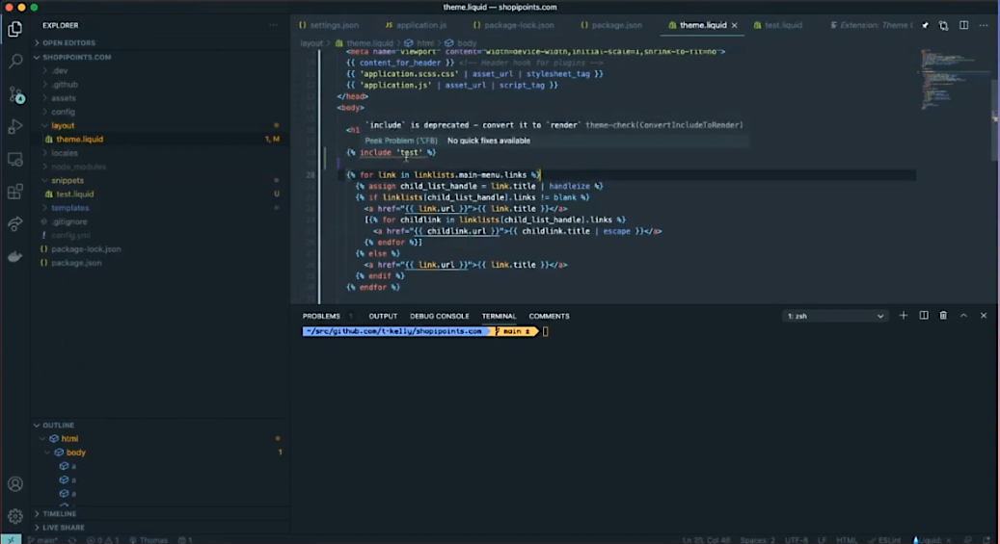
- `{{ Kelly | }}`: "Nice!"
- `{{ | plus: Kelly }}`: "I love to see it how it's inline. So you have the inline feedback here, or you have the global feedback here at the bottom in your `problems` tab that you can see... Okay great... that in theme.liquid we have an ``. So, if we were to change that to ``"
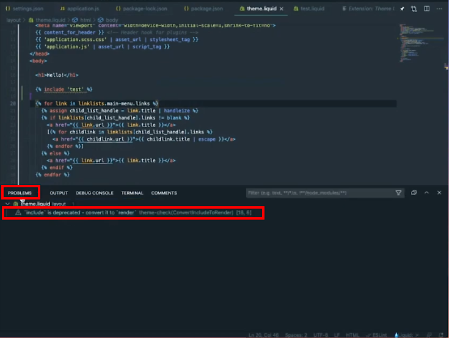
- `{{ Kelly | }}`: "And for those of you who don't use [vscode](https://github.com/Shopify/theme-check/wiki/Visual-Studio-Code), [`theme-check`](https://github.com/Shopify/theme-check/wiki) is also available for [`vim`](https://github.com/Shopify/theme-check/wiki/Vim-Neovim), [`neovim`](https://neovim.io/https://github.com/Shopify/theme-check/wiki/Vim-Neovim) and [sublime](https://github.com/Shopify/theme-check/wiki/Sublime), and then theres something called others 🤣. I just looked on the [Wiki](https://github.com/Shopify/theme-check/wiki), on Github."
- `{{ | plus: Kelly }}`: "In the [Readme.md](<https://github.com/Shopify/theme-check>?"
- `{{ Kelly | }}`: "There's a link for it. Scroll up towards the top a bit... There, 'inside some code editors'"
- `{{ | plus: Kelly }}`: "I wasn't even following the other supported browsers. So, you can use `theme-check` just in the command-line too. We, last year, kind of ran through using ESLint in the command-line. So, that's great for CI (Continuous Integration). We will, probably at some point, hook up theme-check to our repo CI (Continuous Integration)
- `{{ Kelly | }}`: "Marc is saying that the delays due to scanning node.js modules, that a fixed is coming for that... Node.js modules breaks again!"
- `{{ | plus: Kelly }}`: "How big is our node modules:interrobang: I tried to clean. Actually I haven't re-installed it and I don't want to run `npm install` given our history of bad things happening when I do that "live". Do that after. 😎! Let's start developing 🤓"
- `{{ Kelly | }}`: "We'll just do some fun little things here, because it is already almost 3pm. I know we got almost a 20 min late start"
- `{{ | plus: Kelly }}`: "Let's get the homepage in an "ok" state."
- `{{ Kelly | }}`: "Question that says: 'Is there a date at which `` will be removed?' I honestly don't think that it's going to happen, ever. Shopify is really good about supporting things, as long as it's not breaking the `API` or something like that. Shopify still has merchants with separate mobile and desktop themes. So, I'm pretty sure there would be a lot of really upset merchants if their site suddenly broke because `` was no longer supported!"
- `{{ | plus: Kelly }}`: "So, as `{{ Kelly | }}` was saying, basically if we don't have an automatic way of migrating all existing stores off of it, then we're not going to get rid of it because we don't want to break stores. However, if you are kind of on the fence about or not wanting to use one or not really knowing why `` is there it is around liquid performance. It kind of goes into ``. `` has access to all of your liquid assignments, global liquid assignments, and so when it's rendered it's a lot more costly to render a snippet included with the `` tag, because of all this additional scope that's included with it. Ultimately what the `` tag let's liquid do is render this snippet in its own isolated scope. So you'll see that if you include a snippet with `` you don't have access to an assignment that you made inside the template that snippet is included in or inside the layout, or..."
- `{{ Kelly | }}`: "To me that is kind of the downside of using `` because being able to pass variables into a snippet has been always really helpful."
- `#Comments` - `magus824`: "The reason to use "include" is because of it's ability to pass variables out of it (which `` does not unfortunately)"
- `{{ | plus: Kelly }}`: "You can still pass variables... Let's go into this a little..."
- `#Comment`: As `{{ | plus: Kelly }}` works on putting an example on this, one of the viewers did come through with a comment regarding what `{{ Kelly | }}` had just mentioned about not being able to pass variables to ``.
  - `#Comments` - `magus824`: "You can pass them into ``, you just can't pass them out of it".
  - `#Comments` - `sHHr`: "``"
- `{{ Kelly | }}`: "Oh, ok. It's the other way. You can pass them into a `` but not out of the render."
- `{{ | plus: Kelly }}`: "Yes, you can pass them in... yeah, there we go `sHHr` has it. Yeah, there we go. I am going to copy `sHHr` example. 😆 You know it makes me think of California when they say 'sure'! 🤣"
- `{{ Kelly | }}`: 🤣
- `{{ | plus: Kelly }}`: "Ok, so, that is how you would basically, instead of providing the whole global scope to your snippet, you just have to pass things in manually, which I think is fair and I actually, kind of, like that, in that what you know that your snippet has a defined kind of API interface layer around it"
- `{{ Kelly | }}`: "It makes sense because, also, it's like adding all of [`bootstrap`](https://getbootstrap.com/) into your theme, or into your code, when you only need one small portion of it, it's just unnecessary."
- `{{ | plus: Kelly }}`: "hmm. Ok. What I was doing was a little header thing here. We can get rid of this 'Hello'..."
- `{{ Kelly | }}`: "Wow! I work really hard on that 'hello' and you just... 😆"
- `{{ | plus: Kelly }}`: "Yeah, sorry. Gone. 😆 It's gone!!! 😆... Nav is still a thing. I'm forgetting the shortcut key to use to wrap. I remember there was a way of doing that..."
- `{{ Kelly | }}`: "yeah"
- `{{ | plus: Kelly }}`: "That you could wrap. If I have this highlighted, there is a shortcut..."
- `{{ Kelly | }}`: "That is the one that I can never remember"
- `{{ | plus: Kelly }}`: "Yeah, I'm rusty on it 😔... Descriptive HTML, what about... I wish there was a logo. Well you know we could make it up. Everyone's using HTML5 now right:interrobang:..."
- `{{ Kelly | }}`: 😆
- `{{ | plus: Kelly }}`: "Do we want to do a classic `<div>` for the logo?"
- `{{ Kelly | }}`: "Sure"
- `{{ | plus: Kelly }}`: "Oh, you know, this is where I would look at..."
- `{{ Kelly | }}`: "Can I say something?"
- `{{ | plus: Kelly }}`: "Yeah"
- `{{ Kelly | }}`: "Can we move all of this header stuff into a section called `<header>`:interrobang:"
- `{{ | plus: Kelly }}`: "Into a section called `<header>`! Yeah!!!"
- `{{ Kelly | }}`: "We actually don't have a sections directory on here. I'm adding it..."
- `#Comment`: `{{ Kelly | }}` uses [cacher](https://www.cacher.io/) for snippets of code that are constantly reused, which makes it easier on the developer when working on Shopify themes, especially when having to create things like a section header file in the newly created `Section` folder."
- `{{ | plus: Kelly }}`: "Ok, you add it. There is a really handy chunk of code that we use in all of our free themes, that uses the store name by default for the title"
- `{{ Kelly | }}`: "Oh you mean like actual header. Okay, got it."
- `{{ | plus: Kelly }}`: "Yeah, inside the header"
- `#Comment`: `{{ Kelly | }}` is creating a regular section, which doesn't need blocks. She is grabbing section of code from her [cacher](https://www.cacher.io/) app, which grabs the snippets she has put together from her github gist (mentioned on another episode. I believe it was [`{{ Kelly | plus: Kelly}} OBS was broken so we decided to do an AMA`](https://www.youtube.com/watch?v=9T-YjyWgKAI) episode)
- `{{ Kelly | }}`: "Have we built a section together on here?"
- `{{ | plus: Kelly }}`: "We did a very basic one I think:interrobang:"
- `{{ Kelly | }}`: "Okay, so we have. Okay."
- `{{ | plus: Kelly }}`: "Yeah, because we did the announcement bar"
- `{{ Kelly | }}`: "That's right"
- `{{ | plus: Kelly }}`: "The header bar; I mean the announcement bar."
- `{{ Kelly | }}`: "Should I be typing out the `` for this or should I wait?
- `{{ | plus: Kelly }}`: "You can start typing it up. Here, I'll show that page while you're typing it out. Okay, wait let me follow... Okay, while I'm looking at something, I can follow you. There we go, so people can watch"
- `{{ Kelly | }}`: ":cool: :sunglasses:! So you can see (👀) what I am doing."
- `{{ | plus: Kelly }}`: "You can take the steering wheel while for those little snippets"
- `#Comment`: `{{ Kelly | }}` is working on `header.liquid` section
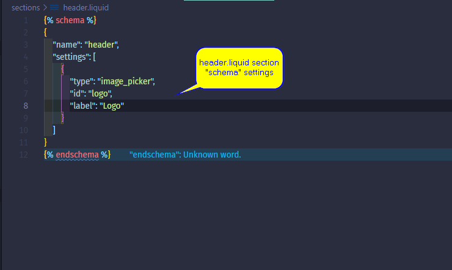
- `{{ | plus: Kelly }}`: "So, you are doing a Logo setting?"
- `{{ Kelly | }}`: "Yeah..."
- `{{ | plus: Kelly }}`: "Beautiful. Okay"
- `{{ Kelly | }}`: "We'll start there"
- `{{ | plus: Kelly }}`: "Yep. Okay"
- `{{ Kelly | }}`: "We're not running [`theme watch`](https://shopify.dev/tools/theme-kit/command-reference#watch) on this right now?
- `{{ | plus: Kelly }}`: "No we are not. Do you have terminal access?"
- `{{ Kelly | }}`: "Oh, yeah. Nope, I have read only"
- `{{ | plus: Kelly }}`: "`npm run watch`
- `{{ Kelly | }}`: "I'm going to switch to `Liquid` because I know it will reformat it. There we go."
- `#Comment`: The Liquid extension for Visual Studio Code is what `{{ Kelly | }}` is referring to switching to. The option, if you using vscode, should be at bottom right of editor."
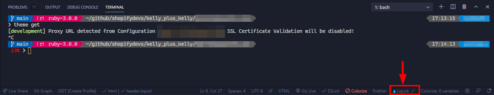
- `{{ | plus: Kelly }}`: "And, I'm going to do a classic copy from a free theme ("move") and will clean this up. So, one of my favorite ways of developing is using stuff that already exists in other themes."
- `{{ Kelly | }}`: "Yeah!?"
- `#Comment`: "`{{ Kelly | }}` was in process of setting up header with header section logo settings. However, this where `{{ | plus: Kelly }}` had copied that section already, from a free theme, and will be pasting in the "snippet" into the header section of `header.liquid` section.
- `{{ | plus: Kelly }}`: "Here, I've got that. Let me..."
-Kelly_plus_Kelly-Building_a_custom_online_store–January_27_2021-header_code_snippet_a.png "Header Code snippet")
- `{{ Kelly | }}`: "Oh, that's what you copied! Okay."
- `{{ | plus: Kelly }}`: "Yep, okay. So, we are going to clean this because this is a beast
- `{{ Kelly | }}`: "That's good. That's good..."
- `{{ | plus: Kelly }}`: "So we can get... oh, let me stop following you. Okay, so we maybe just actually... Let's just start with this `anchor (<a>)`, which we can... The wrapper right now that's some added complexity that we don't really need for this instant. So, what we've got here, we're wrapping whatever we have in an `anchor (<a>)`. I'm gonna get rid of classes for now
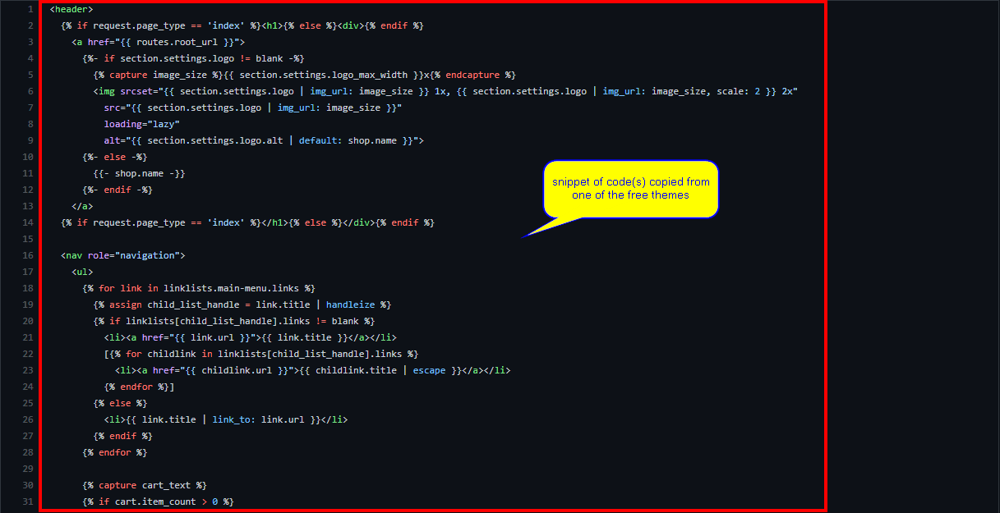
- `{{ Kelly | }}`: "While you are doing that we do have a question from haroldao. 'Hi. Is it possible to know why the Theme Checker extension is not supported as part of the Partners Program?'"
- `{{ | plus: Kelly }}`: "Could you elaborate haroldao?"
- `{{ Kelly | }}`: "It says on the [Github](https://github.com/Shopify/theme-check) that it is not supported by the partner program. Yep, there we go, right below the image 'Disclaimer: This tool is not supported as part of the Partners program.'"
- `#Comment`: At the time of this episode, there was a "Disclaimer: This tool is not supported as part of the Partners program." However, as of today, 3/8/2021, when I checked it says that "Theme Check is now supported 🎉"
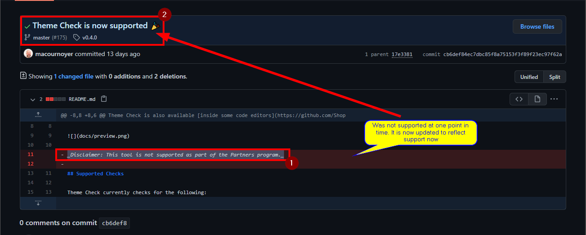
- `{{ | plus: Kelly }}`: "I'm not sure what..."
- `{{ Kelly | }}`: "Click "back" button"
- `{{ | plus: Kelly }}`: "... part of the, yeah... I'm trying to find... If Marc is still in the channel maybe he can answer that. I'm not sure what it's referring to, as part of the [Partners Program](https://www.shopify.com/partners). Does that ring any bell? I'm not sure..." (speaking with Marc if still in chat)
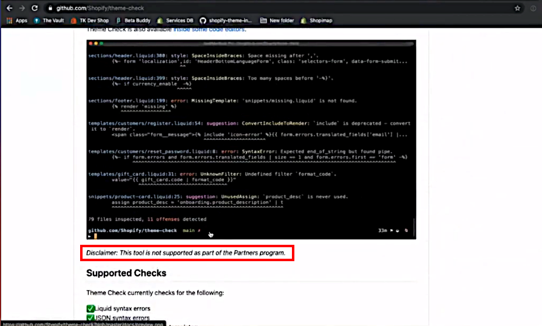
- `{{ Kelly | }}`: "I just think that it's not literally a partner tool"
- `{{ | plus: Kelly }}`: "yeah, the rules that it is enforcing maybe aren't or you don't need to follow these in order to submit, I mean you can't submit a theme in the theme store right now, that's another story. I'm wondering, there's no requirements for you to adhere to these rules as a partner..."
- `{{ Kelly | }}`: "That's honestly probably it because outside of slate there's never been, it's never been, super opinionated for how developers building on [Shopify](https://shopify.com) need to coding, so I guess it's trying not to enforce the rules as an official checker"
- `{{ | plus: Kelly }}`: "Ok, our little snippet here, we have an `<a>` (anchor) that looks at the `routes` object and is going to bring you back to the homepage (we don't need this data attribute for now)"
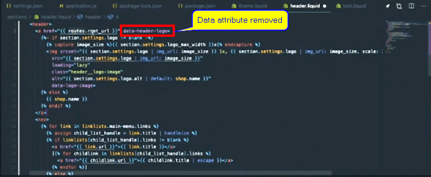
- `{{ Kelly | }}`: "You know while we are talking about [`routes`](https://shopify.dev/docs/themes/liquid/reference/objects/routes) that's actually a newer thing, the [route object](https://shopify.dev/docs/themes/liquid/reference/objects/routes). I'm going to link to that in the comments, show notes, what are we calling these things? The chat, there we go, that's the word. Really useful because it used to be that you to hard code slash account and now you can just use `{{ route.account_url }}`, so highly recommend learning what's available here and using it."
- `#Comment`: FYI, `{{ Kelly | }}`, very active in the community, has other mainstays, like [Ladybug Podcast](https://www.ladybug.dev/), [commerce tea](https://commercetea.com/), a [book](https://www.goodreads.com/author/show/20363515.Kelly_Vaughn), ect. On her [Ladybug Podcast](https://www.ladybug.dev/) show, they refer to [Show Notes](https://www.ladybug.dev/episodes/git-and-github), for meeting note, items, links, etc. mentioned in the podcast, hence why you may hear her say [Show Notes](https://www.ladybug.dev/episodes/web-accessibilitiy) at times. If you would like pay those links a visit! 😎😁🙌
- `{{ | plus: Kelly }}`: "I was just looking at those docs this morning! I was trying to figure out what's the URL patterns available in online stores, like "/collections", "/blogs", "/accounts, /cart..."
- `{{ Kelly | }}`: "I have them all memorized if you just want to ask me anytime 😁"
- `{{ | plus: Kelly }}`: "/products, I'll keep going, see... /numbers, /checkout, that's the one that we don't want to use, for me. Okay. 🤣"
- `{{ Kelly | }}`: 🤣🤣
- `{{ | plus: Kelly }}`: "Okay. Let's run through this. Let's get this committed and we'll preview it, just to make sure it's out. Let's read through it and make sure it looks good"
- `{{ Kelly | }}`: "Okay"
- `{{ | plus: Kelly }}`: "So we have the `<a>` (anchor). We have the section settings logo does not equal blank and that picks off..."

```javascript

```

- `{{ Kelly | }}`: "and that's exactly what I named it"
- `{{ | plus: Kelly }}`: "Yeah! Your `"id": "logo"`, so that's going to be looking for that and then..." (looking through code) "... and then source set (`srcset`), so here... Is this using [`lazysizes.js`](https://afarkas.github.io/lazysizes/index.html)!? This is not using/loading `lazy`..."
- `{{ Kelly | }}`: "It's loading `lazy`
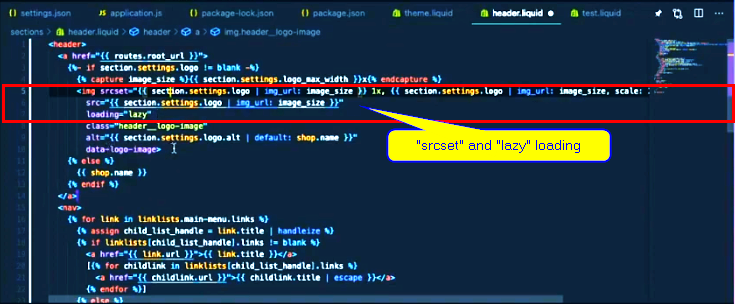
- `{{ | plus: Kelly }}`: "this is using just native lazy loading. Good. Lazy sizes yet or at all. We'll try to not use it because that's another library. Let's try to stay away from extra libraries. Okay, source (`src`), so, here, we're setting source set (`srcset`)... I wonder if this using... no it's not. Okay, so we have two sizes... It's a logo, we technically don't need to... Let's leave it for now and see what happens."

- `{{ Kelly | }}`: "Let's leave it for now. It's fine."
- `{{ | plus: Kelly }}`: "Okay. `alt` settings. So that is for those logo "alts" that comes along because this logo is a picture item. You can set the `alt` text for the picture..."
- `{{ Kelly | }}`: "and by you 'can', you absolutely should"
- `{{ | plus: Kelly }}`: "You absolutely should"
- `{{ Kelly | }}`: "You should always set `alt` text for all of your images on the page and they should be descriptive, not just image or the product name, describe the image."
- `{{ | plus: Kelly }}`: "Oh, I like sHHr's comment/question on [`` vs. ``](https://shopify.dev/docs/themes/liquid/reference/basics/whitespace)"
- `{{ Kelly | }}`: "which is used here"

- `{{ | plus: Kelly }}`: "yeah, we have inconsistent use here and this is living in the [Express theme](https://help.shopify.com/en/manual/online-store/os/using-themes/themes-by-shopify/express). I copied this from the [Express Theme](https://help.shopify.com/en/manual/online-store/os/using-themes/themes-by-shopify/express)
- `{{ Kelly | }}`: "Oooh!"
- `{{ | plus: Kelly }}`: "which is our most recently actively maintained theme. So we've got some inconsistency here in the `liquid` [whitespacing](https://shopify.dev/docs/themes/liquid/reference/basics/whitespace) rule!? I've never actually just used it in one tag like this."
- `{{ Kelly | }}`: "Ive never just used it in one either. If I use it one place, I use it everywhere. Is it throwing any problems?"
- `{{ | plus: Kelly }}`: "What do we have for problems!?"
- `{{ Kelly | }}`: "Oh, just test.liquid, 'template not used'."
- `{{ | plus: Kelly }}`: "test.liquid. Okay, let's get rid of that. We don't need that anymore. That was just for an example. Okay, 😎. You added the "section header". Let's get this..."
- `{{ Kelly | }}`: "Yep. I should have copied a customer account and I didn't. Let me get that"
- `{{ | plus: Kelly }}`: "yeah, get that in. If you can delete that whitespace inside that email. :cool: So, let's see..."
- `{{ Kelly | }}`: "We don't have a logo yet. We have to add it to the customizer"
- `{{ | plus: Kelly }}`: "I'm not working in production either. So I need to go to online store because we are pushing to our unpublished kind of dev store theme right now."
- `{{ Kelly | }}`: "aha 🤦‍♀️!"
- `{{ | plus: Kelly }}`: "Which is... Which one do you think it is?"
- `{{ Kelly | }}`: "Good question. What is the..."
- `{{ | plus: Kelly }}`: "Let me get the `id`"
- `{{ Kelly | }}`: "I can get it. Actually let me go look at it instead"
- `{{ | plus: Kelly }}`: "Okay. You look at it and tell me what the last three numbers are. It's probably the "[DEV] Web Components" one. Config.yml `theme_id`
- `{{ Kelly | }}`: "I don't think i have it"
- `{{ | plus: Kelly }}`: "Here, I got it. Development is "#640". That's weird that you can't see it though.
- `{{ Kelly | }}`: "I think it's because it's not pushed up to [Github](https://github.com/t-kelly/shopipoints.com), that one particular file it contains API information or private app information so you have to give me access to that separately"
- `{{ | plus: Kelly }}`: "Okay. So, it's this one. Typically when you are on `theme watch` it should open it for you, you know!?"
- `{{ Kelly | }}`: "No, it does not."
- `{{ | plus: Kelly }}`: "No! That's just [slate](https://shopify.github.io/slate/docs/about)? I'm just use to working with good old slate!?"
- `{{ Kelly | }}`: "Yep"
- `{{ | plus: Kelly }}`: "There we go. Okay. So, for the people following along, we are going to be, I mean for the first part of this, I would love to really focus on the HTML first. Build this out: HTML, CSS and then JavaScript if we really need it. Really emphasize if we "really" need the JavaScript. I really want to see how far we can get with just HTML and CSS."
![Screenshot of Shopipoints.myshopify.com Partner Admin page. Accessing [Dev] Web Components theme by going to "Actions" and then selecting "Preview"](Assets/img/2021-03-09-17_12_50-{{Kelly_plus_Kelly}}-Building_a_custom_online_store–January_27_2021-Shopipoints_Dev_theme-Partner_admin_center.png "[DEV] Web Components")
![Screenshot of Shopipoints.com [DEV] Web Components theme being used during theme development. Live theme should not be used. Best practice.](Assets/img/2021-03-09-17_42_38-{{Kelly_plus_Kelly}}-Building_a_custom_online_store–January_27_2021-Shopipoints-Dev_Web_Components_theme_a.png "DevTools")
- `{{ Kelly | }}`: "You know what's going to be really fun!? Never using jQuery on this!"
- `{{ | plus: Kelly }}`: "Never using jQuery. Yep, that's a hard rule. I would agree with that. never using jQuery. I'm down. Actually I was reading... Something came through... 86% of the web is still running jQuery!?"
- `{{ Kelly | }}`: "mmhmm"
- `{{ | plus: Kelly }}`: "It's still... Here we are talking about skypack and snowpack and tailwindcss and everyone's still using jQuery."
- `{{ Kelly | }}`: "I do have to wonder though, how many of those websites have actually been updated in the past, say, six months!?"
- `{{ | plus: Kelly }}`: "Yeah, it's like Wordpress websites who have been around for three+ (3+) years
- `{{ Kelly | }}`: "Exactly. Back when jQuery was the thing to use it made life so much easier for writing JavaScript. So... It's gotten easier, over time, with the other tools that are available, especially with ES6."
- `{{ | plus: Kelly }}`: "And the Web and CSS has caught up in a lot of ways..."
- `{{ Kelly | }}`: "Yep"
- `{{ | plus: Kelly }}`: "Like [accordions](https://dev.to/anitamaity/simple-accordion-menu-using-html-and-css-only-4i3c), [slideshows](https://dev.to/codingnepal/automatic-image-slideshow-effect-in-html-css-javascript-3g33) (this is the hot topic). You don' need JavaScript to do a slideshow anymore. I don't even know if we want a [slideshow on our website](https://medium.com/@miriamschwab/3-reasons-why-sliders-are-bad-for-your-website-s-health-5256c406168d)."
- `{{ Kelly | }}`: "You also... No. I will die on this hill. We are not putting a slideshow on our website."
- `{{ | plus: Kelly }}`: "🤣 Yeah! Good! Good! I was going to say."
- `{{ Kelly | }}`: 🤣
- `{{ | plus: Kelly }}`: "😆 Contentious topic amongst designers. People who know the web."
- `{{ Kelly | }}`: "I have opinions 😆"
- `{{ | plus: Kelly }}`: "Okay, just before we wrap things up, I did want to go back to the [whitespace](https://shopify.dev/docs/themes/liquid/reference/basics/whitespace) thing. So, if you look here (screenshot below) at our HTML that's served up, look at all this [whitespace](https://shopify.dev/docs/themes/liquid/reference/basics/whitespace) around "Shopipoints", that's weird right!? So..."
![Screenshot of Shopipoints.com [DEV] Web Components theme being used during theme development. Showcasing whitespace coming from our liquid templating.](Assets/img/2021-03-09-18_29_14-{{Kelly_plus_Kelly}}-Building_a_custom_online_store–January_27_2021-Shopipoints-Dev_Web_Components_theme-Whitespace.png "Whitespace")
- `{{ Kelly | }}`: "I wonder if there is anything we can do about that! :D"
- `{{ | plus: Kelly }}`: "Is there something we can do about that!? :D. So, that whitespace is coming from our liquid templating. Basically, see this line ``, this just doesn't get rendered and it results in an empty line breaks. If I save. Let that update. Now it should... I reload this... I really hope this works. Yeah, there we go. We still have a line break there. Do I want to be picky with the line break!?"
- `#Comment`: `{{ | plus: Kelly }}` went ahead and added the [hyphens](https://shopify.github.io/liquid/basics/whitespace/), in front of the percent signs to control the [whitespace](https://shopify.github.io/liquid/basics/whitespace/).
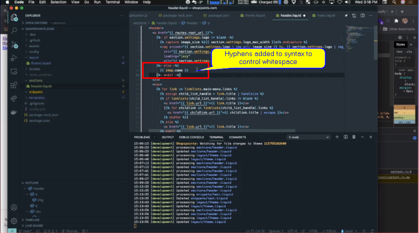
- `{{ Kelly | }}`: "Yes"
- `{{ | plus: Kelly }}`: "yeah! Okay. Let's just do it. Oh, but then I have to..."
- `{{ Kelly | }}`: "It's the `<a>` (anchor) tag."
- `{{ | plus: Kelly }}`: "Do I have to..."
- `{{ Kelly | }}`: "Don't worry about it."
- `{{ | plus: Kelly }}`: "No. Okay. So, you can't get perfect whitespace control. Ideally, maybe with our app..."
- `{{ Kelly | }}`: "You can if you, maybe, shrink everything in but we're not doing that. We want our codes readable."
- `{{ | plus: Kelly }}`: "So we can look at some custom apps, service sides... sHHr knows his stuff"
- `#Comment`: As Thomas, `{{ | plus: Kelly }}`, was talking he saw a comment from [sHHr](https://www.twitch.tv/videos/890448932?t=0h58m0s), one of us viewers, come in with a solution to that line break. sHHr said, "You can do this `{{- shop.name -}}`" which Thomas, `{{ | plus: Kelly }}`, applied and which worked.
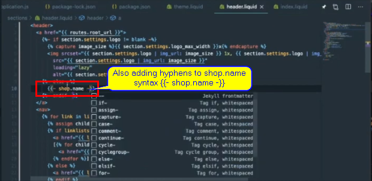
- `{{ Kelly | }}`: "Yeah!! You are absolutely right!" also referring to [sHHr's comment in Twitch chat](https://www.twitch.tv/videos/890448932?t=0h58m0s).
- `{{ | plus: Kelly }}`: "Let's see if that gets rid of the line break. 😁🤩"
- `{{ Kelly | }}`: "😁 Boom!!"
- `{{ | plus: Kelly }}`: "See this is the beauty of developing on Twitch. Thank you sHHr
- `{{ Kelly | }}`: "sHHR!! 😁"
- `{{ | plus: Kelly }}`: "😂 Great! So we've got the [whitespace eliminated](https://shopify.github.io/liquid/basics/whitespace/). We have a header, which... I keep saying let's just one more thing, ONE MORE THING!!! 😄. Let me go to the [Theme Editor](https://shopify.dev/tutorials/develop-theme-use-theme-editor) here.
- `{{ Kelly | }}`: "Are you adding in the Logo?"
- `{{ | plus: Kelly }}`: "Yep. Here's the header. Okay, look we included our section header, select image... Oh, geez 🤦‍♂️! What type of image
![Screenshot of Shopipoints [DEV] Web Components theme, Theme Editor, Header section settings](Assets/img/2021-03-09-20_04_45-{{Kelly_plus_Kelly}}-Building_a_custom_online_store–January_27_2021-Shopipoints-Dev_Web_Components_theme-Theme_Editor-Header-Logo.png "Theme Editor - Header Section")
![Screenshot of Shopipoints [DEV] Web Components theme, Theme Editor, Header section settings, after clicking "Header" option, to add logo](Assets/img/2021-03-09-20_05_17-{{Kelly_plus_Kelly}}-Building_a_custom_online_store–January_27_2021-Shopipoints-Dev_Web_Components_theme-Theme_Editor-Header-Logo2.png "Theme Editor - Add Logo Image")
- `{{ Kelly | }}`: "Uh..."
- `{{ | plus: Kelly }}`: "I don't have an image ready..."
- `{{ Kelly | }}`: "I will..."
- `{{ | plus: Kelly }}`: "Anyone have an image that they'd want to have as a Logo for here, that is appropriate 😁?"
- `{{ Kelly | }}`: "Go to [placekitten.com](https://placekitten.com/) please and download an image"
- `{{ | plus: Kelly }}`: "[placekitten](https://placekitten.com/)?"
- `{{ Kelly | }}`: "Yep... There you go"
- `{{ | plus: Kelly }}`: "Oh!!! 🤗 I need a landscape one"
- `{{ Kelly | }}`: "Okay. You can even set in the dimensions that you want, like slash (`/`) width slash (`/`) height (`*/width/height`)
- `{{ | plus: Kelly }}`: "Oh!!! 🤔🧐"
- `{{ Kelly | }}`: "How cool is that 😁"
- `{{ | plus: Kelly }}`: "Okay, wait. I'm just going to download this one because I don't think I can provide... I need to upload an image right?"
- `{{ Kelly | }}`: "Yeah"
- `{{ | plus: Kelly }}`: "Yeah... Let's save..."
- `{{ Kelly | }}`: "I once launched a website four or five years ago, oh wow it was a long time ago, and I told the clients that they're about page content needed to be updated before they went live. They never updated it and so I think for about a year after they launched, their about us page had a picture of a kitten as their faces."
- `{{ | plus: Kelly }}`: 🤣
- `{{ Kelly | }}`: "It was a site run by cats 😁😆"
- `{{ | plus: Kelly }}`: "Can I... Oh I can!!!" (was wondering about drag/drop of Kitten image downloaded in the Logo > Select Image)
- `{{ Kelly | }}`: "Tada!!!"
- `{{ | plus: Kelly }}`: "There we go. Yeah!!!!"
- `{{ Kelly | }}`: "🤣 Best picture. It's the best logo ever!! 😆"
- `{{ | plus: Kelly }}`: "Here we go. Okay. So we've got..."
- `{{ Kelly | }}`: "Oh, before, can you go back!? One more thing. Click on "Edit", on the image, add that "alt" text.
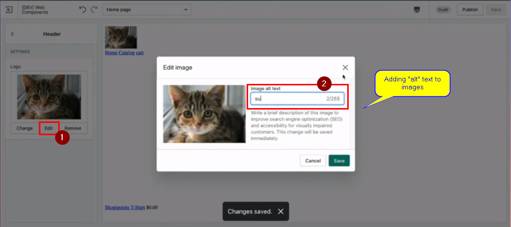
- `{{ | plus: Kelly }}`: "Super cute kitty"
- `{{ Kelly | }}`: 🤣🤣
- `{{ | plus: Kelly }}`: "Kind of looks like my Kitty I used to have"
- `{{ Kelly | }}`: "Please if you are working with merchants, tell them that they need to add that "alt" text into their image in the Theme customizer when they're uploading images. That is Very² (very very) important for accessibility."
- `{{ | plus: Kelly }}`: "Very! Accessibility has been a very present topic around my time at Shopify. I have, admittedly, always had my teammates pioneer it more than myself. I will try to absorb their best practices and their lessons and we'll rely on you as we go through this to make sure that we're, at least, covering our most basic of bases. We'll definitely get some [ARIA](https://developer.mozilla.org/en-US/docs/Web/Accessibility/ARIA) tags."
- `{{ Kelly | }}`: "Oh, yes"
- `{{ | plus: Kelly }}`: "And also accessibility linting. I know that Lighthouse has some, I'm forgetting the linter/Web extension.. Yeah."
- `{{ Kelly | }}`: "By the way David says 'Jobs done. Shopipoints is now complete'"
- `{{ | plus: Kelly }}`: "You know what, it's ten times better than it was before we started.."
- `{{ Kelly | }}`: "😁 I mean cats make everything infinitely better, so yes."
- `{{ | plus: Kelly }}`: "😆 Beautiful! :cool:! So.. I think that we are good for today. We made it online. Hopefully, next time things go smoothly and we can start on time. Thanks for those that joined us.. 20 minutes late 😬"
- `{{ Kelly | }}`: "Stuck around with us 20 minutes later!"
- `{{ | plus: Kelly }}`: "Yeah! 20 minutes late, 20 minutes starting late, and then 20 minutes ending late. We got a full hour in."
- `{{ Kelly | }}`: "Yes we did! Well, we will be back again next week 2pm EST, on Wednesday."
- `{{ | plus: Kelly }}`: "Next week. Any las questions from anyone? Any before we say goodbye?
- `{{ Kelly | }}`: "Last chance!"
- `{{ | plus: Kelly }}`: "Last chance! sHHr!!! Okay. 😆"
- `{{ Kelly | }}`: 😁
- `{{ | plus: Kelly }}`: "I'll give it a second because I know there is a delay"
- `{{ Kelly | }}`: "Here's your last chance to ask when is section everywhere coming 😆"
- `{{ | plus: Kelly }}`: "😆 Actually Liam asked this in the Partner town hall announcement today. I saw this 'hey what's up with sections everywhere'"
- `{{ Kelly | }}`: 🤣
- `{{ | plus: Kelly }}`: "We gotta build this joke. It is a meme, exactly. This is meme quality now. So, we got to build out this meme."
- `#Comment`: magus824 commented in the chat "that is a meme at this point", which Thomas, `{{ | plus: Kelly }}` picked up on that comment as well.
- `{{ Kelly | }}`: "Yep"
- `{{ | plus: Kelly }}`: "we going to find the image for it. Cool. Okay."
- `{{ Kelly | }}`: "I have this really cool idea for the website. We're going to do it next week. Okay!?"
- `{{ | plus: Kelly }}`: "Okay. Stay tuned..."
- `{{ Kelly | }}`: "Alright."
- `{{ | plus: Kelly }}`: "How to end on a teaser! 😁 Well done. There you go. 😄"
- `{{ Kelly | }}`: "That's right! 😄 Stay tuned for some more sections everywhere jokes. 🤣"
- `{{ | plus: Kelly }}`: "See you everyone 👋🙋‍♂️"
- `{{ Kelly | }}`: 🙋‍♀️👋

<br><br>

### Legend

----

<br>

[](https://twitter.com/kvlly)

- `{{ Kelly | }}` = [Kelly Vaughn](https://www.linkedin.com/in/kellyvaughn/)

[](https://twitter.com/thommaskelly)

- `{{ | plus: Kelly }}` = [Thomas Kelly](https://github.com/t-kelly)

<br><br>

### More Links

----

<br>

- Regex tutorial — A quick cheatsheet by examples: <https://medium.com/factory-mind/regex-tutorial-a-simple-cheatsheet-by-examples-649dc1c3f285>
- Regex cookbook — Top 10 Most wanted regex: <https://medium.com/factory-mind/regex-cookbook-most-wanted-regex-aa721558c3c1>
- Helium's Customer Fields App: <https://apps.shopify.com/customr?surface_detail=helium&surface_inter_position=1&surface_intra_position=5&surface_type=search>
- Shopify App CLI: <https://github.com/Shopify/shopify-app-cli>
- YouTube API: <https://developers.google.com/youtube/v3>
- Visual Studio Code - Code Editing. Redefined:
  - <https://github.com/Shopify/theme-check/wiki/Visual-Studio-Code>
  - <https://code.visualstudio.com/>
- Sublime - A sophisticated text editor for code, markup and prose:
  - <https://github.com/Shopify/theme-check/wiki/Sublime>
  - <https://www.sublimetext.com/>
- Vim - the ubiquitous text editor:
  - <https://github.com/Shopify/theme-check/wiki/Vim-Neovim>
  - <https://www.vim.org/>
- Neovim - hyperextensible Vim-based text editor:
  - <https://github.com/Shopify/theme-check/wiki/Vim-Neovim>
  - <https://neovim.io>
- Bootstrap - The most popular HTML, CSS and JS library:
  - <https://getbootstrap.com/>
  - <https://stackoverflow.com/questions/48006296/integrate-bootstrap-on-liquid-shopify>
- Cacher - Code snippet organizer for pros: <https://www.cacher.io/>
- LazySizes - Ultimate and lightweight lazyLoader which lazy loads images: <https://afarkas.github.io/lazysizes/index.html>
- Whitespace control:
  - <https://shopify.dev/docs/themes/liquid/reference/basics/whitespace>
  - <https://shopify.github.io/liquid/basics/whitespace/>
- Slate - End of Support (January 2020): <https://shopify.github.io/slate/docs/about>
- Shopify Theme Editor:
  - <https://shopify.dev/tutorials/develop-theme-use-theme-editor>
  - <https://help.shopify.com/en/manual/online-store/os/using-themes/change-the-layout>
- Accordions: <https://dev.to/anitamaity/simple-accordion-menu-using-html-and-css-only-4i3c>
- Slideshows:
  - <https://dev.to/codingnepal/automatic-image-slideshow-effect-in-html-css-javascript-3g33>
  - <https://medium.com/@miriamschwab/3-reasons-why-sliders-are-bad-for-your-website-s-health-5256c406168d>
- Accessible Rich Internet Applications (ARIA): <https://developer.mozilla.org/en-US/docs/Web/Accessibility/ARIA>
