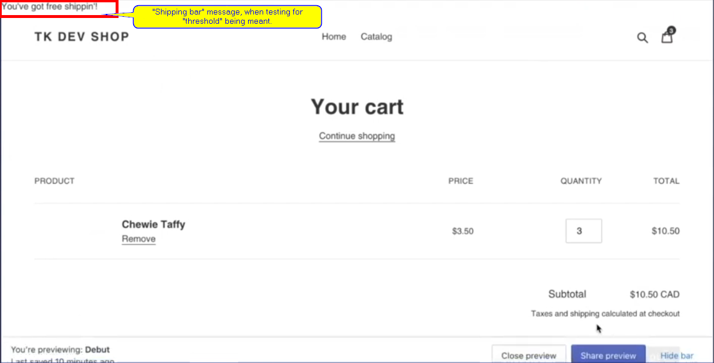

# [Creating Theme Functionality - Sept 30, 2020](https://www.youtube.com/watch?v=wR8L-0QnKZo&t=392s)

<br>

In this recording Kelly Vaughn and Thomas Kelly explore how to add functionality into your theme projects, and explore some of the features you can build in your theme.

The Kellys will walk you through how to:

- Create a custom section that displays a free shipping bar
- Display dynamic updates for cart properties
- Set up free shipping thresholds
- Apply styling to a custom section

<br>

* * *

<br>

Subscribe to our channel for more videos about developing and designing ecommerce stores, apps, and themes with Shopify » www.youtube.com/shopifydevs​

Looking for more information about developing on Shopify check out www.developers.shopify.com and <https://shopify.dev/>​

Connect with us on Twitter » www.twitter.com/shopifydevs

Launch your own online store by visiting Shopify and starting your free trial » <http://bit.ly/VisitShopify>

<br><br>

## Notes

<br>

- `{{ Kelly | }}`: "You don't always need an app to solve some basic problems". Only takes a bit of coding and building a custom section, which can be used in future projects as well.
- `{{ Kelly | }}`: Conversion rate optimization (CRO). Anything for CRO is great especially something like a free shipping bar that counts down when you are getting to that free shipping threshold
- `{{ Kelly | plus: Kelly }}`: imposter syndrome is a thing. it's ok to google, search, for something. shopify.dev site is also your friend. live by it as well.
- `{{ | plus: Kelly }}`: Section everywhere is still coming "Soon".
- `{{ Kelly | plus: Kelly }}`: Can tune into partner town hall webcast:
  - [October 2020 Partner Town Hall](https://www.youtube.com/watch?v=QGGhpiuKFGw)
  - [October 2020 Partner Town Hall - Asia-Pacific Countries (APAC)](https://www.youtube.com/watch?v=3j7mbZsypew)
- `{{ Kelly | }}`: Make theme easy as possible for merchant to update site without breaking things
- `{{ Kelly | }}`: sections "super important" to allow customization and to make sure you set up settings correctly
- `{{ Kelly | }}`: Three different tags can include in a section
  - ``
  - ``
  - ``

 

- `{{ Kelly | }}`: Use `` tags in section, when needed. having a master javascript file where section(s) pulling from loads unnecessary bits to your site.
- Always want to define section by defining it with a name, it's settings, class and/or presets.
  - [Required attributes for input settings](https://shopify.dev/docs/themes/settings#attributes-for-input-settings):
    - `type` - "Name of the type of settings".
    - `id` - uniqure name for this setting. "id is e[xposed to the Liquid templates](https://shopify.dev/tutorials/develop-theme-theme-editor-other-theme-files#access-settings-inputs) via the [settings](https://shopify.dev/docs/themes/liquid/reference/objects#settings) or [section.settings](https://shopify.dev/docs/themes/liquid/reference/objects/section#section-settings) objects".
    - `label` - "A label for this setting". A friendly readable field/area describing what the content `type` is to here for and/or will be doing.

 ```json
 {
      "type": "text",
      "id": "free-shipping-threshold",
      "label": "Free Shipping Threshold",
      "info": "Include number only. Don't include the $."
    },
 ```

 

- multiple `schema` types that can be used
- for `schema` > `settings` > content `type` we will use of "text" a lot.
- If a section is created and not called anywhere, e.g. theme.liquid, then it will not show up in theme style area. Created section needs to be called, or declared, somewhere first.

- No local shopify development for shopify theming. For "local" development, we can use [webpack](https://webpack.js.org/) or [browsersync](https://www.browsersync.io/docs). those are the ones Thomas have used in past, he stated.
- I am pretty sure there are some other ones that can simulate local dev for shopify, might have to search into this some more.
- to get free shipping bar feature to work, we at least need to know subtotal, hence we are going to need to use the "cart" object: `cart.items_subtotal_price`
- "shopify" "object" and whatever object you are looking in google search will usually bring you to correct shopify page, e.g. "[shopify object cart](https://www.google.com/search?q=shopify+object+cart&oq=shopify+object+cart&aqs=chrome..69i64j0i22i30l2j69i57.8633j0j1&sourceid=chrome&ie=UTF-8)" or "[shopify cart object](https://www.google.com/search?newwindow=1&sxsrf=ALeKk00aiuWFZ-dJwZQ0pwSXCpSy0WWNgA%3A1613531791100&ei=j4osYKLMBbKl5NoP0NebcA&q=shopify+cart+object&oq=shopify+cart+object&gs_lcp=Cgdnd3Mtd2l6EAMyBAgAEEMyBggAEBYQHjoHCAAQRxCwA1DFxUlYxcVJYJ3PSWgBcAJ4AIABoQOIAcYEkgEHMC4xLjQtMZgBAKABAqABAaoBB2d3cy13aXrIAQjAAQE&sclient=gws-wiz&ved=0ahUKEwjiz_ep-u_uAhWyElkFHdDrBg4Q4dUDCA0&uact=5)"
- If I got this straight, `cart.items_subtotal_price` [doesn't do currency conversion](https://shopify.dev/docs/themes/liquid/reference/objects/cart). It gives you whole number, such as instead of $3.50, in the example in the video, we see 350. We need to use the `money` [object/filters](https://shopify.dev/docs/themes/liquid/reference/filters/money-filters) to do the conversion.
- Block `name` has a 25 character limit.
- Disabling cart notification. Notification works through javascript/cart.js route, which lets you ajax/fetch request to get cart current state without having to reload page. Without doing this we would have had to code shipping bar around that. So for this webinar {{ Kelly | plus: Kelly }}, it was disabled instead.
- [Money Filter](https://shopify.dev/docs/themes/liquid/reference/filters/money-filters) performs, as stated earlier, currency conversion, especially for localization purposes.
- When building the shipping bar feature, advise is to built-in the conversion within it by using the [money filter](https://shopify.dev/docs/themes/liquid/reference/filters/money-filters)


- To update shopify theme automaticaly from [vscode](https://code.visualstudio.com/), run `theme watch`. We can also setup a .js file and use npm to run the watch command as well. More on this in next video in {{ Kelly | plus: Kelly }} series!
- `Theme watch` is watching for any changing in the theme folder and as soon as something is changed, uploads changes automatically.
- `Theme watch` does not do live reloading. Handles changes. Once changes are uploaded to shopify, you have to refresh browser manually.
- Going back to earlier mention, [browsersync](https://www.browsersync.io/docs) and/or [webpack](https://webpack.js.org/) can be use to setup some sort of "live reload", locally. see respective options for more details.
- Setting up "shipping bar" message

- When dealing with Ajax cart, you have to refresh page to see changes for you to see the changes made:


- Replacing `*` in the message with currency


- To not have to reload page to see changes to shipping bar, we would need to setup javascript/fetch to get info we need without having to depend on Ajax reload.
- We would need to add javascript to cart coding to make this work.
- Adding styles to the "shipping bar" feature.
- Thomas went to Debut and looked to used the "announcement bar" style but since not enabled, decided to go ahead with setting up styles in section instead.
- Kelly also added the schema settings for a merchant to be able to make color changes to shipping bar.

- updating styles sections in "shipping-bar" sections file


- Settings applied:


- we ended up creating a "free-shipping-section" that has a "threshold" and is keeping track of what's remaining and will update until free shipping threshold is hit/achieved.
- Once the "threshold" is met, then it will automatically change to correct message letting customer know they qualify for free shipping.
- We are not, however, using Ajax add a cart, as the Debut theme is using Ajax Add a cart.
- To make use of Ajax add a cart, we would add a `<span></span>` to the asterisks `*`, `<span>*</span>`, then use the Ajax add a cart function to look at the data attribute first for the free shipping threshold and then have it subtract it from the cart subtotal and then render the new amount.
- Liquid syntax cannot be used in schema settings. One, because of when liquid renders. Two, because .json files will not like it, since it deals with "text".
- Thomas and Kelly are using Liquid extension by Nikos for liquid syntax highlighting.

- Next episode will be "Theme Performance"

<br><br>

### Legend

<br>

[](https://twitter.com/kvlly)

- `{{ Kelly | }}` = [Kelly Vaughn](https://www.linkedin.com/in/kellyvaughn/)

[](https://twitter.com/thommaskelly)

- `{{ | plus: Kelly }}` = [Thomas Kelly](https://github.com/t-kelly)

<br><br>

### Links

<br>

- Content schema - List of content types: <https://shopify.dev/docs/themes/sections/content-schema#list-of-content-types>
- kellyvaughn-shipping-bar.liquid: <https://gist.github.com/kellyvaughn/a4c02c27863582c760f20894093db45e>
- <https://gridsome.org/plugins/gridsome-source-shopify>
- <https://github.com/github/renaming>
- <https://ohzsh.sh>
- <https://shopify.dev/docs/themes/settings>
- Browser Sync:
  - <https://www.npmjs.com/package/browsersync-themekit>
  - <https://www.browsersync.io/docs>

<br>
