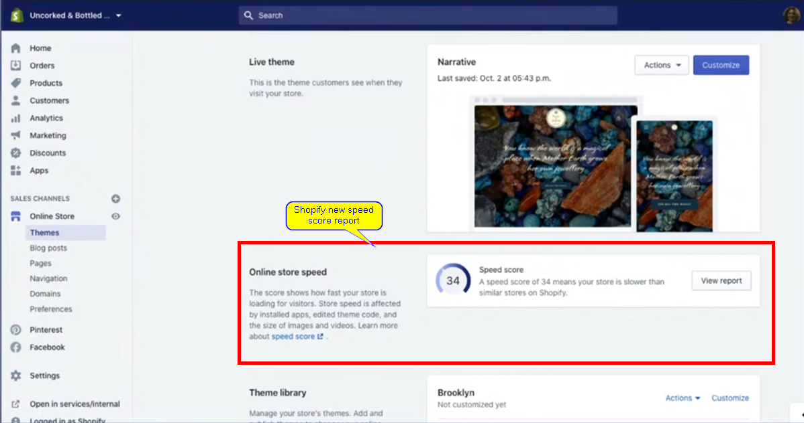

# [{{ Kelly | plus: Kelly }} 4: Theme Performance](https://www.youtube.com/watch?v=zotJ-pcnr5g)

* * *

  

## Notes

* * *

- When thinking to performance, as a merchant, you may be thinking of speed.
- Different people will have different ideas on what performance is.
- Shopify released a speed report.

- Performance in the web platform is somethinbg that everyone is struggling with
- It's important to know how lighthouse works.
- All websites are equal in the site of google lighthouse.
- Not all stores are created equal.
- Score calculated by also looking at your most frequently visited pages, e.g. home page, product page and collections.
- Score is caculated using google lighthouse.
- Google lighthouse is a performance auditing tool, that google has been working on for several years, that tries to boil down performance into one magic number.
- shopify's score also gives you an idea of how you compare to other people in same line as you.

- Performance is user expectation and customer's experience of what is fast.
- Headless implementation convo going on in Twitch chat, in regards to possible impact to performance.
- Headless implementation is decoupling front-end of website from back-end.
- Front-end may be elsewhere. backend, however, is shopify.
- Usually performance gain with that.
- Can have a single progressive web app and have data cache upfront.
- Slow headless implementation is a thing too.
- Third party scipts, for instance, can still weigh down headless implementation.
- Headless implementation is another technology stack with it's pros/cons.
- One of its pros is that it pregenerates these pages. That in itself has something that requires calculations on a frequent basis, say checking inventory.
- Don't go to headless for purely performance reasons.
- Shopify has a really huge page cache. if it was pre-populated same performance gains in headless could be achieved.
- More and more clients are looking to go headless.
- Why and/or should you switch to headless will become clearer over time.
- When looking at performance, advise is to look at what app merchant has installed, as they can add to the slowness of a site/storefront.
- Even if you uninstall an app, its code may still remain in the theme and also add to the performance of a storefront.
- If an app is installed and asked for access to the asset api, that means the app will probably be modifying your theme files and may not necessarily unmodify them when unistalled.
- In order to work on or tweak performance for your theme and/or storefront, we can go to devtools (F12) of the browser and then go to lighthouse. (Make sure to use Chromium base browsers!!)

- Extensions do have an impact on performance as well, when using lighthouse.
- run in incognito mode without any extensions running.
- Lighthouse report give us user centric metrics that are trying to judge user experience.
- These metrics are different ways of judging different points of that user interference.
- "Hero" Metrics:
  - First Contentful Paint: First time something significant is painted on the screen.
  - Speed Index: Time when the majority of the page has finished rendering (around 80% of page).
  - Largest Contentful Paint: When the biggest thing of the page has shown, e.g. image and/or image with text overlay.
  - Time to Interactive: Tied to CPU
  - Total Blocking Time: how much CPU is fully occupied and not able to respond to user interaction
  - Cumulative Layout Shift: Core Web Vitals metric calculated by summing all layout shifts that aren’t caused by user interaction.
    - For example, have you ever visited a news site and was about to click on a link to an article, and then… the layout suddenly moves, an ad appears, and somehow instead of clicking on the article you wanted to read, you instead end up clicking on that useless ad? That sudden movement on the page is called the layout shift.

- In the report, lighthouse also provides us with "Opportunity", nice way of getting started in tweaking the site's performance.
- It's also a way of pointing us in a direction that can help with the tweaking we can perform and may help with site performance.
- Lighthouse's "Opportunity" audit/report is not a debug type of tool. It's more like a signal flare to where may be we should start looking into and possibly see what we can find to help us with improve performance on our site/theme.
- it's important to be using proper size of media for that space.
- In the example being used in the video, for instance, under "Properly size images", it's asking for a PNG image, which is a lossless image file format. We don't need a PNG.
- PNGs really excel if we really need clean lines like in a screenshot with text in it.
- If requesting JPG from shopify, we will be served WebP image.
- Shopify is listening on their side, from your browser, for WebP. If the browser can do and accepts webp then shopify will serve webp image.
- WebP images most of the time are smaller than JPEG.
- WebP?? What is that?? According to [Google Developers](https://developers.google.com/speed/webp/), WebP is a modern image format that provides superior lossless and lossy compression for images on the web.
  - Using WebP, webmasters and web developers can create smaller, richer images that make the web faster.
  - WebP lossless images are 26% smaller in size compared to PNGs. WebP lossy images are 25-34% smaller than comparable JPEG images at equivalent SSIM quality index.
- Thomas is looking to do some edits to the site by using "Overrides", instead of working with the HTML directly.
- "Overrides" sticks even if page/site is refreshed. Unlike when make changes, for testing purposes, to a site in the browser.
- What are "Overrides"? Welp:
  - [Google Developers](https://developers.google.com/web/updates/2018/01/devtools): Local Overrides let you make changes in DevTools, and keep those changes across page loads. Previously, any changes that you made in DevTools would be lost when you reloaded the page. Local Overrides work for most file types, with a couple of exceptions.
  - This option does not seem to be available in Firefox, unless it is under a different naming convention, I personally do not see it. They do, however, have a [Debug extension](https://github.com/firefox-devtools/vscode-firefox-debug) in vscode. Maybe that can be a substitute?!...
- Using "Overrides" we can test changes locally, to the browser.
- Quick way to edit something and see differences.
- Web base service, php insight or webpage test, they will not have access to "Overrides".
- Naritive, the theme that the example site is built on, uses [lazy-loading library called "Lazy sizes"](https://web.dev/use-lazysizes-to-lazyload-images/).
  - lazysizes is the most popular library for lazy-loading images. It is a script that intelligently loads images as the user moves through the page and prioritizes images that the user will encounter soon.
  - Lazy-loading is the strategy of loading resources as they are needed, rather than in advance. This approach frees up resources during the initial page load and avoids loading assets that are never used.
- [In liquid we can specify an image format, for displayed image](https://shopify.dev/docs/themes/liquid/reference/filters/url-filters#img_url).

- If we want to get a score close to 100, there will be tradeoffs.
- [[Kelly V](https://github.com/kellyvaughn)] Q: would you rather go the cropping route or would you rather have an alternate image uploaded for mobile devices?
- [[Thomas K](https://github.com/t-kelly)] A: "would go the cropping route because then it allows any..." <a href=#definitions>[sic]*</a> [contingencies?!] "because if you do if you upload different images then you need to predict or you need to figure it out yourself" [sic].
- If we can use native lazy-loading we should use it, otherwise fill the gap with lazysizes library, as there are situations that native lazy-loading do not cover.
- Question: How much wight should we be putting on internal navigation to subsidiary pages? (Interactive performance)
  - Progessive apps (single page apps), shine because they don't reload pages, just swap info that is there.
  - Can get just as fast navigation if doing right things with regular themes/sites.
  - [Turbolinks](https://github.com/turbolinks/turbolinks). "Turbolinks® makes navigating your web application faster. Get the performance benefits of a single-page application without the added complexity of a client-side JavaScript framework. Use HTML to render your views on the server side and link to pages as usual. When you follow a link, Turbolinks automatically fetches the page, swaps in its `<body>`, and merges its `<head>`, all without incurring the cost of a full page load."
- Turbolinks seems to have been superseded by a new framework called [Turbo](https://turbo.hotwire.dev/).
- [[Kelly](https://github.com/kellyvaughn)] "it is intresting how many of the performance boost are javascript based".
- Kelly ran a lighthouse test on a website and their total load size, entire page itself, was 20Mb.
  - This usually says their are a lot of images too large being loaded.
  - The issue wasn't images, it was gifs.
- [[Kelly](https://github.com/kellyvaughn)] "Important thing to note":
  - Adding animation to site, not css animation, something like gifs, recommendation is to use an HTML 5 video that loops.
  - Gifs are actually heavy as a file size.
  - HTML 5 videos are rendered differently.
- We can see how much JavaScript is downloaded and ran uncompressed by going to Network tab, in devtools, and selecting JS, in the options.
- [Liquid Profiler](https://github.com/Shopify/shopify-theme-inspector) for Chrome, built by Thomas and [Umair Choudhary](https://github.com/uchoudh-zz).
  - Going through growing pains due to new liquid rendering engine, liquid C.
  - Theme inspector takes a look at liquid code of theme on current page and will output computing/processing time to take that liquid file to HTML.
  - Useful for speeding up time to first bite (TTFB). The time it takes for Shopify to send response on HTML document being requested.
    - This breaks down the request.
    - Time that browser is waiting for response is when storefront rendered is doing it's work and creating a response.
    - Depending on site and/or liquid content on page, Time to First Bite (TTFB)
    - Ideal response time should be around 200ms*
    - Shopify has a page caching layer/system.
      - If changes are performed in code editor (Shopify code editor), that action invalidates the page cache. Paged is changed so returning old page make no sense at this point.
      - Once a user request that page, Shopify checks cache and if no cache then will go to liquid, render the page, return it and then fill up the cache again so all future request hit the page cache instead.
- Section everywhere is a whole rebuilt of shopify theme customizer. Developer preview &#42;&#42;&#42;Soon&#42;&#42;&#42;
- Focus on building for the now.
- Ruby not a requirement to make shopify apps.

-

  

### Legend

* * *

 

- `{{ Kelly | }}` = [Kelly Vaughn](https://www.linkedin.com/in/kellyvaughn/)

- `{{ | plus: Kelly }}` = [Thomas Kelly](https://github.com/t-kelly)

  

### Links

* * *

- [Image Lazy-loading](https://web.dev/browser-level-image-lazy-loading)
- [Shopify Theme Inspector](https://github.com/Shopify/shopify-theme-inspector)
- [Turbolinks](https://github.com/turbolinks/turbolinks)

  

definitions:

&#42; [[sic]](https://en.wikipedia.org/wiki/Sic) - The Latin adverb sic ("thus", "just as"; in full: sic erat scriptum, "thus was it written")
