# [{{ Kelly | plus: Kelly }} Versioning + Linting - Nov 18, 2020](https://www.youtube.com/watch?v=OfwYfg7qJng)

 

In ths episode of `{{ Kelly | plus: Kelly }}` we are going to cover versioning and code linting.

Theme versioning is a bit of a pain point for Shopify theme development so The Taproom, Kelly's company, went ahead and created their own system for it that `{{ Kelly | }}` wants to share.

We are also going to be speaking on Linting, which `{{ | plus: Kelly }}` will be speaking on.

Follow the build LIVE every Wednesday @2PM EST at <https://twitch.tv/shopifydevs>​. Code available at <https://github.com/t-kelly/shopipoints.com>

 

* * *

 

Subscribe to our channel for more videos about developing and designing ecommerce stores, apps, and themes with Shopify » www.youtube.com/shopifydevs​

Looking for more information about developing on Shopify check out www.developers.shopify.com and <https://shopify.dev/>​

Connect with us on Twitter » www.twitter.com/shopifydevs

Launch your own online store by visiting Shopify and starting your free trial » <http://bit.ly/VisitShopify>​

 

* * *

  

## Notes

- `{{ | plus: Kelly }}`: `Linting` is good to get it out of the way at the begining of a project.
- `{{ | plus: Kelly }}`: Bringing `linting` halfway through a project we might end up with way more linting errors than needs to be.
- `{{ | plus: Kelly }}`: `Linting` is way of making sure that your code is consistent through a project.
  - Style `linting`, for instance. It would be general order of styles, like display positioned as one of the first ones.
  - JavaScript `linting`, is another. Adhering to specific ways of writing a function, for instance or declaring variables, semicolons, etc.
- `{{ | plus: Kelly }}`: Nice to get it setup at begining of project.
- `{{ | plus: Kelly }}`: part of building The Taproom build process.
- `{{ Kelly | }}`: self-taught. Degrees are in psychology and social work.
- `{{ | plus: Kelly }}`: Many in the industry are self-taught.
- `{{ | plus: Kelly }}`: School may be one way of lending a job and/or client(s), however, another way is to have a project that you work on that you get really into, that you can talk about during interviews and kind of show this passion and this knowledge about the project you're working on and that you're capable of learning about this topic. I think you can get pretty far with something like that as well.
- `{{ Kelly | }}`: Check out [ladybug podcast](https://www.ladybug.dev/). You can learn about coding and hear other people's stories.
- `{{ | plus: Kelly }}`: everyone comes from every walks of life and end up in code.
- `{{ | plus: Kelly }}`: New to Shopify is "Speed score over time". You can see if things haven't dropped. if things have dropped, we can see actions/activities, such as installed apps, theme edits, theme settings changes, made for that period in time when things dropped.
- When working with multiple developers working on same store, same theme, developer we may be working with can request access from their partner account and we can see the request for access on our partner site home page. We can then accpet or reject the request once we click on "review request".
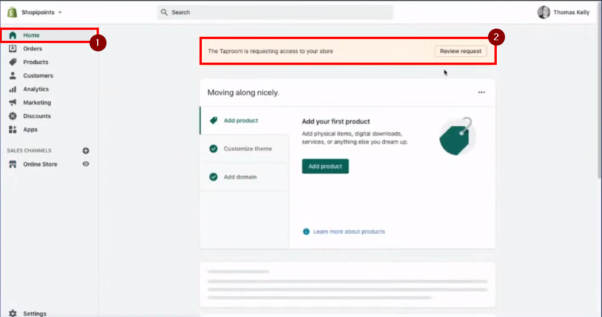
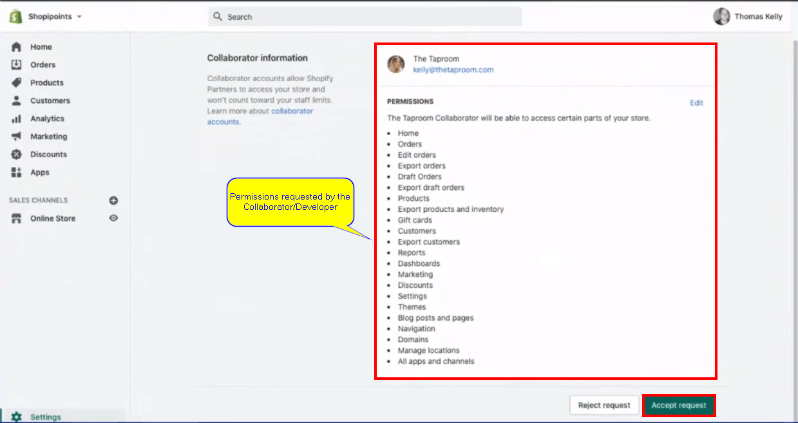
- Last episode we were able to set up NPM scrips. However, last we left, we did not merge the PR because our additions/changes weren't ready. Offiline `{{ | plus: Kelly }}` did go ahead and performed some additional changes, which should be in the [shopipoints.com gihub repo](https://github.com/t-kelly/shopipoints.com) now. Edits that were made:
  - deploy.js script edits
  - watch script added
  - ability to specify what environment we're pushing to, such either production or dev.
  - set `--allowlive` flag for production
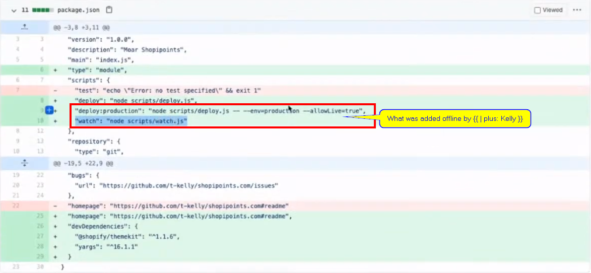
- Another offile change by `{{ | plus: Kelly }}` was duplicating the live team. It's not good practice to be updating "live" themes. Production theme should not be touched until ready to deploy. Instead, we should copy the live theme and work off of that.
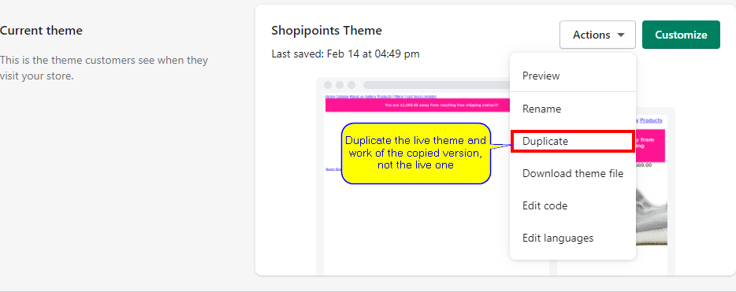
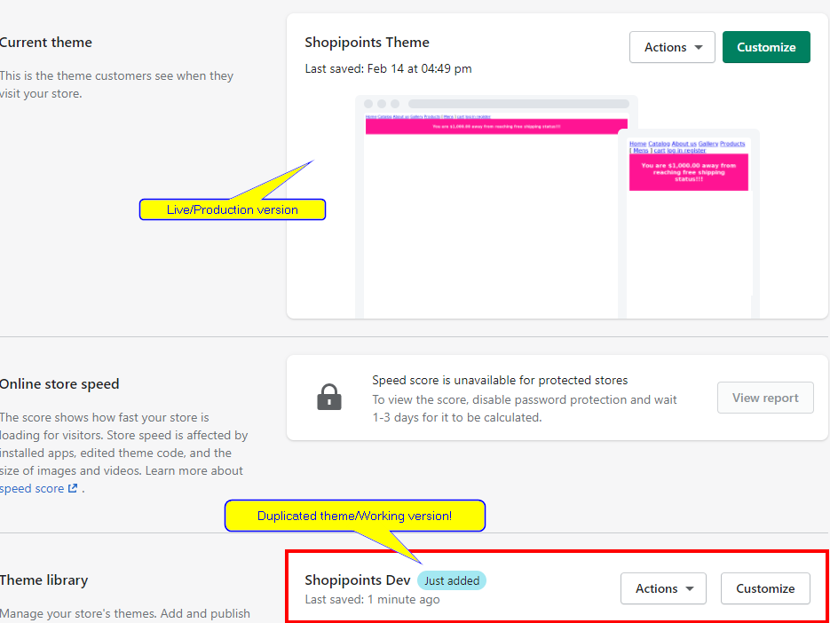
- Running `npm deploy` will run `deploy: node scripts/deploy.js` is set to always deploy to dev.
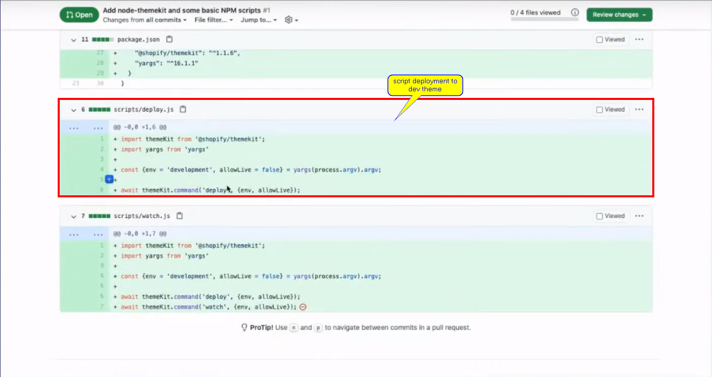
- running `npm deploy:production` will run `deploy:production: "node scripts/deploy.js --env=production --allowLive=true"`
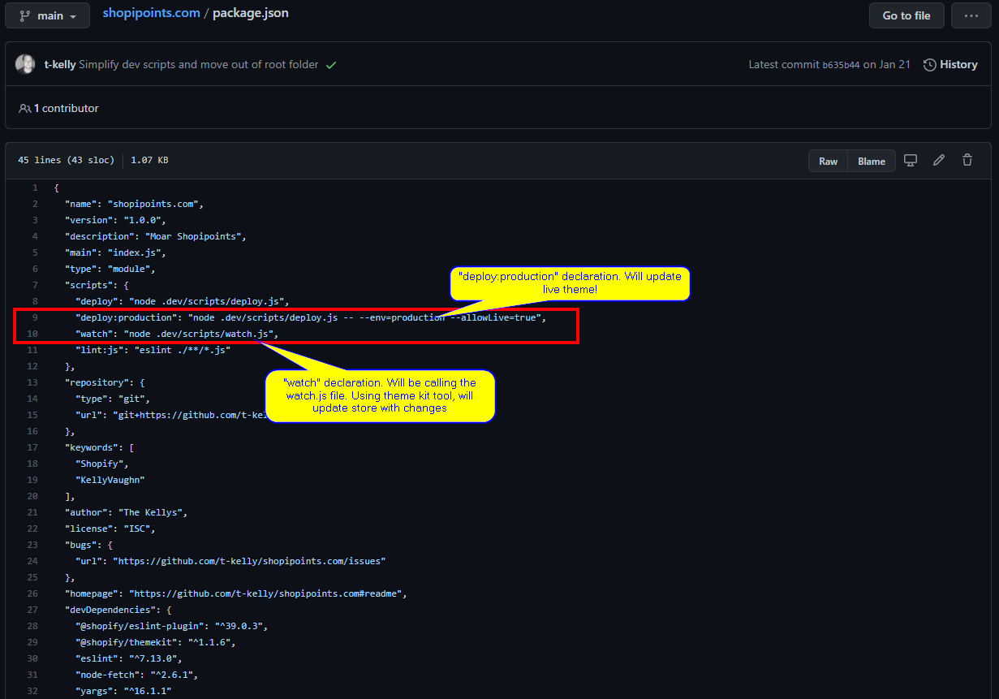
- Always cleanup branches when done merging.
- When doing versioning, The Taproom also version the actual theme(S) as well. The naming convention they use is [Dev] "initial of person doing the edits", for instance: `[Dev] KV`.
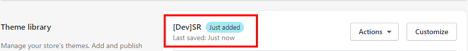
- This is very good practice, especially when collaborating with others and/or merchants are making changes within the theme customizer, like switching images, content links, etc.
- Doing this helps with us not overiding settings that other Dev/Merchants have already made.
- Make sure that we are branching when working on themes as well.
- The taproom convention is developer `initial+[task]`, e.g. `KV+linting`.
- Now, since at the time of this webcast we weren't working on an actual coding scenario, therefore `{{ Kelly | }}` used `KV+linting`. If we were working on something I am sure that it would look something like `KV+free-shipping-bar`, which is a task we worked on back in [Sept last year](https://www.youtube.com/watch?v=wR8L-0QnKZo&t=392s).
- `{{ Kelly | plus: Kelly }}`: Make sure that when you clone a repo, run `npm install`.
- The naming convention used at The Taproom is for devs to let other collaborators know that branch with their initials in it is theirs and what they are working on.
- `{{ Kelly | }}` The Taproom uses Pull Request templates. Very useful when working in teams and/or collaborating with other developers.
- `{{ Kelly | }}`: The templates help with streamlining Pull Requests. The Taproom, for instance, with the templates allways endup with same exact format, same exact structure. This includes things like "Why are we making those changes?", "What file(s) are changing?", "Are there any comments do we need to be aware of?", actual test links as well. For example, let's say we've made a change on the product display page, we can provide a link to that product display page within the shopify preview link so it saves the time from another developer who is going to review the code from having to actually go in and hunt that page down.
- `{{ | plus: Kelly }}`: It's a great way to make sure that we have a checklist of of all the things that we need to have in our "PR", basically.
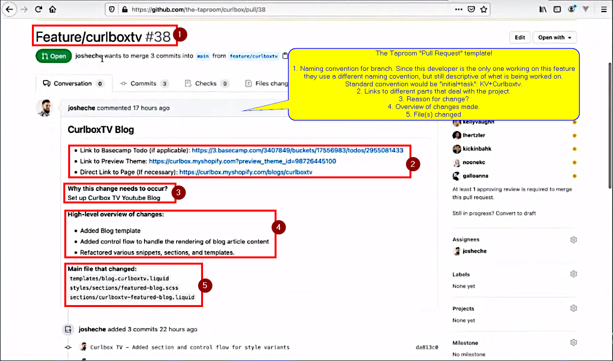
- Code reviews are required for every single "Pull Request" at The Taproom.
- occasionally you're going to see merge conflicts in here where basically you have the same page the same file being changed in two different places on two different branches and you're you have conflicting lines there so instead of automatically overwriting what's what's newest there it gives you it tells you there's a merge conflict so you have a chance to merge somebody else's changes that have already been pulled in that you did not pull down locally with your new changes so nothing gets lost.
- [Symantic versioning](https://semver.org/) is also another tool used when building themes. for instance, @The Taproom, they use [1.0.0] New theme format for symantic versioning of themes. I believe this also for theme staging?! Yep, for staging, after listening again to the section where `{{ Kelly | }}` [start to speak on staging](https://youtu.be/OfwYfg7qJng?t=3199).
- In [symantic version](https://semver.org/) of themes, @The Taproom, or in general concerning symantic versioning, they would increment middle number [1.1.0] for features. Bug fixes would be last number [1.1.1]. Major updates/upgrades, which could potentially break things, the first number [2.0.0].
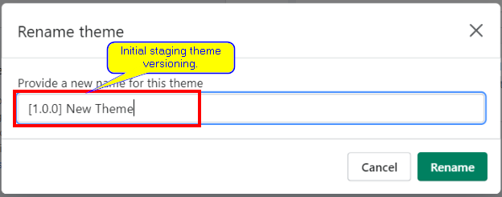
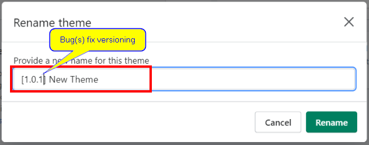
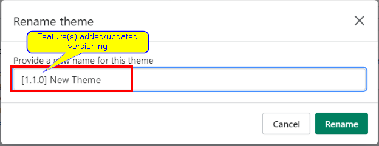
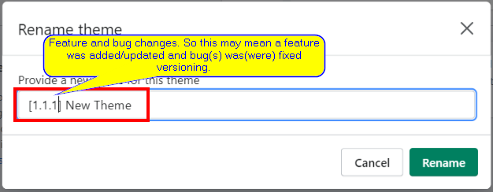
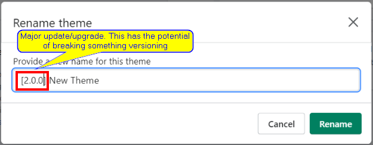
- Symantic versioning is used in programming/coding. We also see this in NPM packages.
- Again, as `{{ | plus: Kelly }}` stated:
  - First number in the trio number versioning is major updates. somthing will break and/or not work when updating to this new theme.
  - Second number is minor updates. Merchants should be able to update theme without issues. Everything should just work.
  - Third, and final, number is patching. A bug(s) was(were) fixed. Should be able to update automatically, nothing breaking.
- Handy concept to have in our toolkit
- Concept also helps in finding issues in code. We can then look back to last working version and see what possibly caused issue.
- Another good reason for working with Pull Requests (PRs). It's just an easy way to go back ans see kind of a concise list of changes that have happened in a project.
- @The Taproom uses labels in Github as well. They'll use something like "waiting client approval". The Pull Request(s) (PR) would stay open because they wouldn't want to merge changes until client gives the official "Ok" to the changes and ready to go live.
- Using tags like there help other members of the team or anybody collaborating with to know exactly why a PR is still open.
- We should start forming this habits now, even when working by self, initially, and then in teams eventually, or collabs! :D
- Practice same behaviors spoken on in this webcast.
- check `{{ Kelly | }}`'s [personal github repo](https://github.com/kellyvaughn) to see how even in her other ventures she pratices same github standards as in her business [The Taproom](https://thetaproom.com/).
- [The Taproom](https://thetaproom.com/) uses basecamp for project management. There, they have a thread that they call "Thread Changes", which is there for tracking any changes merchants made to any theme or any file on their theme, as they merchants/client use that thread to post when they updated a file and/or install some app(s).
- Why this workflow? because when an update is made and the client/merchant notes that in the thread that The Taproom has in basecamp, the team at the Taproom would then know to go ahead and pull down the live site compare changes and merge in those changes, alongside with the reasoning why, such as "merchant/client installed app xyz" or "app support change theme files", etc.
- This help in keeping history in sync with everything else going on with that project.

 

## Linting

 

- `npm i -D eslint`
  - `npm i -D @shopify/eslint-plugin`
- `npm install @shopify/stylelint-plugin`
- [@shopify/stylelint-plugin](https://www.npmjs.com/package/@shopify/stylelint-plugin) is to format styles
- [@shopify/eslint-plugin](https://www.npmjs.com/package/@shopify/eslint-plugin) is to format javascript or ecma scripts
- adding `--save-dev` or `-D` to npm, such as `npm i eslint --save-dev` or `npm i -D eslint`, saves what we are installing in the package.json file as Dev dependencies so that when repo is cloned and whoever cloned it runs `npm install`, dev depencies are installed automatically.
- Best practice to work on different branches when collaborating, even though technically we can collaborate on same branch with someone else. However, the whole purpose of branching is to not override what someone is doing/have done.
- Using the [shopify theme development articles](https://www.shopify.com/partners/blog/topics/shopify-theme-development) are a really great resource for learning theme development.
- We created a new branch so that we can perform the changes we are looking to do. Branch name is `initials+task_being_performed`, so it should look like `TK+Add-Linting`.
- We added the linting pluggins above. Updated the package.json to use eslint and extend the linting to also use [`@shopify/stylelint-plugin`](https://www.npmjs.com/package/@shopify/stylelint-plugin) and [`@shopify/eslint-plugin`](https://www.npmjs.com/package/@shopify/eslint-plugin). Set up options for bother should be at their respective NPM repo.
- Make sure that node.js is at least version 14. However, as of this writing, node.js is at version 15 now.
- set package.json to `"type": "modules"`
- We were getting a parsing error, not a linting error. Due, to time, we will be re-visiting this on the next stream.
- Next stream will be a continuation of Versioning/Linting, including continuous integration.
- Continous Integration (CI) deals with Automating things, such as automating linting.
- `{{ Kelly | }}`: The more we can automate the better.
- If interested, `{{ | plus: Kelly }}` is using a [Sony a6400](https://www.sony.com/electronics/interchangeable-lens-cameras/ilce-6400) with a [16mm 1.4 sigma lens](https://www.amazon.com/Sigma-16mm-Contemporary-Lens-Sony/dp/B077BWD2BB).
- Next Webcast/Stream will be continuation of this cast.

  

### Legend

* * *

 

- `{{ Kelly | }}` = [Kelly Vaughn](https://www.linkedin.com/in/kellyvaughn/)

- `{{ | plus: Kelly }}` = [Thomas Kelly](https://github.com/t-kelly)

  

### Links

* * *

 

- Handling Theme Settings in Javascript and CSS Files: <https://github.com/the-taproom/build-process/blob/main/setup-docs/liquid-settings-for-js-css.md>
- Ladybug Podcast: <https://ladybug.dev>
- `{{ Kelly | }}`'s Github Repo: <https://github.com/kellyvaughn>
- The Taproom: <https://thetaproom.com/>
- The Taproom Repo: <https://github.com/the-taproom>
- Shopify Theme Development: <https://www.shopify.com/partners/blog/topics/shopify-theme-development>
- How to Create Your First Shopify Theme Section: <https://www.shopify.com/partners/blog/how-to-create-your-first-shopify-theme-section>
- Semantic Versioning 2.0.0: <https://semver.org/>
- Sony a6400: <https://www.sony.com/electronics/interchangeable-lens-cameras/ilce-6400>
